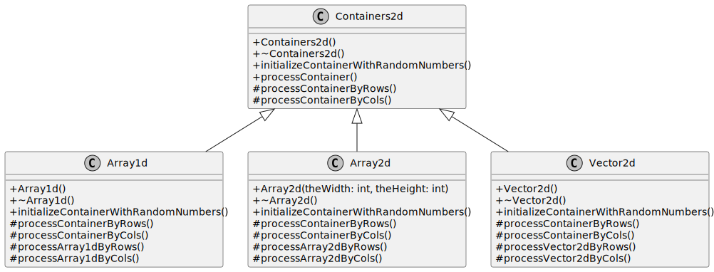
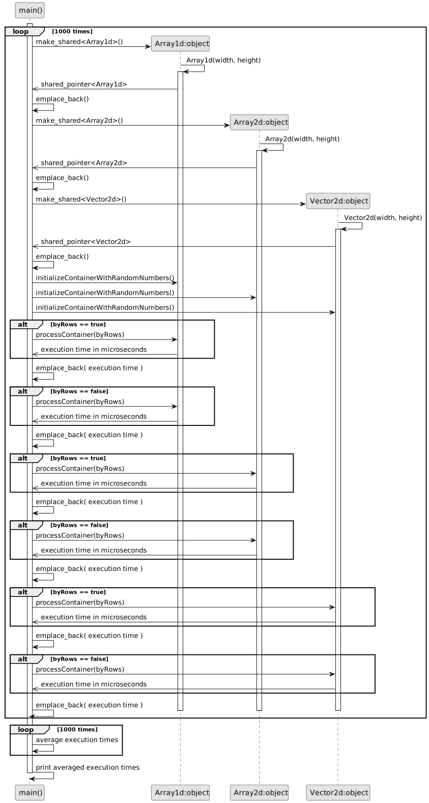

# C++ Performance Study: Use CPU Cache Properties
[Code on Github](https://github.com/VPERepos/CppPerformanceStudy_UseCPUCacheProperties/tree/main)
## Introduction
While learning how to work with images for computer vision, I was told to use a property of CPU cache in order to process two dimensional arrays in C++ faster. It means that accessing 2D arrays by rows in the inner loop is faster than by columns, due to the property of fast cache memory access, containing data lines. It is faster to get the whole line of data from the cache, than jumping from line to line. This small project compares 3 ways of containing 2D data in C++ (but the list is not complete only by these 3 types of data structures). The first considered data structure is a standard C++ dynamically allocated one dimensional array. The second is two dimensional C++ dynamically allocated array. And the last one is a vector of vectors from the standard C++ library.
## Code structure and behaviour
Another interesting programming feature that I wanted to show in this project is code duplication avoidance by utliziation of polymorph classes. The initial git commit here consists of proof of consept and one can see that code that measures the execution time is duplicated for every data structure. That is why I decided to refactor the code resulting in introduction of the following classes.

There is a parent class called Containers2d that has common functionality and variables and 3 specializing classes containing the described data structures. After refactoring the code that implements execution time measurements resides only in one place in the parent class. The functionality of the program is described by the following sequence diagram.
The containers are initialized randomly and the program measures execution time of accessing each element calculating squared value and saving it in the initial container. This is done 1000 times in order to measure average execution time.

## Results and discussion
The results of several runs for different array sizes are presented in the file results.txt in the repository. Here some excerpt for an array 1000x1000 is presented in the table.
| | | | |
|:---|:---|:---|:---|
|<strong>Processing type</strong>|<strong>Execution time (microseconds) Array1d</strong>|<strong>Execution time (microseconds) Array2d</strong>|<strong>Execution time (microseconds) Vector2d</strong>|
|Processed by rows| 2732.27 | 2622.73 | 7236.22 |
|Processed by columns| 3098.9 | 2879.58 | 7669.81 |
|Ratio (%)| 13 | 10 | 6 |
One can see that the slowest container is STL vector - around 3 times slower than the fastest one - dynamic 2D array. But the biggest performance increase has the 1D dynamic array. The results range a little bit from experiment to experiment, but the tendency remains the same. There are only several weird measurements braking the tendency, but recompilation of the project eliminated the behaviour, when STL vector processing by columns was a lot faster than by rows (please see the results.txt in the repository). 