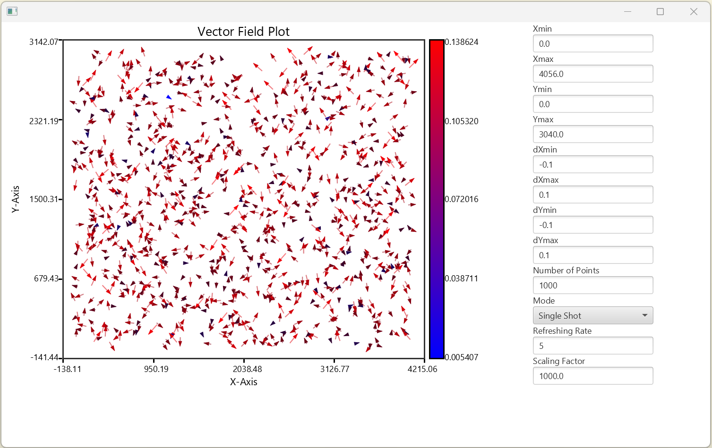
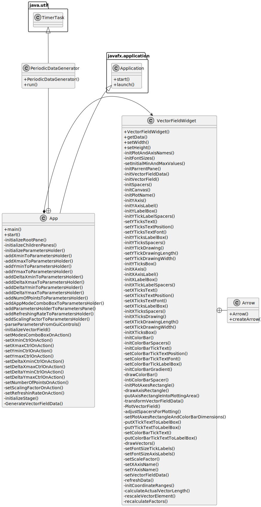
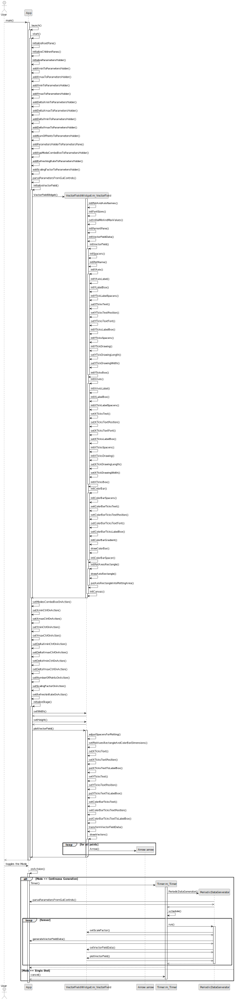

# Vector Field Widget
[Code on Github](https://github.com/VPERepos/VectorFieldWidget/tree/main/VectorFieldWidget)
## Motivation
Vector field plotting is a very usefull approach to representing spacial distribution of data errors or deviation from some "golden data". This is widely applied for example to analysis of camera calibration results. When I started working on plumb line camera calibration procedure in Java, I realized that there were no such a widget in JavaFX by that time, so I decided to program it myself.
## Overview
As one can see from the following picture the main application consists of two parts: vector field widget and parameters part. The parameters control a random data generator, that can be driven in a single shot and continuous modes. The ranges for the data and corresponding arrows can be controlled from the GUI as well. In order to adjust the representation lengths of the vectors, one can tune the scaling factor parameter. The refreshing rate controls the frequency of the timer that runs in the separated thread when in continuous mode.

## Classes structure and functionality
Lately I have been adjusting my approach of using UML diagrams for documenting program code. Once I do not use UML code generators, diagrams do not have to be that detailed as UML standard prescribes. So I decided to hide the information about private variables, function return types and function parameters. All this information can be retreived from the code itself. This way I can describe the structure of a code and function calls dynamics. This kind of simplyfied UML diagramming approach can be seen in the following pictures.  

The application in general consists of a consumer App class and a VectorFieldWidget class. They are related in a form of a composition. There are also two small supporting classes: a PeriodicDataGenerator class, declared inside of the App class, and an Arrow class representing a geometric object and declared inside the VectorFieldWidget class.

A behaviour of the program can be seen in the following sequence diagram. Two use cases are described here: user starts an application with activating the initializations of all geometric components of the main application widget and the vector field widget and the second use case of toggling the generation mode by user. This lot of functions is produced intentionally according to "Clean Code" rules by Uncle Bob, like one function - one action. This way a code can be self documented by function names without comments.

