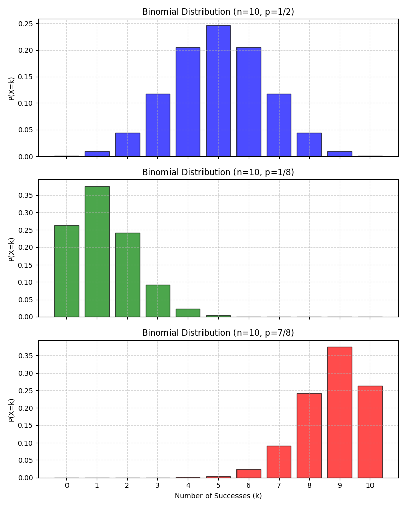
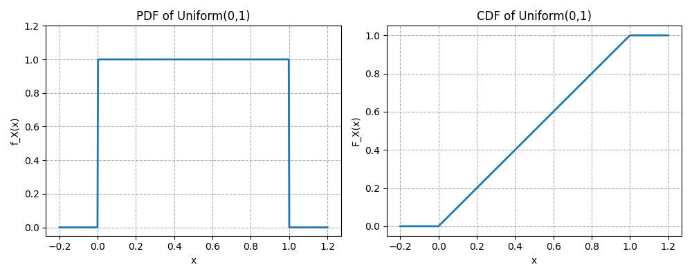

<style>

table, th, td, tr {
   border: none;
   vertical-align: top;
   background-color: white;
   border-collapse: collapse;
}

blockquote {
    border-left: none;
    padding-left: 10px;
}

h1 { counter-reset: h2counter; }
h2 { counter-reset: h3counter; }
h3 { counter-reset: h4counter; }
h4 { counter-reset: h5counter; }
h5 { counter-reset: h6counter; }
h6 { }
h2:before {
counter-increment: h2counter;
content: 
}
h3:before {
counter-increment: h3counter;
content: 
}
h4:before {
counter-increment: h4counter;
content: counter(h4counter) ".";
}
h5:before {
counter-increment: h5counter;
content: counter(h5counter) ".";
}
h6:before {
counter-increment: h6counter;
content:   counter(h6counter) ".";
}


</style>


# Knowledge Base

## Possible interview questions.

---

### Interview questions for probability and statistics.

#### Can you give an intuitive definition of probability of an event?
Intuitively, probability is the measure of how likely an event is to happen, a value between 0 (impossible) and 1 (certain), often expressed as a fraction or percentage, representing the proportion of times an outcome occurs over many repetitions of an experiment, like a coin landing on heads roughly half the time in many flips.

#### What is the absolute necessery condition for the intuitive definition of probability to be true?
The intuitive definition of probability (classical/frequentist) says it's the ratio of favorable outcomes to total possible outcomes (P(E) = Favorable/Total). The crucial condition for this simple formula to work is that all possible outcomes must be equally likely (equally probable).

#### What is the difference between probability and statistics?
Probability tells you how to go from a population to a sample, and statistics tells you how to go from a sample to a population. So if one has a bin with red and blue balls and takes a number of balls from it, statistics estimates how many blue and red balls there could be in the bin. The probability estimates how likely it is that you take specific number of blue and red balls knowing the number of it in the bin. 

#### Enlist and explain the most important combinatoric formulas.
* <strong> Number of possible permutations to arrange $n$ distinct objects: </strong> <br/>
Consider 5 balls of different colors, how many ways are there to put it on a table near each other on a line?
$$P(n) = n!$$

* <strong> Permutations with replacement: </strong> <br/>
How to order r distinct, independent objects with n options for each object (how many outcomes are there throwing r = 6 dies with n = 6 faces).
$$P(n,r) = n^r$$ 

* <strong> Permutations without replacement: </strong> <br/>
How to order r samples out of n distinct objects (how many ways are there to take r = 5 cards out of a deck with n = 52 distinct cards).
$$P(n,r) = \frac{n!}{(n-r)!}$$ 

* <strong> Combinations with replacement: </strong> <br/>
Choose r distinct objects with n options, where order of the objects does not matter, but options of the objects can repeat (choosing 2 ice-cream scoops out of 3 flavors, but scoops can be of the same flavor ).
$$C(n,r) = \frac{(n+r-1)!}{r!(n-1)!}$$ 

* <strong> Combinations without replacement: </strong> <br/>
Choose r samples out of n available (like choose r = 3 persons from a group of n = 5 people, a person can not be chosen twice).
$$C(n,r) = \frac{n!}{r!(n-r)!}$$

#### How is probability generally defined in terms of sets?
Let $S$ be a sample space, $A \subseteq S$ - an event or a subset from the sample space, then probability $P(A)$ is a function defined between 0 and 1 describing how likely it is for the event to come. Probability function must sutisfy following rules:
* $P(\emptyset) = 0$, $P(S) = 1$ and $P(A) \geq 0$
* For disjoint events $A \subset S$ and $B \subset S$, the probability of an overlapping event is a sum of the probabilities of the separate events:
$$ P(A \cup B) = P(A) + P(B)$$

#### How to express a possible outcome or element of a sample space in terms of sets?
Let $s$ be a possible outcome or an element of a sample space $S$:
$$ s \in S $$

#### What are the differences between "element of", "subset" and "proper subset"?
* $\subseteq$ - "subset" means every element of a set is also in another set and these sets may be equal, e.g.:
$$ \{1,2\} \subseteq \{1,2,3,4\} $$
$$ \{1,2,3,4\} \subseteq \{1,2,3,4\} $$

* $\subset$ - "proper subset" means every element of a set is also in another set, but they are not equal, e.g.:
$$ \{1,2\} \subset \{1,2,3,4\} $$
$$ \{1,2,3,\} \subset \{1,2,3,4\} $$

* $\in$ - "element of" means an object is an element of a set, e.g.:
$$ 3 \in \{1,2,3,4\}$$
 A set can also be an element of another set, but only as a single element and not as a combination or permutation of another single elements, e.g:
$$ \{1,2\} \in \{\{1,2\},1,2,3,4\} $$

#### What is the difference between union and intersection of two sets?
* $A \cup B$ - union, means that elements are in A, or in B, or in both sets, e.g.:
$$ A=\{1,2,3\},B=\{3,4,5\}$$
$$ A\cup B=\{1,2,3,4,5\}$$

* $A \cap B$ - intersection, means that elements are in A and B, e.g.:
$$ A=\{1,2,3\},B=\{3,4,5\}$$
$$ A\cap B = \{3\}$$

#### What is the probability of the union of two non-disjoint event sets?
Addition rule of probability, or inclusion exclusion formula:
$$ P(A \cup B) = P(A) + P(B) - P(A \cap B) $$

#### How to calculate a probability that an event won't happen, knowing its probability to happen?
Because the probability of a sample space is 1 and if we know the probability of an event to happen, we can calculate the needed probability as follows:
$$ P(A^c) = 1 - P(A) $$

#### What is conditional probability of two events and how it is calculated? Give a simple example.
The conditional probability of an event A given event B is written as:
$$ P(A|B) $$
and is defined by:
$$P(A|B) = \frac{P(A \cap B)}{P(B)},$$
where $P(B) > 0$.

Imagine a sample space S as a big rectangle (all possible outcomes). 
* Let's draw set B as a circle inside S, meaning all outcomes where event B happens.
* Let's draw set A as another circle, meaning all outcomes where A happens.
* The intersection of the circles $A \cap B$ represents outcomes where both A and B happen.

Now, if one knows that B has happened, the subsets are restricted to B. One ignores everything outside B and wants to know how much of B is also in A, which is the overlap of two events and rerpesents conditional probability.

Let's consider 100 students:
* 40 are in club A
* 50 are in club B
* 20 are in both A and B

Then, the probability that a student from club A is also in club B:
$$
P(A∣B)=\frac{P(A \cap B)}{P(B)}=\frac{\frac{20}{100}}{\frac{50}{100}}=\frac{20}{50}=0.4
$$

#### What is Bayes' rule?
Bayes' rule describes connection between conditional probabilities of two events:
$$
P(A|B) = \frac{P(A)P(B|A)}{P(B)}
$$
Which follows from the definition of the probability of the intersection of two events:
$$
P(A \cap B) = P(B)P(A|B) = P(A)P(B|A)
$$
Which in turn follows from the definition of conditional probability.

#### Define the law of total probability.
The law of total probability allows to compute the probability of an event A by breaking the sample space into disjoint cases (events that do not overlap) that together cover all possibilities.
If $\{B_1, B_2, ..., B_n\}$ is a partition of the sample space S (disjoint events that sum to the whole space, $B_1 \cup ... \cup B_n=S$), then:
$$
P(A) = \sum_{i=1}^{n}P(A|B_i)P(B_i).
$$

#### What is the difference between prior and posterior probabilities?
The prior probability of an event is the initial belief about the event before observing any new evidence. It’s what is known or assumed before seeing data. The prior probability is defined by $P(A)$.
The posterior probability is the updated belief about an event after observing evidence. It is defined by conditional probability $P(A|B)$.

#### When are two events independent?
Two events are independent when the probability of their intersection is equal to the multiplication of their prior probabilities:
$$
P(A \cap B) = P(A)P(B).
$$

Which is equivalent to the following:
$$
P(A|B)=P(A).
$$

#### How is independence of many events defined?
Infintely many events are said to be independent if any finite subset of them is independent. It means that the probabilities of the intersections of the finite subsets is defined by multiplication of their prior probabilities (pairs, triplets, quadruplets and so on).

#### What is conditional independence?
Events A and B are conditionally independent given E if the following is true:
$$
P(A \cap B|E) = P(A|E)P(B|E).
$$

#### Give a definition of random variables.
A random variable is a function that assigns a numerical value to any possible outcome from a sample space of an experiment, e.g. an experiment with two coin tosses:

Sample space is $S= \{ HH, HT, TH, TT\}$, now define $X(HH)=2$ , $X(HT)=1$, $X(TH)=1$ and $X(TT)=0$, where variable $X$ represents number of heads in a series of two coin tosses. 

#### What is a distribution of a random variable?
Distribution of a random variable specifies the probability of all events associated with it. 

#### Name two main types of random variables.
There are two main types of random variables discrete and continuous.

#### Give a formal definition of a discrete random variable.
A random variable X is discrete if there exists a finite or countable set $\{x_1, x_2, x_3,... \} \subset \mathbf{R}$ such that $P(X=x_i)>0$ for each $i$ and $\sum P(X=x_i)=1$.

#### What is support of a discrete random variable?
It is a finite or countable set of values, where the probability of a variable taking these values is bigger then zero.

#### What is probability mass function of a discrete random variable?
The probability mass function of a discrete random variable X is a function $p_X(x)=P(X=x)$ that gives probability of the variable to take value $x$ from its support. 

#### Give a formal definition of the Bernoulli distribution.
A random variable $X$ is said to follow a Bernoulli distribution with parameter $p$, where $0 \le p \le 1$, if probability mass function (PMF) is $P(X=x)=p^x(1-p)^{1-x}$, for $x \in \{0,1\}$. Here $X=1$ represents success with probability $p$ and $X=0$ represents failure with probability $1-p$. A Bernoulli distribution models a single binary experiment with success probability $p$.

#### What is an indicator random variable?
An indicator random variable is a function that takes value 1 when a given event occurs and 0 otherwise. It is a Bernoulli-distributed random variable with parameter equal to the probability of the event.

#### What is Bernoulli trial?
A Bernoulli trial is a single random experiment with exactly two possible outcomes, usually called success and failure, where the probability of success is fixed.

#### Give a formal definition of Binomial distribution.
A random variable $X$ is said to follow a Binomial distribution with parameters $n \in N$ and $p \in [0,1]$ if it represents the number of successes in $n$ independent Bernoulli trials, each with success probability $p$. It is denoted by $X \sim Binomial(n,p)$. A Binomial distribution models the number of successes in a fixed number of independent Bernoulli trials with the same success probability. The PMF of the Binomial distribution is defined as:
$$
P(X=k)=
\begin{pmatrix}
n \\
k
\end{pmatrix}
p^k(1-p)^{n-k} = \frac{n!}{k!(n-k)!}p^k(1-p)^{n-k},
$$
for $k=0,1,2,...,n$. The first part of the PMF represents the number of combinations for $k$ successes out of $n$ trials and we are not interested in the order of the sucesses.

Here is the visualization of some Binomial distributions:



#### Give a formal definition of Hypergeometric distribution.
A discrete random variable $X$ has a Hypergeometric distribution if it counts the number of successes in a sample of size $n$ drawn without replacement from a finite population of size $N$ containing exactly $K$ successes. It is denoted by $X \sim HGeom(N,K,n)$, where $N$ is the total population size, $K$ is the total number of sucesses in the population, $n$ - number of draws and $X$ - number of sucesses in the sample. 

The PMF of the Hypergeometric distribution for $k = 0,1,2, ...,min(K,n)$ is defined by:
$$
P(X=k)=
\frac{
\begin{pmatrix}
K \\
k
\end{pmatrix}
\begin{pmatrix}
N-K \\
n-k
\end{pmatrix}
}
{
    \begin{pmatrix}
N \\
n
\end{pmatrix}
},
$$

where:
* $\begin{pmatrix} K \\ k \end{pmatrix}$ - number of ways to choose $k$ sucesses out of available $K$ successes.
* $\begin{pmatrix} N-K \\ n-k \end{pmatrix}$ - number of ways to choose remaining $n-k$ failures out of $N-K$ available.
* $\begin{pmatrix} N \\ n \end{pmatrix}$ - number of total ways to choose $n$ elements out of $N$ available.

Here are plots of some Hypergeometric distributions:


#### Is there connection between Binomial and Hypergeometric distributions?
The binomial can actually be seen as a limit or approximation of the hypergeometric under certain conditions.
| | |
|:---|:---|
|<strong>Binomial</strong>|<strong>Hypergeometric</strong>|
| Independent trials | Dependent draws |
| Sampling with replacement | Sampling without replacement |
| Infinite or very large population | Finite population |
|Constant success probability $p$ | Changing success probability |

When the population is very large compared to the sample size, sampling without replacement behaves almost like sampling with replacement.

#### Give a formal definition of a discrete uniform distribution.
A discrete random variable $X$ is said to have a discrete uniform distribution over a finite set of $n$ values $\{x_1,x_2,...,x_n\}$ if each value is equally likely.
$$
P(X=x_i) = \frac{1}{n},
$$
for $i = 1,2,...,n$.

#### What is Cumulative Distribution Function (CDF)?
For a random variable $X$ the CDF is a function $F_X(x) = P(X \le x)$, for all $x \in R$.

#### Enlist and explain key properties of a CDF.

* **Non-decreasing:** 
If $x_1 \le x_2$, then
$$
F_X(x_1) \le F_X(x_2).
$$


* **Right-continuous:** at the points of jumps CDF is continuous from the right part.
$$
F_X(a) = \lim\limits_{x \to a^+}F_X(x)
$$
* **Convergent to 0 and 1 in the limits:** 
$$
\lim\limits_{x \to -\infty}F_X(x) = 0
$$
$$
\lim\limits_{x \to \infty}F_X(x) = 1
$$
* **Probability recovery:**
$$
P(a < X \le b) = F_X(b) - F_X(a)
$$
#### How are PMF and CDF of a discrete random variable related?
The relation between PMF and CDF of a discrete random variable can be described as:
$$
F_X(x) = \sum_{t \le x}p_X(t).
$$
Here are the plots of PMF and CDF for $X \sim Bin(4, 1/2)$:


#### Give a formal definition of a function of random variables.
A function of a random variable $X$ is a new random variable $Y$, defined by applying deterministic function $g: R \rightarrow R$ to $X$:
$$
Y = g(X).
$$
And formally for any outcome $s \in S$:
$$
Y(s) = g(X(s)).
$$

#### How to calculate PMF of a function of a random variable?
For a discrete random variable $X$ an $Y = g(X)$, the PMF of $Y$ is given by:
$$
p_Y(y) = P(Y=y) = \sum_{x \in g^{-1}(\{y\})}P(X=x) = \sum_{x:g(x) = y}p_X(x)
$$
Here probabilities of all values of $X$ that map to the same $y$ are summed.
For example lets consider a square function of a die roll:
* $X$ is die roll outcome with PMF $p_X(k) = 1/6$, for $k=1,2,...,6$
* $Y=X^2$ values are 1,4,9,16,25,36
* The PMF of $Y$ can be calculated as:
$$
p_Y(y) = P(Y=y) = P(x = \sqrt{y}) = 1/6
$$

#### Define when two random variables are independent.
Two random variables $X$ and $Y$ are independent if:
$$
P(X \le x, Y \le y) = P(X \le x)P(Y \le y)
$$

#### What is the distribution of the sum of two independent variables with binomial distributions?
If $X \sim Bin(n,p)$ and $Y \sim Bin(m,p)$ and they are independent, then:
$$
X+Y \sim Bin(n+m,p)
$$

#### Give a definition of conditional independence of two random variables given a third random variable.
Random variables $X$ and $Y$ are conditionally independent given a random variable $Z$ for all $x,y \in R$ and $z$ in support of $Z$ if:
$$
P(X \le x, Y \le y| Z = z) = P(X \le x| Z = z)P(Y \le y| Z = z).
$$

#### What is expectation of a discrete random variable?
Expectation or mean value of a discrete random variable is defined as a weighted average:
$$
E(X) = \sum_{x}xP(X=x).
$$

#### How do expectations of two random variables with the same distribution relate to each other?
Expectations of two random variables with the same distribution are equal.

#### How is the expectation of a sum of two random variables or a product of a constant and a random variable defined?
Due to linearity of expectations, these values for any random variables $X$ and $Y$ and a constatnt $c$  are defined as:
$$
E(X+Y) = E(X) + E(Y)
$$
and
$$
E(cX) = cE(X).
$$

#### How is monotonicity of expectation is defined?
For two random variables for which the enaquality $X \ge Y$ is true with probability 1, the expectation relation is as follows: $E(X) \ge E(Y)$, where equality holds only if $X=Y$ with probability 1.

#### What is Geometric distribution of a discrete random variable?
Let $(X_1, X_2, ...)$ be a sequence of independent and equaly distributed Bernoulli trials with 
$$
P(X_i = 1) = p, \quad P(X_i = 0) = 1 - p, \quad 0 < p \le 1.
$$
Define the random variable 
$$
X=min\{n \ge 1: X_n = 1\}.
$$
Then $X$ is said to have a geometric distribution with parameter $p$, denoted by:
$$
X \sim Geom(p).
$$
The variable $X$ counts the number of trials until first success which occurs with a probability $p$ for each trial. The PMF of geometric distribution is defined for $k = 1,2,...$ by:
$$
P(X=k)=(1-p)^{k-1}p.
$$
The geometric distribution is memoryless:
$$
P(X > m + n|X > m) = P(X > n).
$$
The expectation for this distribution is:
$$
E(X) = \frac{1}{p}.
$$
Here are some plots of Geometric distributions for different probabilities:


#### Give a formal definition of the Cumulative Distribution Function of Geometric distribution.
The CDF of a discrete random variable $X$ with $Geom(p)$ distribution is defined for $k=1,2,3,...$ by:
$$
F_X(k)=P(X \le k)=1-(1-p)^{k}
$$
Here is a plot of PMF versus CDF of Geometric distribution:


#### How is the Negative Binomial distribution defined?
If a random variable $X$ counts the number of trials to get $r$-th success in a series of independent Bernoulli trials, then the variable has the Negative Binomial distribution, which is denoted by:
$$
X \sim NBin(r,p),
$$ 
where $p$ is the probability of success.

#### How does PMF of the Negative Binomial distribution look like?
For $k=r, r+1, r+2,...$ the PMF of the Negative Binomial Distribution is defined by:
$$
P(X = k)= 
\begin{pmatrix}
k - 1 \\
r - 1
\end{pmatrix}
p^r(1-p)^{k-r}.
$$

#### How is the Expectation of the Negative Binomial distribution defined?
The expectation of a random variable with the Negative Binomial distribution is defined by:
$$
E(X) = \frac{r}{p}.
$$

#### What are the main properties of indicator variables?
* $(I_A)^k = I_A$ for any positive integer $k$
* $I_{A^c} = 1 - I_A$
* $I_{A \cap B} = I_AI_B$
* $I_{A \cup B} = I_A + I_B - I_AI_B$

#### How is the Fundamental Bridge between probability and expection defined?
The probability of an event $A$ is the expected value of its indicator variable:
$$
P(A) = E(T_A).
$$

#### Give the formal definition of the Low of Unconcious Statistician (LOTUS).
If $X$ is a discrete random variable and $g$ is a function of real numbers, then:
$$
E(g(X)) = \sum_{x}g(x)P(X=x).
$$

#### Define the Variance of a discrete random variable.
The variance of a discrete random variable $X$ is given by:
$$
Var(X) = E((X - E(X))^2).
$$
Or an equivalent formula:
$$
Var(X) = E(X^2) - (E(X))^2,
$$
where 
$$
E(X^2) = \sum_{x}x^2p_X(x),
$$
with $p_X(x)$ be the PMF of $X$.

#### What are the main properties of Variance?
* <strong>Non-negativity:</strong><br>
$Var(X) \ge 0$.

* <strong>Translation invariance:</strong><br>
$Var(X+c) = Var(X)$, for any constant $c$.

* <strong> Scaling property: </strong><br>
$Var(cX) = c^2Var(X)$, for any constant $c$.

* <strong>Additivity for independent random variables $X$ and $Y$:</strong><br>
$Var(X+Y) = Var(X)+Var(Y).$

#### Give the formula of the variance of a discrete random variable with Binomial distribution.
If $X \sim Bin(n,p)$, then the variance of such variable is given by:
$$
Var(X) = np(1-p).
$$

#### Give the formula of the variance of a discrete random variable with Hypergeometric distribution.
If $X \sim Hypergeometric(N,K,n)$, then the variance of such variable is given by:
$$
Var(X) = n \frac{K}{N}\left( 1 - \frac{K}{N} \right)\frac{N -n}{N-1}.
$$

#### Give the formula of the variance of a discrete random variable with Negative Binomial distribution.
If $X \sim NegBin(r,p)$, then the variance of such variable is given by:
$$
Var(X) = \frac{r(1-p)}{p^2}.
$$

#### Give the formula of the variance of a discrete random variable with Geometric distribution.
If $X \sim Geom(p)$, then the variance of such variable is given by:
$$
Var(X) = \frac{(1-p)}{p^2}.
$$

#### Give a formal definition and interpretation of Poisson distribution.
Let $\lambda > 0$ be a fixed real number. A discrete random variable $X$ is said to have a Poisson distribution with parameter $\lambda$, denoted: 
$$
X \sim Poisson(\lambda),
$$
if its PMF is defined as:
$$
p_X(k) = P(X=k) = \frac{\lambda^{k}e^{-\lambda}}{k!}, \quad k=0,1,2,.... 
$$
The Poisson distribution models the number of occurrences of events in:
* a fixed interval of time, area, volume, or space,
* when events occur independently,
* at a constant average rate $\lambda$,<br>

and cannot occur simultaneously.<br>
<strong>Examples:</strong>
* Number of emails arriving in one hour.
* Number of radioactive decays per second.
* Number of customers entering a store in a day.

Here are the plots of PMF and CDF of $X \sim Poisson(2)$:


#### How is the expectation of Poisson distribution is defined?
If $X \sim Poisson(\lambda)$, then its expectation is given by:
$$
E(X) = \lambda.
$$

#### How is the variance of Poisson distribution is defined?
If $X \sim Poisson(\lambda)$, then its variance is given by:
$$
Var(X) = \lambda.
$$

#### How is the sum of two independent  Poissons defined?
If $X \sim Poisson(\lambda_1)$ and $Y \sim Poisson(\lambda_2)$ and $X$ independent of $Y$ then:
$$
X+Y \sim Poisson(\lambda_1 + \lambda_2).
$$

#### How is the conditional distribution of a variable with Poisson distribution given a sum with another independent variable with Poisson defined?
If $X \sim Poisson(\lambda_1)$ and $Y \sim Poisson(\lambda_2)$ and $X$ independent of $Y$, then the conditional distribution of $X$ given $X+Y=n$ is $Bin(n, \lambda_1/(\lambda_1 + \lambda_2))$.

#### How are Binomial and Poisson distributions related?
If $X \sim Bin(n,p)$ with $n \to \infty$ and $p \to 0$ such that $\lambda = np$ remains finite, then $X$ can be approximated by $Poisson(\lambda)$.

#### Give a formal definition of a continuous random variable in terms of distribution.
A random variable has a continuous distribution if its CDF is differentiable. The function is allowed to be continuous but not differentiable at the end points as long as it differentiable at the rest of the points.

#### What is the main difference between discrete and continuous variables in terms of probability?
For a continuous random variable the probability $P(X=x)=0$ in contrast to a discrete random variable. One can only define probability of a continuous random variable to fall into some range of values.

#### What is the Probability Density Function of a continuous random variable?
The probability density function (PDF) $f$ of a continuous random variable $X$ is defined by derivative of the CDF of this variable. The support of the variable is the set of all $x$, where $f(x) > 0$. The CDF $f(x)$ itself is not a probability and it must be integrated for a range of values in order to calculate probability that a corresponding random variable falls into this range.

#### How to calculate CDF from PDF of a continuous random variable?
The CDF of a continuous random variable can be calculated from PDF as follows:
$$
F(x) = \int_{-\infty}^{x}f(t)dt.
$$

#### Which criteria must be sutisfied by a function to be a valid PDF?
In order to be a valid PDF a function must be:
* Non-negative: 
$$
f(x) \ge 0
$$
* Integrate to 1:
$$
\int_{-\infty}^{\infty}f(x)dx = 1.
$$

#### How is the expectation of a continuous random variable defined?
The expectation, or mean value of a continuous random variable is defined as follows:
$$
E(X) = \int_{-\infty}^{\infty}xf(x)dx.
$$
It can be thought of as a balancing point of a continuous distribution. The expectation in this case has also the property of linearity as for discrete variables.

#### Define the Low of the Unconcious Statistician (LOTUS) for continuous random variables.
If $X$ is a continuous random variable and $g$ is a function of real numbers, then:
$$
E(g(X))=\int_{-\infty}^{\infty}g(x)f(x)dx.
$$

#### Give a formal definition of the Continuous Uniform distribution.
A continuous random variable has a Uniform distribution $X \sim Uniform(a,b)$ on the interval $[a,b]$, where $a < b$, if its PDF is
$$
f(x)=\Biggl\{
\begin{matrix}
\frac{1}{(b - a)}, \quad x\in [a,b] \\
0, \quad x\notin [a,b] 
\end{matrix}
$$
The CDF of the Uniform distribution is defined as:
$$
F(x)=\Biggl\{
\begin{matrix}
0, \quad \quad \quad x \le a \\
\frac{(x - a))}{(b - a)}, \quad a < x < b \\
1, \quad \quad \quad x \ge b 
\end{matrix}
$$
Here are the plots of PDF and CDF of $X \sim Uniform(0,1)$:


#### How is the Expectation of the continuous Uniform distribution defined?
The expectation of a random variable $X \sim Uniform(a,b)$ is defined as follows:
$$
E(X)=\frac{a + b}{2}.
$$

#### How is Variance of the continuous Uniform distribution defined?
The variance of a random variable $X \sim Uniform(a,b)$ is defined as follows:
$$
E(X)=\frac{(b - a)^2}{12}.
$$

#### Give a formal definition of the Standard Normal Distribution.
A continuous random variable $X$ is said to have the standard normal distribution $X \sim N(0,1)$ if its PDF is
$$
f_X(x) = \frac{1}{\sqrt{2\pi}}e^{-x^2/2}, \quad x \in R.
$$

#### How does the CDF of the Standard Normal distribution is defined?
The CDF of the standard normal distribution is defined as:
$$
F_X(x) = P(X \le x) = \int_{- \infty}^{x}\frac{1}{\sqrt{2\pi}}e^{-t^2/2}dt.
$$
Here are the plots of PDF and CDF of the standard normal distribution:


#### Give the values of the expectation and variance of the Standard Normal Distribution.
The expectation of the standard normal distribution is $E(X)=0$ and the variance is $Var(X)=1$.

#### Give the formal definition of the Normal Distribution.
A continuous random variable $X$ is said to have a normal distribution with parameters mean $\mu \in R$ and variance $\sigma^2 > 0$, denoted by $X \sim N(\mu, \sigma^2)$, if its PDF is
$$
f_X(x) = \frac{1}{\sqrt{2\pi \sigma^2}}exp\left(\frac{-(x - \mu)^2}{2\sigma^2}\right), \quad x \in R.
$$

#### How is the CDF of the Normal distribution is defined?
The CDF of the normal distribution is defined as:
$$
F_X(x) = P(X \le x) = \int_{- \infty}^{x}\frac{1}{\sqrt{2\pi \sigma^2}}exp\left(\frac{-(t - \mu)^2}{2\sigma^2}\right)dt.
$$

#### Give a formal definition of the Exponential distribution.
A continuous random variable $X$ is said to have an exponential distribution with a rate parameter $\lambda > 0$, denoted by $X \sim Exp(\lambda)$, if its PDF is
$$
f_X(x) = \lambda e^{-\lambda x}, \quad x \ge 0. 
$$
The exponential distribution models the waiting time until the first event in a process where events occur continuously and independently at a constant average rate.

#### How is the CDF of the Exponential distribution defined?
The CDF of the exponential distribution is defined as
$$
F_X(x) = P(X \le x) =1 - e^{-\lambda x}, \quad x \ge 0. 
$$
Here are the plots of PDF and CDF of the exponential distribution:


#### How does Expectation of the Exponential distribution look like?
The expectation of the exponential distribution is defined as:
$$
E(X) = \frac{1}{\lambda}.
$$

#### How does Variance of the Exponential distribution look like?
The variance of the exponential distribution is defined as:
$$
E(X) = \frac{1}{\lambda^2}.
$$

#### What does memoryless property of a continuous distribution mean?
A continuous variable $X$ with support $[0,\infty)$ is said to be memoryless, if for all $s,t \ge 0$,
$$
P(X > s + t|X > s) = P(X > t).
$$
The future does not depend on the past.

#### Which distribution does a memoryless continuous variable have?
If $X$ is a positive continuous random variable with memoryless property, then it has an exponential distribution.

#### Give a formal definition of a Poisson process.
A process of events occuring in continuous time is called a Poisson process with the rate $\lambda$, if two conditions hold:
* The number of occurances that take place in an interval of length $t$ is a random variable with $Pois(\lambda)$ distribution.
* The number of occurances in disjoint intervals are independent of each other.

#### How are interarrival times in a Poisson process defined?
An interarrival time $T_n$ in a Poisson process is the waiting time between the $(n - 1)$-st and $n$-th event. E.g. $T_1$ is the time until the first event, $T_2$ - is the time between the first and the second event, etc. The interarrival times in a Poisson process have Exponentioal distribution and are independent of each other. The average waiting time is $1/\lambda$.

#### Give a formal definition of the Mean value of a distribution.
The mean value, or the center of mass of a distribution is defined by the expectation of the distribution (weighted average).

#### Give a formal definition of the Median value of a distribution.
Let $X$ be a real valued random variable. A real number $m \in R$ is called median of distribution of $X$ if
$$
P(X \le m) \ge \frac{1}{2}
$$
and
$$
P(X \ge m) \ge \frac{1}{2}.
$$

#### Give a formal definition of the Mode value of a distribution.
For any real valued random variable $X$, a real number $m \in R$ is called mode value if it maximizes the PMF in a discrete case, $P(X=m) \ge P(X=x)$ and the PDF for continuous variable, $f_X(m) \ge f_X(x)$ for all $x$.  

---
---

### Interview questions for Databases.
**Sources:** <br>
www.softwaretestinghelp.com/database-interview-questions/ <br>
www.mindmajix.com/nosql-interview-questions <br>
www.ibm.com/docs/en/ida/9.1.1?topic=entities-primary-foreign-keys <br>

#### How is a Database defined?
Database is an organized collection of related data where the data is stored and organized to serve some specific purpose.

#### Define DBMS.
DBMS stands for Database Management System. It is a collection of application programs which allow the user to organize, restore and retrieve information about data as effectively as possible. Some of the popular DBMS’s are MySql, Oracle, PostgreSql, SqLite, etc.

#### Define RDBMS.
Relational Database Management System (RDBMS) is based on a relational model of data that is stored in databases in separate tables and they are related to the use of a common column. Data can be accessed easily from the relational database using Structured Query Language (SQL).

#### Enlist the advantages of DBMS.
The advantages of DBMS includes:
* Data is stored in a structured way and hence redundancy is controlled.
* Validates the data entered and provide restrictions on unauthorized access to the database.
* Provides backup and recovery of the data when required.
* It provides multiple user interfaces.

#### What is the Database Transaction?
Sequence of operation performed which changes the consistent state of the database to another is known as the database transaction. After the completion of the transaction, either the successful completion is reflected in the system or the transaction fails and no change is reflected.

#### Enlist four fundamental Properties of Transactions in RDBMS.
Four crucial properties define relational database transactions: atomicity, consistency, isolation, and durability—typically referred to as ACID.
* **Atomicity** defines all the elements that make up a complete database transaction.
* **Consistency** defines the rules for maintaining data points in a correct state after a transaction.
* **Isolation** keeps the effect of a transaction invisible to others until it is committed, to avoid confusion.
* **Durability** ensures that data changes become permanent once the transaction is committed.

#### Explain the terms ‘Record’, ‘Field’ and ‘Table’ in terms of database.
**Record:** Record is a collection of values or fields of a specific entity. For Example, An employee, Salary account, etc. <br>
**Field:** A field refers to an area within a record that is reserved for specific data. For Example, Employee ID.<br>
**Table:** Table is the collection of records of specific types. For Example, the Employee table is a collection of records related to all the employees.<br>

#### What do you understand by Data Redundancy?
Duplication of data in the database is known as data redundancy. As a result of data redundancy, duplicated data is present at multiple locations, hence it leads to wastage of the storage space and the integrity of the database is destroyed.

####  What is a Primary Key in a Relational Database?
A Primary Key is a column or a set of columns in a table whose values uniquely identify a row in the table. A relational database is designed to enforce the uniqueness of primary keys by allowing only one row with a given primary key value in a table.

#### What is a Foreign Key in a Relational Database?
A Foreign Key is a column or a set of columns in a table whose values correspond to the values of the primary key in another table. In order to add a row with a given foreign key value, there must exist a row in the related table with the same primary key value.

#### What are Non-key Attributes?
Non-key attributes are attributes that are not part of any key. Generally, most attributes are simply descriptive, and fall into this category. Consider an Employee entity type that has attributes for first name, last name, birth date; these attributes would serve to describe an employee but would not serve to uniquely identify employees.

#### Categorize Data Modification Anomalies in a Database.
* **Insertion Anomaly**: Insertion Anomaly refers to when one cannot insert a new tuple into a relationship due to lack of data.
* **Deletion Anomaly**: The delete anomaly refers to the situation where the deletion of data results in the unintended loss of some other important data.
* **Updatation Anomaly**: The update anomaly is when an update of a single data value requires multiple rows of data to be updated.

#### What are the various types of relationships in Database? Define them.
There are 3 types of relationships in Database:
* **One-to-one**: One table has a relationship with another table having the similar kind of column. Each primary key relates to only one or no  record in the related table.
* **One-to-many**: One table has a relationship with another table that has primary and foreign key relations. The primary key table contains only one record that relates to none, one or many records in the related table.
* **Many-to-many**: Each record in both the tables can relate to many numbers of records in another table.

#### Explain Normalization and De-Normalization.
**Normalization** is the process of removing redundant data from the database by splitting the table in a well-defined manner in order to maintain data integrity. This process saves much of the storage space. It is also used to eliminate undesirable characteristics like Insertion, Update, and Deletion Anomalies.

**De-normalization** is the process of adding up redundant data on the table in order to speed up the complex queries and thus achieve better performance.

#### What are the different types of Normalization?
Different types of Normalization are:
* **First Normal Form (1NF)**: A relation is said to be in 1NF only when all the entities of the table contain unique or atomic values. It meens all rows must be unique, each cell must contain only single value (not a list) and each value should be non-divisible (can't be split down further).
* **Second Normal Form (2NF)**: A relation is said to be in 2NF only if it is in 1NF and all the non-key attribute of the table is fully dependent on the primary key. For example we have a table with columns composed of Student ID, Course ID and Course Fee. Course Fee does not depend fully on the primary key represented by Student ID. In order to achieve 2NF on splits the table in one that contains Student ID and Course ID and another that contains Course ID and Course Fee.
* **Third Normal Form (3NF)**: A relation is said to be in 3NF only if it is in 2NF and every non-key attribute of the table is not transitively dependent on the primary key. For example if we have a table containing Tournament Name, Year, Winner's Name and Winner's Date of Birth. Winners date of birth can be defined by winner's name and not by the primary key represented by tournament name and year, so the table must be split.

#### What is BCNF?
BCNF is the Boyce Code Normal form. It is the higher version of 3Nf which does not have any multiple overlapping candidate keys. For example if we have a table with Student ID, Corse ID and Professor ID, where the same course could be held by different professors, we have to split the table into table eith Student ID and professor ID and the table with professor ID and Course ID.

#### What is SQL?
Structured Query language, SQL is an ANSI (American National Standard Institute) standard programming language that is designed specifically for storing and managing the data in the relational database management system (RDBMS) using all kinds of data operations.

#### How many SQL statements are used? Define them.
SQL statements are basically divided into three categories, DDL, DML, and DCL. <br>
They can be defined as:
* **Data Definition Language (DDL)** commands are used to define the structure that holds the data. These commands are auto-committed i.e. changes done by the DDL commands on the database are saved permanently.
* **Data Manipulation Language (DML)** commands are used to manipulate the data of the database. These commands are not auto-committed and can be rolled back.
* **Data Control Language (DCL)** commands are used to control the visibility of the data in the database like revoke access permission for using data in the database.

#### Enlist some commands of DDL, DML and DCL.
* **Data Definition Language (DDL) commands:** <br>
    CREATE to create a new table or database.<br>
    ALTER for alteration.<br>
    TRUNCATE to delete data from the table.<br>
    DROP to drop a table.<br>
    RENAME to rename a table.<br>

* **Data Manipulation Language (DML) commands:**<br>
    INSERT to insert a new row.<br>
    UPDATE to update an existing row.<br>
    DELETE to delete a row.<br>
    MERGE for merging two rows or two tables.<br>

* **Data Control Language (DCL) commands:**<br>
    COMMIT to permanently save.<br>
    ROLLBACK to undo the change.<br>
    SAVEPOINT to save temporarily.<br>

#### What is Quaery Processor in DBMS?
The Query Processor receives the queries (requests) from the user and interprets them in the form of instructions. It has four components: **DML Compiler**, **DDL Interpreter**, **Query Optimizer** and **Embedded DML Pre-compiler**.

#### Define DML Compiler.
It converts the DML (Data Manipulation Language) Instructions into Machine Language (low-level language).

#### What is DDL interpreter?
It interprets the DDL (Data Definition Language) Instructions and stores the record in a data dictionary (in a table containing meta-data).

#### What is Query Optimizer?
It executes the DML Instructions and picks the lowest cost evaluation plan out of all the alternatives present.

#### What is Embedded DML Pre-compiler?
It translates the DML statements embedded in Application Programs into procedural function calls.

#### Enlist the advantages of SQL.
* Simple SQL queries can be used to retrieve a large amount of data from the database very quickly and efficiently.
* SQL is easy to learn and almost every DBMS supports SQL.
* It is easier to manage the database using SQL as no large amount of coding is required.

#### What is a Relational Database Schema?
A database schema refers to the logical and visual configuration of the entire relational database. The database objects are often grouped and displayed as tables, functions, and relations. A schema describes the organization and storage of data in a database and defines the relationship between various tables.

#### What is a Physical Level in a Relational Database.
The concept of Physical Level in a database refers to the lowest level of organization and representation of data in a database management system. At the physical level, data is represented in the form of bits, bytes, and blocks of data stored on a storage device (such as a hard drive or solid-state drive).

#### What is a Conceptual (Logical) Level in a Relational Database.
The conceptual level is a way of describing what data is stored within the whole database and how the data is inter-related. The conceptual level does not specify how the data is physically stored.

#### What is a View Level in a Relational Database?
Views are virtual tables. They are only a structure, and contain no data. Their purpose is to allow a user to see a subset of the actual data. A view can consist of a subset of one table. A View can be considered as a template query.

#### What are the advantages and disadvantages of views in the database?
**Advantages of Views:**
* As there is no physical location where the data in the view is stored, it generates output without wasting resources.
* Data access is restricted as it does not allow commands like insertion, updation, and deletion.<br>

**Disadvantages of Views:**
* The view becomes irrelevant if we drop a table related to that view.
* Much memory space is occupied when the view is created for large tables.


#### What do you understand by Data Independence? What are its two types?
Data Independence refers to the ability to modify the schema definition in one level in such a way that it does not affect the schema definition in the next higher level.<br>
The 2 types of Data Independence are:
* **Physical Data Independence:** It modifies the schema at the physical level without affecting the schema at the conceptual level.
* **Logical Data Independence:** It modifies the schema at the conceptual level without affecting or causing changes in the schema at the view level.

#### What do you understand by Functional dependency?
A relation is said to be in functional dependency when one attribute uniquely defines another attribute. For Example, R is a Relation, X and Y are two attributes. T1 and T2 are two tuples. Then,<br>
T1[X]=T2[X] and T1[Y]=T2[Y] <br>
Means, the value of component X uniquely define the value of component Y. Also, X->Y means Y is functionally dependent on X.

#### What is a Fully Functional Dependancy?
To fulfill the criteria of fully functional dependency, the relation must meet the requirement of functional dependency. A functional dependency ‘A’ and ‘B’ are said to be fully functional dependent when removal of any attribute say ‘X’ from ‘A’ means the dependency does not hold anymore.

#### What do you understand by the E-R model?
E-R model is an Entity-Relationship model which defines the Conceptual View of the database. The E-R model basically shows the real-world entities and their association/relations. Entities here represent the set of attributes in the database.

#### Define Entity, Entity type, and Entity set.
**Entity** can be anything, be it a place, class or object which has an independent existence in the real world. <br>
**Entity Type** represents a set of entities that have similar attributes.<br>
**Entity Set** in the database represents a collection of entities having a particular entity type.<br>

#### What is a Weak Entity?
In a relational database, a weak entity is an entity that cannot be uniquely identified by its attributes alone; therefore, it must use a foreign key in conjunction with its attributes to create a primary key. The foreign key is typically a primary key of an entity it is related to. 

#### Explain the terms ‘Attribute’ and ‘Relations’.
**Attribute** is described as the properties or characteristics of an entity. For Example, Employee ID, Employee Name, Age, etc., can be attributes of the entity Employee. <br>
**Relation** is a two-dimensional table containing a number of rows and columns where every row represents a record of the relation. Here, rows are also known as ‘Tuples’ and columns are known as ‘Attributes’. <br>

#### What are VDL and SDL?
**VDL** is **View Definition Language** which represents user views and their mapping to the conceptual schema. <br>
**SDL** is **Storage Definition Language** which specifies the mapping between two schemas.<br>

#### Define Cursor and its types. 
Cursor is a temporary work area that stores the data, as well as the result set, occurred after manipulation of data retrieved. A cursor can hold only one row at a time. <br>
The 2 types of Cursor are:
* **Implicit cursors** are declared automatically when DML statements like INSERT, UPDATE, DELETE is executed.
* **Explicit cursors** have to be declared when SELECT statements that are returning more than one row are executed.

#### Define Database Lock and its types.
Database lock basically signifies the transaction about the current status of the data item i.e. whether that data is being used by other transactions or not at the present point of time. <br>
There are two types of Database lock: **Shared Lock** and **Exclusive Lock**. <br>
**Shared Lock** exist when two transactions are granted read access. One transaction gets the shared lock on data and when the second transaction requests the same data it is also given a shared lock. Both transactions are in a read-only mode, updating the data is not allowed until the shared lock is released. <br>
An **Exclusive Lock** means that no other users can update or delete the item until the database server removes the lock.

#### What is Data Warehousing?
Data Warehousing integrates data and information collected from various sources into one comprehensive database. For example, a data warehouse might combine customer information from an organization's point-of-sale systems, its mailing lists, website, and comment cards.

#### What do you understand by Join?
Join is the process of deriving the relationship between different tables by combining columns from one or more tables having common values in each. When a table joins with itself, it is known as Self Join.

#### What do you understand by Index Hunting?
Index hunting is the process of boosting the collection of indexes which helps in improving the query performance as well as the speed of the database (in analogy with direct access by index in a lookup table).

#### How to improve query performance using Index hunting?
Index hunting help in improving query performance by: <br>
* Using a query optimizer to coordinate queries with the workload.
* Observing the performance and effect of index and query distribution.

#### Differentiate between ‘Cluster’ and ‘Non-cluster’ index.
**Clustered Index** alters the table and re-order the way in which the records are stored in the table. Data retrieval is made faster by using the clustered index. SQL Server clustered index creates a physical sorted data structure of the table rows according to the defined index key. This sorted data structure is called a B-tree (balanced tree). B-tree structure enables us to find the queried rows faster to using the sorted key value(s). <br>
A **Non-clustered Index** does alter the records that are stored in the table but creates a completely different object within the table.

#### What do you understand by Fragmentation?
Fragmentation is a feature that controls the logical data units, also known as fragments that are stored at different sites of a distributed database system.

#### Define Join types.
Given below are the types of Join, which are explained with respect to the tables as an example. <br>

**employee Table** 
| | |
|:---|:---|
|<strong>EmpID</strong>|<strong>EmpName</strong>|
|1000| Kolya |
|1001| Tolya |
|1002| Sasha |
|1003| Alexey |


**employee_info Table**
| | |
|:---|:---|
|<strong>EmpID</strong>|<strong>Adress</strong>|
|1000| Moscow |
|1001| Spb |
|1002| Nijniy |
|1003| Novosib |

* **Inner JOIN:** Inner JOIN is also known as a simple JOIN. This SQL query returns results from both the tables having a common value in rows.
**SQLQuery:**
``` sql
SELECT * from employee, employee_info WHERE employee.EmpID = employee_info.EmpID 
```
**Result:** <br>
| | | | |
|:---|:---|:---|:---|
|<strong>EmpID</strong>|<strong>EmpName</strong>|<strong>EmpID</strong>|<strong>Adress</strong>|
|1000| Kolya |1000| Moscow |
|1001| Tolya |1001| Spb |
|1002| Sasha |1002| Nijniy |
|1003| Alexey |1003| Novosib |

* **Natural JOIN** This is a type of Inner JOIN that returns results from both the tables having the same data values in the columns of both the tables to be joined.
**SQLQuery:**
``` sql
SELECT * from employee NATURAL JOIN employee_info
```
**Result:** <br>
| | | |
|:---|:---|:---|
|<strong>EmpID</strong>|<strong>EmpName</strong>|<strong>Adress</strong>|
|1000| Kolya | Moscow |
|1001| Tolya | Spb |
|1002| Sasha | Nijniy |
|1003| Alexey | Novosib |

* **Cross JOIN:** Cross JOIN returns the result as all the records where each row from the first table is combined with each row of the second table.<br>
**SQLQuery:**
``` sql
SELECT * from employee CROSS JOIN employee_info;
```	
* **Right JOIN:** Right JOIN is also known as Right Outer JOIN. This returns all the rows as a result from the right table even if the JOIN condition does not match any records in the left table.<br>

**employee Table** 
| | |
|:---|:---|
|<strong>EmpID</strong>|<strong>EmpName</strong>|
|1000| Kolya |
|1001| Tolya |
|1002| Sasha |
|1003| Alexey |
|1004| Masha |
|1005| Dasha |

**employee_info Table**
| | |
|:---|:---|
|<strong>EmpID</strong>|<strong>Adress</strong>|
|1000| Moscow |
|1001| Spb |
|1002| Nijniy |
|1003| Novosib |
|1006| Tomsk |
|1007| Almaty |

**SQLQuery:**
``` sql
SELECT * from employee RIGHT OUTER JOIN employee_info on (employee.EmpID = employee_info.EmpID);
```
**Result:** <br>
| | | | |
|:---|:---|:---|:---|
|<strong>EmpID</strong>|<strong>EmpName</strong>|<strong>EmpID</strong>|<strong>Adress</strong>|
|1000| Kolya |1000| Moscow |
|1001| Tolya |1001| Spb |
|1002| Sasha |1002| Nijniy |
|1003| Alexey |1003| Novosib |
|Null| Null |1006| Tomsk |
|Null| Null |1007| Almaty |

* **Left JOIN:** Left JOIN is also known as Left Outer JOIN. This returns all the rows as a result of the left table even if the JOIN condition does not match any records in the right table. This is exactly the opposite of Right JOIN.

**SQLQuery:**
``` sql
SELECT * from employee LEFT OUTER JOIN employee_info on (employee.EmpID = employee_info.EmpID);
```
**Result:** <br>
| | | | |
|:---|:---|:---|:---|
|<strong>EmpID</strong>|<strong>EmpName</strong>|<strong>EmpID</strong>|<strong>Adress</strong>|
|1000| Kolya |1000| Moscow |
|1001| Tolya |1001| Spb |
|1002| Sasha |1002| Nijniy |
|1003| Alexey |1003| Novosib |
|1004| Masha |Null| Null |
|1005| Dasha |Null| Null |

* **Outer/Full JOIN:** Full JOIN return results in combining the result of both the Left JOIN and Right JOIN.

**SQLQuery:**
``` sql
SELECT * from employee FULL OUTER JOIN employee_info on (employee.EmpID = employee_info.EmpID);
```
**Result:** <br>
| | | | |
|:---|:---|:---|:---|
|<strong>EmpID</strong>|<strong>EmpName</strong>|<strong>EmpID</strong>|<strong>Adress</strong>|
|1000| Kolya |1000| Moscow |
|1001| Tolya |1001| Spb |
|1002| Sasha |1002| Nijniy |
|1003| Alexey |1003| Novosib |
|1004| Masha |Null| Null |
|1005| Dasha |Null| Null |
|Null| Null |1006| Tomsk |
|Null| Null |1007| Almaty |

#### What do you understand by ‘Atomicity’ and ‘Aggregation’?
**Atomicity** is the condition where either all the actions of the transaction are performed or none. This means, when there is an incomplete transaction, the database management system itself will undo the effects done by the incomplete transaction. <br>
**Aggregation** is the concept of expressing the relationship with the collection of entities and their relationships.

#### Define Phantom Deadlock.
Phantom deadlock detection is the condition where the deadlock does not actually exist but due to a delay in propagating local information, deadlock detection algorithms identify the deadlocks.

#### Define Checkpoint.
Checkpoint declares a point before which all the logs are stored permanently in the storage disk and the database is in consistent state. In the case of crashes, the amount of work and time is saved as the system can restart from the checkpoint.

#### What is Database Partitioning?
Database partitioning is the process of partitioning tables, indexes into smaller pieces in order to manage and access the data at a finer level. This process of partitioning reduces the cost of storing a large amount of data as well as enhances the performance and manageability.

####  Explain the importance of Database Partitioning.
* Improves query performance and manageability.
* Simplifies common administration tasks.
* Acts as a key tool for building systems with extremely high availability requirements.
* Allows accessing a large part of a single partition.

#### Explain the Data Dictionary.
Data Dictionary is a set of information describing the content and structure of the tables and database objects. The job of the information stored in the data dictionary is to control, manipulate and access the relationship between database elements.

#### Explain the Primary Key and Composite Key.
**Primary Key** is that column of the table whose every row data is uniquely identified. Every row in the table must have a primary key and no two rows can have the same primary key. Primary key value can never be null nor can it be modified or updated. <br>
**Composite Key** is a form of the candidate key where a set of columns will uniquely identify every row in the table.

#### What do you understand by the Unique key?
A Unique key is the same as the primary key whose every row data is uniquely identified with a difference of null value i.e. Unique key allows one value as a NULL value.

#### What do you understand by Database Triggers?
A set of commands that automatically get executed when an event like Before Insert, After Insert, On Update, On Delete of row occurs in a table is called a Database Trigger.

#### Define Stored Procedures.
A Stored procedure is a collection of pre-compiled SQL Queries, which when executed denotes a program taking input, process and gives the output.

#### What do you understand by B-Trees?
B-Tree represents the data structure in the form of a tree for external memory that reads and writes large blocks of data. It is commonly used in databases and file systems where all the insertions, deletions, sorting, etc., are done in logarithmic time.

#### Name the different Data Models that are available for database systems.
* Relational model
* Network model
* Hierarchical model

#### Differentiate between ‘DELETE’, ‘TRUNCATE’ and ‘DROP’ commands.
After the execution of **DELETE** operation, **COMMIT** and **ROLLBACK** statements can be performed to retrieve the lost data. <br>
After the execution of **TRUNCATE** operation, **COMMIT**, and **ROLLBACK** statements cannot be performed to retrieve the lost data. <br>
**DROP** command is used to drop the table or key like the primary key/foreign key.

#### Based on the given table, solve the following queries.
**employee Table** <br>
| | | | |
|:---|:---|:---|:---|
|<strong>EmpID</strong>|<strong>EmpName</strong>|<strong>Age</strong>|<strong>Adress</strong>|
|1000| Kolya |26| Moscow |
|1001| Tolya |30| Spb |
|1002| Sasha |22| Nijniy |
|1003| Alexey |50| Novosib |
|1004| Masha |28| Kaliningrad |

**a)** Write the SELECT command to display the details of the employee with empid as 1004.
**SQLQuery:**
``` sql
SELECT EmpId, EmpName, Age, Adress from Employee WHERE empId = 1004;
```

**Result:** <br>
| | | | |
|:---|:---|:---|:---|
|<strong>EmpID</strong>|<strong>EmpName</strong>|<strong>Age</strong>|<strong>Adress</strong>|
|1004| Masha |28| Kaliningrad |

**b)** Write the SELECT command to display all the records of table Employees.

**SQLQuery:**
``` sql
SELECT * from Employee;
```

**c)** Write the SELECT command to display all the records of the employee whose name starts with the character ‘T’.

**SQLQuery:**
``` sql
SELECT * from Employee WHERE EmpName LIKE ‘T%’;
```

**d)** Write a SELECT command to display id, age and name of the employees with their age in both ascending and descending order.

**SQLQuery:**
``` sql
SELECT EmpId, EmpName, Age from Employee&amp;nbsp; ORDER BY Age;
```

**SQLQuery:**
``` sql
SELECT EmpId, EmpName, Age from Employee&amp;nbsp; ORDER BY Age Desc;
```
#### What do you understand by NoSQL?
Nowadays, developers are dealing with a large volume of data which is called Big Data. So naturally, big complexity and big issues will be there. Once most of the systems are getting online, so data load increases. NoSQL helps to manage unstructured, messy, and complicated data. This is not a traditional database or relational database management.

#### How many types of NoSQL Databases are there?
* **Graph Database** - stores nodes and relationships instead of tables or documents. Data is stored just like you might sketch ideas on a whiteboard. Your data is stored without restricting it to a pre-defined model, allowing a very flexible way of thinking about and using it. For example **Neo4j** is a Graph Database.
* **Key Value Calculation** - stores data as a collection of key-value pairs in which a key serves as a unique identifier. Both keys and values can be anything, ranging from simple objects to complex compound objects. Key-value databases (or key-value stores) are highly partitionable and allow horizontal scaling at a level that other types of databases cannot achieve. Examples are DynamoDB, Cassandra, Redis, etc.
* **Document Oriented** - a special type of Key-Value Store where keys can only be Strings. Moreover, the document is encoded using standards like JSON or related languages like XML (Semi-Structured Data). You can also store PDFs, image files, or text documents directly as values. Examples are CouchDB, MongoDB, etc.
* **Column View Presentation** - represents data in columnar form reducing the number of I/O operations on hardrives. Used in warehouses for big data analytics.

#### Write down the difference between vertical and horizontal databases.
**Horizontal Scaling** means that you scale by adding more machines into your pool of resources whereas **Vertical Scaling** means that you scale by adding more power (CPU, RAM) to an existing machine.<br>
An easy way to remember this is to think of a machine on a server rack, we add **more machines** across the **horizontal direction** and add **more resources** to a machine in the **vertical direction**. <br>
In the database world, horizontal-scaling is often based on the partitioning of the data i.e. each node contains only part of the data, in vertical-scaling the data resides on a single node and scaling is done through multi-core i.e. spreading the load between the CPU and RAM resources of that machine.

#### When should one use NoSQL in place of the normal database?
If you are looking for key-value stores with massive high-speed performances, you can use NoSQL. Because in the relational databases, we use ACID transactions. Once we use this kind of transaction, the schema-based process will slow down the database performance. 

Suggestive possible situations to use NoSQL are:
* If you use multiple JOIN queries.
* If the client wants high traffic site.
* If you are using denormalized data.

#### What do you know about polyglot persistence in NoSQL?
Polyglot persistence is a hybrid approach enabling usage of multiple databases in a single application/software. A Software that is capable of using more than one type of data storage is referred to as Polyglot-persistent software.

#### Clarify the Key-Value Approach in a NoSQL Database.
Key-Value Approach implies storing data in a **Hash Table**. Searching data in a hash table is of constant time complexity, which makes it very fast.

#### Explain the CAP theorem in NoSQL.
CAP theorem or Eric Brewers theorem states that we can only achieve at most two out of three guarantees for a database: Consistency, Availability, and Partition Tolerance.

#### What is Sharding an a NoSQL Database?
Sharding is a method of storing data records across many server instances. This is done through storage area networks to make hardware perform like a single server. The NoSQL framework is natively designed to support automatic distribution of the data across multiple servers including the query load.

#### What is Big SQL?
IBM Db2 Big SQL is a high performance massively parallel processing (MPP) SQL engine for Hadoop (software framework for distributed storage and processing of big data) that makes querying enterprise data from across the organization an easy and secure experience. A Db2 Big SQL query can quickly access a variety of data sources including HDFS (Hadoop Distributed File Scheme), GPFS (General Parallel File System), RDBMS, NoSQL databases, object stores, and WebHDFS by using a single database connection or single query for best-in-class analytic capabilities.

#### How does Impedance Mismatch Happening in a Database?
A Programming Impedance Mismatch occurs when data needs to be transformed into a different architectural paradigm. The most prominent example involves object-oriented codebases and relational databases.
An impedance mismatch arises when data is fetched from or inserted into a database. The properties of objects or classes within the codebase need to be mapped to their corresponding database table fields. 

#### What is an Aggregate-Oriented Database
Typical Aggregate-Oriented NoSQL databases will store an aggregation in the form of strings or entire documents. That is usually in plain text, often in a specific format or notation, such as JSON or XML. In the case of document NoSQL databases, the “value” portion of the entry can get much larger.

#### What is eventual consistency in the context of NoSQL?
Eventual consistency is a data modeling concept that ensures that updates made to distributed NoSQL databases will eventually be reflected across all nodes. This ensures that identical database queries will return the same results after some period of time.

#### What are the BASE Properties in NoSQL?
BASE Properties aim to handle large volumes of data and enable scalability and flexibility in distributed systems. Here is a breakdown of what each property means:
* **Basically Available:** BASE systems prioritize availability over strong consistency. This means that even in the face of failures or concurrent updates, the system remains operational and accessible to users.
* **Soft State:** BASE systems allow for temporary inconsistency or partial updates. The state of the system can be transiently inconsistent during concurrent updates, but the system is eventually brought back to a consistent state.
* **Eventual Consistency:** BASE systems guarantee that updates will eventually propagate and reach a consistent state across all replicas or nodes. However, immediate consistency is not a requirement, and there may be a delay in achieving consistency.

#### Can Normalization be used in a NoSQL Database?
Yes, normalization can be used by a NoSQL database. One of the famous NoSQL named Cassandra (key-value database) is based on normalization to finding stored data. It creates a series of tables related to the different fields.

---
---

### Interview questions for Python.
**Sources:**<br>
www.interviewbit.com/python-interview-questions/ <br>
www.geeksforgeeks.org/python-interview-questions/ <br>

#### What is Python? What are the benfits of using it?
Python is a high-level, interpreted, dynamically typed, general-purpose programming language. It can be used to build almost any type of application with the right tools/libraries. Python supports objects, modules, threads, exception-handling, and automatic memory management which help in modelling real-world problems and building applications to solve these problems.<br>
Benefits of using Python:
* Python is a general-purpose programming language that has a simple, easy-to-learn syntax that emphasizes readability and therefore reduces the cost of program maintenance. Moreover, the language is capable of scripting, is completely open-source, and supports third-party packages encouraging modularity and code reuse.
* Its high-level data structures, combined with dynamic typing and dynamic binding, attract a huge community of developers for Rapid Application Development and deployment.

#### Explain Interpreted Programming Language.
An interpreted language executes its statements line by line. Languages such as Python, Javascript, R, PHP, and Ruby are prime examples of Interpreted languages. Programs written in an interpreted language runs directly from the source code, with no intermediary compilation step.

#### What is a dynamically typed language?
Typing refers to type-checking in programming languages. In a strongly-typed language, such as Python, "1" + 2 will result in a type error since these languages don't allow for "type-coercion" (implicit conversion of data types). On the other hand, a weakly-typed language, such as Javascript, will simply output "12" as a result.<br>
Type-checking can be done at two stages:
* Static - Data Types are checked before execution.
* Dynamic - Data Types are checked during execution.<br>

Python is an interpreted language, executes each statement line by line and thus type-checking is done on the fly, during execution. Hence, Python is a Dynamically Typed Language.

#### What is PEP 8 and why is it important?
PEP stands for **Python Enhancement Proposal**. A PEP is an official design document providing information to the Python community, or describing a new feature for Python or its processes. PEP 8 is especially important since it documents the style guidelines for Python Code. Apparently contributing to the Python open-source community requires you to follow these style guidelines sincerely and strictly.

#### What is Scope in Python?
Every object in Python functions within a scope. A scope is a block of code where an object in Python remains relevant. Namespaces uniquely identify all the objects inside a program. However, these namespaces also have a scope defined for them where you could use their objects without any prefix. A few examples of scope created during code execution in Python are as follows:
* A **Local Scope** refers to the local objects available in the current function.
* A **Global Scope** refers to the objects available throughout the code execution since their inception.
* A **Module-level Scope** refers to the global objects of the current module accessible in the program.
* An **Outermost Scope** refers to all the built-in names callable in the program. The objects in this scope are searched last to find the name referenced.

#### What is the difference between Mutable and Immutable Data Types in Pyhon?
Mutable data types can be edited i.e., they can change at runtime. Eg – List, Dictionary, etc. Immutable data types can not be edited i.e., they can not change at runtime. Eg – String, Tuple, Byte and all single value built-in types.

#### What are lists and tuples? What is the key difference between the two?
Lists and Tuples are both sequence data types that can store a collection of objects in Python. The objects stored in both sequences can have different data types. Lists are represented with square brackets ['sara', 6, 0.19], while tuples are represented with parantheses ('ansh', 5, 0.97). The key difference between the two is that while lists are mutable, tuples on the other hand are immutable objects. This means that lists can be modified, appended or sliced on the go but tuples remain constant and cannot be modified in any manner.

#### What are the common built-in data types in Python?
There are several built-in data types in Python. Although, Python doesn't require data types to be defined explicitly during variable declarations type errors are likely to occur if the knowledge of data types and their compatibility with each other are neglected. Python provides ``type()`` and ``isinstance()`` functions to check the type of these variables. These data types can be grouped into the following categories:
* **None Type:** represents the null values in Python. Boolean equality operation can be performed using these NoneType objects.
* **Numeric Types:** there are three distinct numeric types - **integers**, **floating-point numbers**, and **complex numbers**. Additionally, **booleans** are a sub-type of integers.
* **Sequence Types:** there are four kinds of sequence data types: **list** (matable), **tuple** (immutable), **range** (immutable) and **str**(immutable).
* **Mapping Types:** **dict** (dictionary) is mutable data type that stores key-value pairs. Implemented as a **Hash Map**.
* **Set Types:** Currently, Python has two built-in types - **set** and **frozenset**. **set** type is mutable and supports methods like add() and remove(). **frozenset** type is immutable and can't be modified after creation.
* **Modules:** is an additional built-in type supported by the Python Interpreter. It supports one special operation, i.e., attribute access: ``mymod.myobj``, where ``mymod`` is a module and ``myobj`` references a name defined in m's symbol table. The module's symbol table resides in a very special attribute of the module __dict__, but direct assignment to this module is neither possible nor recommended.
* **Callable Types:** Callable types are the types to which function call can be applied. They can be **user-defined functions**, **instance methods**, **generator functions** and some other built-in functions, methods and classes.
 
#### What is ``pass`` in Python?
The ``pass`` keyword represents a null operation in Python. It is generally used for the purpose of filling up empty blocks of code which may execute during runtime but has yet to be written.

#### How are arguments passed by value or by reference in Python?
Everything in Python is an object and all variables hold references to the objects. The reference values are according to the functions; as a result, you cannot change the value of the references. However, you can change the objects if it is mutable.

#### What is List Comprehension? Give an Example.
List comprehension is a syntax construction to ease the creation of a list based on existing iterable.<br>
For Example:<br>
```python
my_list = [i for i in range(1, 10)]
```

#### What is a lambda function?
A lambda function is an anonymous function. This function can have any number of parameters but, can have just one statement. <br>
For Example:
```python
a = lambda x, y : x*y
print(a(7, 19))
```

#### What is the difference between / and // in Python?
``/`` represents precise division (result is a floating point number) whereas ``//`` represents floor division (result is an integer).<br>
For Example:
```python
5//2 = 2
5/2 = 2.5
```

#### How is Exceptional handling done in Python?
There are 3 main keywords i.e. ``try``, ``except``, and ``finally`` which are used to catch exceptions and handle the recovering mechanism accordingly. ``try`` is the block of a code that is monitored for errors. Except block gets executed when an error occurs.<br>
The beauty of the ``final`` block is to execute the code after trying for an error. This block gets executed irrespective of whether an error occurred or not. ``final`` block is used to do the required cleanup activities of objects/variables.

#### What is swapcase function in Python?
It is a string’s function that converts all uppercase characters into lowercase and vice versa. It is used to alter the existing case of the string. This method creates a copy of the string which contains all the characters in the swap case. <br> 
For Example:
```python
string = "PythonRules"
string.swapcase() ---> "pYTHONrULES"
```

#### Can we pass a function as an argument in Python?
Yes, Several arguments can be passed to a function, including objects, variables (of the same or distinct data types), and functions. Functions can be passed as parameters to other functions because they are objects. Higher-order functions are functions that can take other functions as arguments.

#### What are ``*args`` and ``*kwargs``?
To pass a variable number of arguments to a function in Python, use the special syntax ``*args`` and ``**kwargs`` in the function specification. It is used to pass a variable-length, keyword-free argument list. By using the *, the variable we associate with the * becomes iterable, allowing you to do operations on it such as iterating over it and using higher-order operations like map and filter.

#### Is Indentation Required in Python?
Yes, indentation is required in Python. A Python interpreter can be informed that a group of statements belongs to a specific block of code by using Python indentation. Indentations make the code easy to read for developers in all programming languages but in Python, it is very important to indent the code in a specific order.

#### What is docstring in Python?
Python documentation strings (or docstrings) provide a convenient way of associating documentation with Python modules, functions, classes, and methods.
* **Declaring Docstrings:** The docstrings are declared using ”’triple single quotes”’ or “””triple double quotes””” just below the class, method, or function declaration. All functions should have a docstring.
* **Accessing Docstrings:** The docstrings can be accessed using the ``__doc__`` method of the object or using the help function.

#### What is a ``break``, ``continue``, and ``pass`` in Python? 
The ``break`` statement is used to terminate the loop or statement in which it is present. After that, the control will pass to the statements that are present after the break statement, if available.<br>
``continue`` is also a loop control statement just like the break statement. ``continue`` statement is opposite to that of the break statement, instead of terminating the loop, it forces to execute the next iteration of the loop.<br>
``pass`` means performing no operation or in other words, it is a placeholder in the compound statement, where there should be a blank left and nothing has to be written there.

#### How do you floor a number in Python?
The Python math module includes a method that can be used to calculate the floor of a number.
* ``floor()`` method in Python returns the floor of x i.e., the largest integer not greater than x. 
* Also, The method ``ceil(x)`` in Python returns a ceiling value of x i.e., the smallest integer greater than or equal to x.

#### What are global, protected and private attributes in Python?
* **Global** variables are public variables that are defined in the global scope. To use the variable in the global scope inside a function, we use the global keyword.
* **Protected** attributes are attributes defined with an underscore prefixed to their identifier eg. _sara. They can still be accessed and modified from outside the class they are defined in but a responsible developer should refrain from doing so.
* **Private** attributes are attributes with double underscore prefixed to their identifier eg. __ansh. They cannot be accessed or modified from the outside directly and will result in an AttributeError if such an attempt is made.

#### What is the use of ``self`` in Python?
``self`` is used to represent the instance of the class. With this keyword, you can access the attributes and methods of an object inside the class definition in Python.

#### What is ``__init__`` in Python?
``__init__`` is a contructor method in Python and is automatically called to allocate memory when a new object/instance is created. All classes have a ``__init__`` method associated with them. It helps in distinguishing methods and attributes of a class from local variables.

#### What is slicing in Python?
* As the name suggests, ‘slicing’ is taking parts of a container.
* Syntax for slicing is ``[start : stop : step]``
* ``start`` is the starting index from where to slice a list or tuple
* ``stop`` is the ending index or where to stop.
* ``step`` is the number of steps to jump.
* Default value for start is 0, stop is number of items, step is 1.
* Slicing can be done on strings, arrays, lists, and tuples.

#### What is the difference between Python Arrays and Lists?
* **Arrays** in Python can only contain elements of same data types i.e., data type of array should be homogeneous. It is a thin wrapper around C language arrays and consumes far less memory than lists.
* **Lists** in Python can contain elements of different data types i.e., data type of lists can be heterogeneous. It has the disadvantage of consuming large memory.<br>
Example:
```python
import array
a = array.array('i', [1, 2, 3])
for i in a:
    print(i, end=' ')    #OUTPUT: 1 2 3
a = array.array('i', [1, 2, 'string'])    #OUTPUT: TypeError: an integer is required (got type str)
a = [1, 2, 'string']
for i in a:
   print(i, end=' ')    #OUTPUT: 1 2 string
```

#### How is memory managed in Python?
* Memory management in Python is handled by the Python Memory Manager. The memory allocated by the manager is in form of a private heap space dedicated to Python. All Python objects are stored in this heap and being private, it is inaccessible to the programmer. Though, python does provide some core API functions to work upon the private heap space.
* Additionally, Python has an in-built garbage collection to recycle the unused memory for the private heap space.

#### What are Python namespaces? Why are they used?
A namespace in Python ensures that object names in a program are unique and can be used without any conflict. Python implements these namespaces as dictionaries with 'name as key' mapped to a corresponding 'object as value'. This allows for multiple namespaces to use the same name and map it to a separate object. A few examples of namespaces are as follows:
* **Local Namespace** includes local names inside a function. The namespace is temporarily created for a function call and gets cleared when the function returns.
* **Global Namespace** includes names from various imported packages/ modules that are being used in the current project. This namespace is created when the package is imported in the script and lasts until the execution of the script.
* **Built-in Namespace** includes built-in functions of core Python and built-in names for various types of exceptions.

The lifecycle of a namespace depends upon the scope of objects they are mapped to. If the scope of an object ends, the lifecycle of that namespace comes to an end. Hence, it isn't possible to access inner namespace objects from an outer namespace.

#### What are Decorators in Python?
Decorators in Python are essentially functions that add functionality to an existing function in Python without changing the structure of the function itself. They are represented the ``@decorator_name`` in Python and are called in a bottom-up fashion. <br>
For example:
```python
# decorator function to convert to lowercase
def lowercase_decorator(function):
   def wrapper():
       func = function()
       string_lowercase = func.lower()
       return string_lowercase
   return wrapper
# decorator function to split words
def splitter_decorator(function):
   def wrapper():
       func = function()
       string_split = func.split()
       return string_split
   return wrapper
@splitter_decorator # this is executed next
@lowercase_decorator # this is executed first
def hello():
   return 'Hello World'
hello()   # output => [ 'hello' , 'world' ]
```
The beauty of the decorators lies in the fact that besides adding functionality to the output of the method, they can even accept arguments for functions and can further modify those arguments before passing it to the function itself. The inner nested function, i.e. 'wrapper' function, plays a significant role here. It is implemented to enforce encapsulation and thus, keep itself hidden from the global scope.
```python
# decorator function to capitalize names
def names_decorator(function):
   def wrapper(arg1, arg2):
       arg1 = arg1.capitalize()
       arg2 = arg2.capitalize()
       string_hello = function(arg1, arg2)
       return string_hello
   return wrapper
@names_decorator
def say_hello(name1, name2):
   return 'Hello ' + name1 + '! Hello ' + name2 + '!'
say_hello('sara', 'ansh')   # output => 'Hello Sara! Hello Ansh!'
```
#### How do you copy an object in Python?
In Python, the assignment statement (``=`` operator) does not copy objects. Instead, it creates a binding between the existing object and the target variable name. To create copies of an object in Python, we need to use the copy module. Moreover, there are two ways of creating copies for the given object using the ``copy`` module:
* **Shallow Copy** is a bit-wise copy of an object. The copied object created has an exact copy of the values in the original object. If either of the values is a reference to other objects, just the reference addresses for the same are copied.
* **Deep Copy** copies all values recursively from source to target object, i.e. it even duplicates the objects referenced by the source object.<br>
Examples:
```python
from copy import copy, deepcopy
list_1 = [1, 2, [3, 5], 4]
## shallow copy
list_2 = copy(list_1) 
list_2[3] = 7
list_2[2].append(6)
list_2    # output => [1, 2, [3, 5, 6], 7]
list_1    # output => [1, 2, [3, 5, 6], 4]
## deep copy
list_3 = deepcopy(list_1)
list_3[3] = 8
list_3[2].append(7)
list_3    # output => [1, 2, [3, 5, 6, 7], 8]
list_1    # output => [1, 2, [3, 5, 6], 4]
```

#### What is pickling and unpickling?
Python library ``pickle`` offers a feature - serialization out of the box. Serializing an object refers to transforming it into a format that can be stored, so as to be able to deserialize it, later on, to obtain the original object. Here, the pickle module comes into play.

#### What are Generators in Python?
Generators are functions that return an iterable collection of items, one at a time, in a set manner. Generators, in general, are used to create iterators with a different approach. They employ the use of ´´yield´´ keyword rather than ´´return`` to return a generator object.<br>
Let's try and build a generator for fibonacci numbers:
```python
## generate fibonacci numbers upto n
def fib(n):
   p, q = 0, 1
   while(p < n):
       yield p
       p, q = q, p + q
x = fib(10)    # create generator object 
 
## iterating using __next__(), for Python2, use next()
x.__next__()    # output => 0
x.__next__()    # output => 1
x.__next__()    # output => 1
x.__next__()    # output => 2
x.__next__()    # output => 3
x.__next__()    # output => 5
x.__next__()    # output => 8
x.__next__()    # error
 
## iterating using loop
for i in fib(10):
   print(i)    # output => 0 1 1 2 3 5 8
```

#### What is the difference between .py and .pyc files?
* .py files contain the source code of a program. Whereas, .pyc file contains the bytecode of your program. We get bytecode after compilation of .py file (source code). .pyc files are not created for all the files that you run. It is only created for the files that you import.
* Before executing a python program python interpreter checks for the compiled files. If the file is present, the virtual machine executes it. If not found, it checks for .py file. If found, compiles it to .pyc file and then python virtual machine executes it.
* Having .pyc file saves you the compilation time.

#### How Python is interpreted?
* Python as a language is not interpreted or compiled. Interpreted or compiled is the property of the implementation. Python is a bytecode(set of interpreter readable instructions) interpreted generally.
* Source code is a file with .py extension.
* Python compiles the source code to a set of instructions for a virtual machine. The Python interpreter is an implementation of that virtual machine. This intermediate format is called “bytecode”.
* .py source code is first compiled to give .pyc which is bytecode. This bytecode can be then interpreted by the official CPython or JIT(Just in Time compiler) compiled by PyPy.

#### What are iterators in Python?
* An iterator is an object.
* It remembers its state i.e., where it is during iteration (see code below to see how)
* ``__iter__()`` method initializes an iterator.
* It has a ``__next__()`` method which returns the next item in iteration and points to the next element. Upon reaching the end of iterable object ``__next__()`` must return StopIteration exception.
* It is also self-iterable.
* Iterators are objects with which we can iterate over iterable objects like lists, strings, etc.<br>

Example:
```python
class ArrayList:
   def __init__(self, number_list):
       self.numbers = number_list
   def __iter__(self):
       self.pos = 0
       return self
   def __next__(self):
       if(self.pos < len(self.numbers)):
           self.pos += 1
           return self.numbers[self.pos - 1]
       else:
           raise StopIteration
array_obj = ArrayList([1, 2, 3])
it = iter(array_obj)
print(next(it)) #output: 2
print(next(it)) #output: 3
print(next(it))
#Throws Exception
#Traceback (most recent call last):
#...
#StopIteration
```

#### What are negative indexes and why are they used?
* Negative indexes are the indexes from the end of the list or tuple or string.
* Arr[-1] means the last element of array Arr[]. <br>

Example:
```python
arr = [1, 2, 3, 4, 5, 6]
#get the last element
print(arr[-1]) #output 6
#get the second last element
print(arr[-2]) #output 5
```

#### Which sorting technique is used by ``sort()`` and ``sorted()`` functions of python?
Python uses the TimSort algorithm for sorting. It’s a stable sorting whose worst case is O(N log N). It’s a hybrid sorting algorithm, derived from MergeSort and InsertionSort, designed to perform well on many kinds of real-world data.

#### How do you create a class in Python?
To create a class in python, we use the keyword “class” as shown in the example below:
```python
class Employee:
   def __init__(self, emp_name):
       self.emp_name = emp_name
```
To instantiate or create an object from the class created above, we do the following:
```python
emp_1=Employee("Mr. Employee")
```
To access the name attribute, we just call the attribute using the dot operator as shown below:
```python
print(emp_1.emp_name)
```
To create methods inside the class, we include the methods under the scope of the class as shown below:
```python
class Employee:
   def __init__(self, emp_name):
       self.emp_name = emp_name
       
   def introduce(self):
       print("Hello I am " + self.emp_name)
```
The ``self`` parameter has to be the first parameter of any method defined inside the class. The method of the class ``Employee`` can be accessed as shown below:
```python
emp_1.introduce()
```

#### How does inheritance work in python? Explain it with an example.
Inheritance gives the power to a class to access all attributes and methods of another class. It aids in code reusability and helps the developer to maintain applications without redundant code. The class inheriting from another class is a child class or also called a derived class. The class from which a child class derives the members are called parent class or superclass.<br>
Python supports different kinds of inheritance, they are:
* **Single Inheritance:** Child class derives members of one parent class.
```python
# Parent class
class ParentClass:
    def par_func(self):
         print("I am parent class function")

# Child class
class ChildClass(ParentClass):
    def child_func(self):
         print("I am child class function")

# Driver code
obj1 = ChildClass()
obj1.par_func()
obj1.child_func()
```
* **Multi-level Inheritance:** The members of the parent class, A, are inherited by child class which is then inherited by another child class, B. The features of the base class and the derived class are further inherited into the new derived class, C. Here, A is the grandfather class of class C.
```python
# Parent class
class A:
   def __init__(self, a_name):
       self.a_name = a_name
   
# Intermediate class
class B(A):
   def __init__(self, b_name, a_name):
       self.b_name = b_name
       # invoke constructor of class A
       A.__init__(self, a_name)

# Child class
class C(B):
   def __init__(self,c_name, b_name, a_name):
       self.c_name = c_name
       # invoke constructor of class B
       B.__init__(self, b_name, a_name)
       
   def display_names(self):
       print("A name : ", self.a_name)
       print("B name : ", self.b_name)
       print("C name : ", self.c_name)

#  Driver code
obj1 = C('child', 'intermediate', 'parent')
print(obj1.a_name)
obj1.display_names()
```
* **Multiple Inheritance:** This is achieved when one child class derives members from more than one parent class. All features of parent classes are inherited in the child class.
```python
# Parent class1
class Parent1:
   def parent1_func(self):
       print("Hi I am first Parent")

# Parent class2
class Parent2:
   def parent2_func(self):
       print("Hi I am second Parent")

# Child class
class Child(Parent1, Parent2):
   def child_func(self):
       self.parent1_func()
       self.parent2_func()

# Driver's code
obj1 = Child()
obj1.child_func()
```
* **Hierarchical Inheritance:** When a parent class is derived by more than one child class, it is called hierarchical inheritance.
```python
# Base class
class A:
     def a_func(self):
         print("I am from the parent class.")

# 1st Derived class
class B(A):
     def b_func(self):
         print("I am from the first child.")

# 2nd Derived class
class C(A):
     def c_func(self):
         print("I am from the second child.")
 
# Driver's code
obj1 = B()
obj2 = C()
obj1.a_func()
obj1.b_func()    #child 1 method
obj2.a_func()
obj2.c_func()    #child 2 method
```

#### How do you access parent members in the child class?
Following are the ways using which you can access parent class members within a child class:
* **By using Parent class name:** You can use the name of the parent class to access the attributes as shown in the example below:
```python
class Parent(object):  
   # Constructor
   def __init__(self, name):
       self.name = name    
 
class Child(Parent): 
   # Constructor
   def __init__(self, name, age):
       Parent.name = name
       self.age = age
 
   def display(self):
       print(Parent.name, self.age)
 
# Driver Code
obj = Child("Interviewbit", 6)
obj.display()
```
* **By using ``super()``:** The parent class members can be accessed in child class using the ``super`` keyword.
```python
class Parent(object):
   # Constructor
   def __init__(self, name):
       self.name = name    
 
class Child(Parent):
   # Constructor
   def __init__(self, name, age):         
       ''' 
       In Python 3.x, we can also use super().__init__(name)
       ''' 
       super(Child, self).__init__(name)
       self.age = age
 
   def display(self):
      # Note that Parent.name cant be used 
      # here since super() is used in the constructor
      print(self.name, self.age)
  
# Driver Code
obj = Child("Interviewbit", 6)
obj.display()
```

#### Are access specifiers used in python?
Python does not make use of access specifiers specifically like private, public, protected, etc. However, it does not derive this from any variables. It has the concept of imitating the behaviour of variables by making use of a single (protected) or double underscore (private) as prefixed to the variable names. By default, the variables without prefixed underscores are public.

#### Is it possible to call parent class without its instance creation?
Yes, it is possible if the base class is instantiated by other child classes or if the base class is a static method.

#### How is an empty class created in python?
An empty class does not have any members defined in it. It is created by using the ``pass`` keyword (the pass command does nothing in python). We can create objects for this class outside the class.

#### What is Polymorphism in Python?
Polymorphism means the ability to take multiple forms. So, for instance, if the parent class has a method named ABC then the child class also can have a method with the same name ABC having its own parameters and variables. Python allows polymorphism.

#### Differentiate between new and override modifiers.
The ``new`` modifier is used to instruct the compiler to use the new implementation and not the base class function. The ``override`` modifier is useful for overriding a base class function inside the child class.

#### How will you check if a class is a child of another class?
This is done by using a method called ``issubclass()`` provided by python. The method tells us if any class is a child of another class by returning true or false accordingly. 

#### Define encapsulation in Python?
Encapsulation means binding the code and the data together. A Python class is an example of encapsulation.

#### How do you do data abstraction in Python?
Data Abstraction is providing only the required details and hides the implementation from the world. It can be achieved in Python by using interfaces and abstract classes.

#### Give an example of Multithreading with Threads Synchronization in Python.
The following code gives an example of threads synchronaization in Python:
```python

import threading 
  
# global variable x 
x = 0
  
def increment(): 
    """ 
    function to increment global variable x 
    """
    global x 
    x += 1
  
def thread_task(lock): 
    """ 
    task for thread 
    calls increment function 100000 times. 
    """
    for _ in range(100000): 
        lock.acquire() 
        increment() 
        lock.release() 
  
def main_task(): 
    global x 
    # setting global variable x as 0 
    x = 0
  
    # creating a lock 
    lock = threading.Lock() 
  
    # creating threads 
    t1 = threading.Thread(target=thread_task, args=(lock,)) 
    t2 = threading.Thread(target=thread_task, args=(lock,)) 
  
    # start threads 
    t1.start() 
    t2.start() 
  
    # wait until threads finish their job 
    t1.join() 
    t2.join() 
  
if __name__ == "__main__": 
    for i in range(10): 
        main_task() 
        print("Iteration {0}: x = {1}".format(i,x)) 

```
**Output:**<br>
Iteration 0: x = 200000<br>
Iteration 1: x = 200000<br>
Iteration 2: x = 200000<br>
Iteration 3: x = 200000<br>
Iteration 4: x = 200000<br>
Iteration 5: x = 200000<br>
Iteration 6: x = 200000<br>
Iteration 7: x = 200000<br>
Iteration 8: x = 200000<br>
Iteration 9: x = 200000<br>

#### Give an example of Threads Synchronization with Condition Variables.
Consider the following example:
```python
import threading
import time
import logging

logging.basicConfig(level=logging.DEBUG,
                    format='(%(threadName)-9s) %(message)s',)

def consumer(cv):
    logging.debug('Consumer thread started ...')
    with cv:
    	logging.debug('Consumer waiting ...')
        cv.wait()
        logging.debug('Consumer consumed the resource')

def producer(cv):
    logging.debug('Producer thread started ...')
    with cv:
        logging.debug('Making resource available')
        logging.debug('Notifying to all consumers')
        cv.notifyAll()

if __name__ == '__main__':
    condition = threading.Condition()
    cs1 = threading.Thread(name='consumer1', target=consumer, args=(condition,))
    cs2 = threading.Thread(name='consumer2', target=consumer, args=(condition,))
    pd = threading.Thread(name='producer', target=producer, args=(condition,))

    cs1.start()
    time.sleep(2)
    cs2.start()
    time.sleep(2)
    pd.start()
```
**Output:**<br>
(consumer1) Consumer thread started ...<br>
(consumer1) Consumer waiting ...<br>
(consumer2) Consumer thread started ...<br>
(consumer2) Consumer waiting ...<br>
(producer ) Producer thread started ...<br>
(producer ) Making resource available<br>
(producer ) Notifying to all consumers<br>
(consumer1) Consumer consumed the resource<br>
(consumer2) Consumer consumed the resource<br>

#### Give an example of using ThreadPoolExecuter in Python.
Consider the following:
```python
import concurrent.futures
import urllib.request

URLS = ['http://www.foxnews.com/',
        'http://www.cnn.com/',
        'http://europe.wsj.com/',
        'http://www.bbc.co.uk/',
        'http://nonexistant-subdomain.python.org/']

# Retrieve a single page and report the URL and contents
def load_url(url, timeout):
    with urllib.request.urlopen(url, timeout=timeout) as conn:
        return conn.read()

# We can use a with statement to ensure threads are cleaned up promptly
with concurrent.futures.ThreadPoolExecutor(max_workers=5) as executor:
    # Start the load operations and mark each future with its URL
    future_to_url = {executor.submit(load_url, url, 60): url for url in URLS}
    for future in concurrent.futures.as_completed(future_to_url):
        url = future_to_url[future]
        try:
            data = future.result()
        except Exception as exc:
            print('%r generated an exception: %s' % (url, exc))
        else:
            print('%r page is %d bytes' % (url, len(data)))
```

#### Give an example of using ProcessPoolExecuter.
The following code describes such a use case:
```python
import concurrent.futures
import math

PRIMES = [
    112272535095293,
    112582705942171,
    112272535095293,
    115280095190773,
    115797848077099,
    1099726899285419]

def is_prime(n):
    if n < 2:
        return False
    if n == 2:
        return True
    if n % 2 == 0:
        return False

    sqrt_n = int(math.floor(math.sqrt(n)))
    for i in range(3, sqrt_n + 1, 2):
        if n % i == 0:
            return False
    return True

def main():
    with concurrent.futures.ProcessPoolExecutor() as executor:
        for number, prime in zip(PRIMES, executor.map(is_prime, PRIMES)):
            print('%d is prime: %s' % (number, prime))

if __name__ == '__main__':
    main()
```

#### Explain the difference between Thread and Process in Python.
A **Process** is an instance of a program, e.g. a Python interpreter. They are independent from each other and do not share the same memory.<br>
**Key facts:** - A new process is started independently from the first process - Takes advantage of multiple CPUs and cores - Separate memory space - Memory is not shared between processes - One GIL (Global interpreter lock) for each process, i.e. avoids GIL limitation - Great for CPU-bound processing - Child processes are interruptable/killable
* Starting a process is slower that starting a thread
* Larger memory footprint
* IPC (inter-process communication) is more complicated

A **Thread** is an entity within a process that can be scheduled for execution (Also known as "leightweight process"). A Process can spawn multiple threads. The main difference is that all threads within a process share the same memory.<br>
**Key facts:** - Multiple threads can be spawned within one process - Memory is shared between all threads - Starting a thread is faster than starting a process - Great for I/O-bound tasks - Leightweight - low memory footprint
* One GIL for all threads, i.e. threads are limited by GIL.
* Multithreading has no effect for CPU-bound tasks due to the GIL.
* Not interruptible/killable -> be careful with memory leaks.
* Increased potential for race conditions.

#### What is the Python Global Interpreter Lock (GIL)?
Python Global Interpreter Lock (GIL) is a type of process lock which is used by python whenever it deals with processes. Generally, Python only uses only one thread to execute the set of written statements. This means that in python only one thread will be executed at a time. The performance of the single-threaded process and the multi-threaded process will be the same in python and this is because of GIL in python. We can not achieve multithreading in python because we have global interpreter lock which restricts the threads and works as a single thread.


---
---

### Interview questions for algorithms and data structures.
**Sources:**<br>
www.wikipedia.com <br>
www.geeksforgeeks.org <br>
www.simplilearn.com/data-structure-interview-questions-and-answers-article <br>
www.herovired.com/learning-hub/blogs/arrays-in-data-structure/#basic-operations <br>
www.tutorialspoint.com/data_structures_algorithms/hash_data_structure.htm <br>
www.masaischool.com/blog/tree-data-structure-types-operations-applications/ <br>
www.vinayakd.com/articles/delete-n-ary-tree-node <br>

#### What is a Data Structure?
In computer science, a data structure is a **data organization**, and storage format that is usually chosen **for efficient access** to data.<br>

#### Describe the types of Data Structures?
* **Array** - an array is a number of elements in a specific order, typically all of the same type. Elements are accessed using an integer index to specify which element is required.<br>
* **List** - a linked list is a linear collection of data elements of any type, called nodes, where each node has itself a value, and points to the next node in the linked list. The principal advantage of a linked list over an array is that values can always be efficiently inserted and removed without relocating the rest of the list. Certain other operations, such as random access to a certain element, are however slower on lists than on arrays.<br>
* **Record** - a record (also **called tuple** or **struct**) is an **aggregate data structure**. A record is a value that contains other values, typically in fixed number and sequence and typically indexed by names. The elements of records are usually called fields or members. In the context of object-oriented programming, records are known as plain old data structures to distinguish them from objects. <br>
* **Hash tables** -  also known as hash maps, are data structures that provide fast retrieval of values based on keys. They use a hashing function to map keys to indexes in an array, allowing for constant-time access in the average case. Hash tables are commonly used in dictionaries, caches, and database indexing. However, hash collisions can occur, which can impact their performance. Techniques like chaining and open addressing are employed to handle collisions.<br>
* **Graphs** - collections of nodes connected by edges, representing relationships between entities. They consist of vertices (nodes) and edges (connections between nodes). Graphs can be directed or undirected, and they can have cycles or be acyclic.<br>
* **Stacks and queues** - abstract data types that can be implemented using arrays or linked lists. A stack has two primary operations: push (adds an element to the top of the stack) and pop (removes the topmost element from the stack), that follow the Last In, First Out (LIFO) principle. Queues have two main operations: enqueue (adds an element to the rear of the queue) and dequeue (removes an element from the front of the queue) that follow the First In, First Out (FIFO) principle.<br>
* **Trees** - represent a hierarchical organization of elements. A tree consists of nodes connected by edges, with one node being the root and all other nodes forming subtrees. **Binary trees** (particularly heaps), **AVL trees**, and **B-trees** are some popular types of trees. They enable efficient and optimal searching, sorting, and hierarchical representation of data.
* **Trie** - also known as a **prefix tree**, is a specialized tree data structure used for the efficient retrieval of strings. Tries store characters of a string as nodes, with each edge representing a character. They are particularly useful in text processing scenarios like autocomplete, spell-checking, and dictionary implementations. Tries enable fast searching and prefix-based operations on strings.<br>

#### What is a Linear Data Structure? Name a few examples.
A data structure is linear if all its elements or data items are arranged in a sequence or a linear order. The elements are stored in a **non-hierarchical way** so that each item has successors and predecessors except the first and last element in the list.
Examples of linear data structures are **Array**, **Stack**, **Queue**, and **Linked List**.<br>

#### How are the elements of a 2D Array stored in the memory.
* **Row-Major Order**: In row-major ordering, the first row of a 2D array is entirely stored in memory, followed by the second row of the array, and so on until the final row.
* **Column-Major Order**: In column-major ordering, the first column of the array is entirely saved in memory, followed by the second row of the array, and so on until the last column of the array is fully recorded in the memory.

#### What are some use cases for Row-Major and Column-Major storing of 2D Arrays?
**Row-Major** stored arrays are more efficient for row-wise access like in **Image Processing**. **Column-Major** stored arrays are more efficient for column-wise access like for **Matrix Multiplication**.<br>

#### How can you possibly choose between Row-Major and Column-Major 2D Arrays storing implementations?
By choosing a **programming language**. **Row-Major** is implemented in languages like C/C++ and **Column-Major** - in Fortran.

#### What is a Linked List Data Structure?
It’s a both **linear and non-linear Data Structure**, depending on application, or a sequence of data objects where **elements are not stored in adjacent memory locations**. The elements are linked using pointers to form a chain. Each element is a separate object, called a node.  Each node has two items: a data field and a reference to the next node. The entry point in a linked list is called the head. Where the list is empty, the head is a null reference and the last node has a reference to null. A linked list is a dynamic data structure, where the number of nodes is not fixed, and the list has the ability to grow and shrink on demand.
It is applied in cases where:
* We deal with an unknown number of objects or don’t know how many items are in the list
* We need constant-time insertions/deletions from the list, as in real-time computing where time predictability is critical
* Random access to any elements is not needed
* The algorithm requires a data structure where objects need to be stored irrespective of their physical address in memory
* We need to insert items in the middle of the list as in a priority queue
<br>

#### Are Linked Lists considered Linear or Non-linear Data Structures?
Linked lists are considered both linear and non-linear data structures depending upon the application they are used for. When used for access strategies, it is considered as a linear data-structure. When used for data storage, it is considered a non-linear data structure.

#### What are the advantages of a Linked List over an Array? In which scenarios do we use Linked List and when Array?
Advantages of a linked list over an array are:
* **Insertion and Deletion**<br>
Insertion and deletion of nodes is an easier process, as we only update the address present in the next pointer of a node. It’s expensive to do the same in an array as the room has to be created for the new elements and existing elements must be shifted.<br>
* **Dynamic Data Structure**<br>
As a linked list is a dynamic data structure, there is no need to give an initial size as it can grow and shrink at runtime by allocating and deallocating memory. However, the size is limited in an array as the number of elements is statically stored in the main memory.<br>
* **No wastage of Memory**<br>
As the size of a linked list can increase or decrease depending on the demands of the program, and memory is allocated only when required, there is no memory wasted. In the case of an array, there is memory wastage. For instance, if we declare an array of size 10 and store only five elements in it, then the space for five elements is wasted.<br>
* **Implementation**<br>
Data structures like stack and queues are more easily implemented using a linked list than an array.<br>
* **Some scenarios where we use linked list over array are**:
    * When we do not know the upper limit on the number of elements in advance
    * When there are a large number of add or remove operations
    * When there are no large number of random access to elements
    * When we want to insert items in the middle of the list, such as when implementing a priority queue<br>

* **Some scenarios in which we use array over the linked list are**:
    * When we need to index or randomly access elements
    * When we know the number of elements in the array beforehand, so we can allocate the correct amount of memory
    * When we need speed when iterating through all the elements in the sequence
    * When memory is a concern; filled arrays use less memory than linked lists, as each element in the array is the data but each linked list node requires the data as well as one or more pointers to the other elements in the linked list
<br>

#### What is a Doubly-Linked List?
It is a complex type (double-ended LL) of a linked list in which a node has two links, one that connects to the next node in the sequence and another that connects to the previous node. This allows traversal across the data elements in both directions.<br>

#### What are Dynamic Data Structures? Name a few.
They are collections of data in memory that expand and contract to grow or shrink in size as a program runs. This enables the programmer to control exactly how much memory is to be utilized. Examples are the **dynamic array**, **linked list**, **stack**, **queue**, and **heap**.<br>

#### What is a Stack?
A stack is an abstract data type that specifies a linear data structure, as in a real physical stack or piles where you can only take the top item off the stack in order to remove things. Thus, insertion (push) and deletion (pop) of items take place only at one end called top of the stack, with a particular order: LIFO (Last In First Out) or FILO (First In Last Out).

#### Where are Stacks used?
* Expression, evaluation, or conversion of evaluating prefix, postfix, and infix expressions
* Syntax parsing
* String reversal
* Parenthesis checking
* Backtracking

#### What are the operations that can be performed on a Stack?
A stack may perform three fundamental operations:
* PUSH: The push action inserts a new element into the stack. The new feature is placed at the top of the stack. 
* POP: The pop operation is performed to remove the stack's topmost element.
* PEEK: A peek action returns the value of the stack's topmost element without removing it from the stack.

#### What is a queue Data Structure?
A queue is an abstract data type that specifies a linear data structure or an ordered list,  using the First In First Out (FIFO) operation to access elements. Insert operations can be performed only at one end called REAR and delete operations can be performed only at the other end called FRONT.

#### List some applications of the Queue Data Structure.
To prioritize jobs as in the following scenarios:
* As waiting lists for a single shared resource (like printer, CPU, call center systems).
* In the asynchronous transfer of data (file IO, sockets).

#### What is a Dequeue?
It is a double-ended queue, or a data structure, where the elements can be inserted or deleted at both ends (FRONT and REAR).

#### What operations can be performed on Queues?
* enqueue() adds an element to the end of the queue
* dequeue() removes an element from the front of the queue
* init() is used for initializing the queue
* isEmpty() tests for whether or not the queue is empty
* The front is used to get the value of the first data item but does not remove it
* The rear is used to get the last item from a queue

#### Define the Graph Data Structure.
It is a type of non-linear data structure that consists of vertices or nodes connected by edges or arcs to enable storage or retrieval of data. Edges may be directed or undirected.

#### What are the applications of Graph Data Structures?
* Transport grids where stations are represented as vertices and routes as the edges of the graph
* Utility graphs of power or water, where vertices are connection points and edge the wires or pipes connecting them
* Social network graphs to determine the flow of information and hotspots (edges and vertices)
* Neural networks where vertices represent neurons and edge the synapses between them

#### List the types of Trees?
* **The General Tree** <br>
A tree is referred to as a generic tree if its hierarchy is not constrained. In the General Tree, each node can have an endless number of offspring, and all other trees are subsets of the tree.<br>

* **The Binary Tree** <br>
The binary tree is a type of tree in which each parent has at least two offspring. The children are referred to as the left and right youngsters. This tree is more popular than most others. When specific limitations and features are given to a Binary tree, various trees such as AVL tree, BST (Binary Search Tree), RBT tree, and so on are also utilized. <br>

* **Binary Search Tree** <br>
Binary Search Tree (BST) is a binary tree extension that includes numerous optional constraints. In BST, a node's left child value should be less than or equal to the parent value, while the right child value should always be higher than the parent's value.<br>

* **The AVL Tree** <br>
The AVL tree is a self-balancing binary search tree (automatically keeps its height (maximal number of levels below the root) small in the face of arbitrary item insertions and deletions). The term AVL is given in honor of the inventors Adelson-Velshi and Landis. This was the first tree to achieve dynamic equilibrium. Each node in the AVL tree is assigned a balancing factor based on whether the tree is balanced or not. The node kids have a maximum height of one AVL vine. Search, insert, delete operations have O(log n) complexity.<br>

* **Red and Black Tree** <br>
Red-black trees are another type of auto-balancing tree. The red-black term is derived from the qualities of the red-black tree, which has either red or black painted on each node. It helps to keep the forest in balance. Even though this tree is not perfectly balanced, the searching process takes just O(log n) time. <br>

* **The N-ary Tree** <br>
In this sort of tree with a node, N is the maximum number of children. A binary tree is a two-year tree since each binary tree node has no more than two offsprings. A full N-ary tree is one in which the children of each node are either 0 or N. <br>

* **Octree** <br>
An octree is a tree data structure in which each internal node has exactly eight children. Octrees are most often used to partition a three-dimensional space by recursively subdividing it into eight octants.

* **Heap** <br>
A heap is a tree-based data structure that satisfies the heap property: in a max heap, for any given node C, if P is a parent node of C, then the key (the value) of P is greater than or equal to the key of C. In a min heap, the key of P is less than or equal to the key of C.

#### How is a Node Height in the Tree Data Structure determined?
The height of a node is the number of edges from that node to the leaf node (the lowermost node in the hierarchy).

#### How is a Node Depth in the Tree Data Structure determined?
The depth of a node is the number of edges it takes from the root (the uppermost node in the hierarchy) node to that particular node.

#### What is a Node Degree in the Tree Data Structure?
The total number of branches coming out of a node is considered to be the degree of that node.

#### What is a Forest in relation with the Tree Data Structure?
A collection of disconnected trees is called a forest. If you cut the root of a tree, the disjoint trees hence formed make up a forest. 

#### How is a Balanced Binary Tree determined?
A balanced binary tree, also referred to as a height-balanced binary tree, is defined as a binary tree in which the height of the left and right subtree of any node differ by not more than 1.

#### What is a Self-balancing Binary Tree?
Self-Balancing Binary Search Trees are height-balanced binary search trees that automatically keep the height as small as possible when insertion and deletion operations are performed on the tree. Most prominent examples are AVL Trees and Red-Black Trees.

#### What is a B-Tree Data Structure?
A B-tree is a sort of self-balancing search tree whereby each node could have more than two children and hold multiple keys.

#### Explain what Jagged Array is?
It is an array whose elements themselves are arrays and may be of different dimensions and sizes.

#### What is an Algorithm?
An algorithm is a step by step method of solving a problem or manipulating data. It defines a set of instructions to be executed in a certain order to get the desired output.

#### What is an asymptotic analysis of an algorithm?
Asymptotic analysis is the technique of determining an algorithm's running time in mathematical units to determine the program's limits, also known as "run-time performance." The purpose is to identify the best case, worst case, and average-case times for completing a particular activity.

#### What are Asymptotic Notations?
Asymptotic Notation represents an algorithm's running time - how long an algorithm takes with a given input, n. Big O, big Theta, and big Omega are the three distinct notations. When the running time is the same in all circumstances, big-Theta is used, big-O for the worst-case running time, and big-Omega for the best case running time.

#### What are the common algorithmic runtimes in big O notation?
* **Constant** - O(1) (Insertion in a linked list)
* **Logarithmic** - O(log(N)) (Binary Search)
* **Linear** - O(N) (Linear Search)
* **Polynomial** - O(N^b) (QuickSort with O(N*log(N)))
* **Exponential** - O(b^N) (Fibonacci series (each element is a sum of previous two) without Dynamic Programming, (O(N) with dynamic programming))
* **Factorial** - O(N!) (Generation of all possible permutations of N objects)

#### What are basic operations on Arrays?
* **Traversing** - looping through each element in the array and processing each element one at a time.<br>
* **Insertion** - the process of adding new elements into an existing array. This can be done by providing an index for where the insertion should occur and then shifting other elements in the array to make space for the insertion.<br>
* **Deletion** - the opposite of insertion and involves removing elements from an existing array. After deleting an element, all other elements in the array must be shifted to fill any gaps left from deletion.
* **Searching** - process of identifying an element from within an array by comparing it to your desired value until you find a match. 
* **Sorting** - process of arranging elements of an array in either ascending or descending order.

#### What are the basic types of searching? Describe their worst case asymptotic behaviour.
* **Linear Search** - compares each element one after another until a match is found, or all elements have been searched. It has O(n) time complexity, because in worst case the searched element is the last one, or there is no such elements and you go through whole array.
* **Binary Search** - can be done in sorted arrays by comparing the middle element with the target and if they are not equal, the half where the target cannot lie is elemenated. The time complexity is O(log2(N)), because with each step you divide the number of elements N by 2, like N/2, N/4, N/8... until you reach 1. So N/2^k = 1 and thus k = log2(N).

#### What are some common array sorting algorithms?
* **PermutationSort** - most ineffective sorting algorithm. It works by generating permutations of an array and checking if it is in the right sorted order. The worst case time complexity is O(?) undefined, since it has no upper bound and could run forever.
* **BubbleSort** - simple and easy to understand sorting algorithm. Consists of two loops. In the case of sorting in ascending order, the inner loop goes over elements and if an element is bigger than the next one, they are swapped. The outer loop repeats the procedure. The time complexity is O(N^2). Still too slow for real life problems.
* **QuickSort** - the fastest sorting algorithm based on divide and conquer principle. The key process in **QuickSort** is a **Partition**. The target of partitions is to place the pivot (any element can be chosen to be a pivot) at its correct position in the sorted array and put all smaller elements to the left of the pivot, and all greater elements to the right of the pivot. Partition is done recursively on each side of the pivot after the pivot is placed in its correct position and this finally sorts the array. The time complexity is O(N*log(N)).
* **InsertionSort** - is a simple sorting algorithm that works by iteratively inserting each element of an unsorted list into its correct position in a sorted portion of the list. It is a stable sorting algorithm, meaning that elements with equal values maintain their relative order in the sorted output. Insertion sort is like sorting playing cards in your hands. You split the cards into two groups: the sorted cards and the unsorted cards. Then, you pick a card from the unsorted group and put it in the right place in the sorted group. It has the worst-case time-complexity of O(N^2).
* **HeapSort** - is a comparison-based sorting technique based on **Binary Heap** data structure.
    * Build a heap from the given input array.
    * Repeat the following steps until the heap contains only one element:
        * Swap the root element of the heap (which is the largest element) with the last element of the heap.
        * Remove the last element of the heap (which is now in the correct position).
        * Heapify the remaining elements of the heap in top-down order.
    * The sorted array is obtained by reversing the order of the elements in the input array.

#### Name the main properties of the basic operations on linked lists.
* **Traversing** - this operation has a time complexity of O(N), the same as for arrays. But one can not access elemnts of a linked list by direct indexing.
* **Insertion** - this operation has a constant time complexity in contrast to arrays, where the worst case time complexity of the operation is O(N). It needs only to modify pointers in the chain at the place of insertion.
* **Deletion** - the mechanism is the same as for **Insertion**.
* **Search** - the same as for an Array in the case of an unsorted list, the worst case time complexity of searching an element is O(N). Binary search can be done only for sorted lists.
* **Sort** - the same algorithms as for Arrays can be applied for linked lists with the time complexity depending on the chosen algorithm.

#### How can one detect loops in a Linked Lists, name a few approaches?
* **Floyd's Loop Detection Algorithm** - uses two pointers running over a linked list with different velocities, like first goes over each element, the second jumps over one element. If there are loops in the linked list, the two pointers will be equal at some point in the loop. Otherwise, the both reach the last element in the list. 
* **Using Hashing** - traverse the linked list and save the calculated hash of each node's adress. If the current node's hash points to one of the previously calculated hashes, then the list has loops. If the last element is reached without pointing to the previous hashes, then there are no loops.

#### Give some examples of basic Hash Functions that can be used in Hash Table Data Structure?
* **Division** - a modulus function that returns the division remainder is used in this case. A key value is divided by the table length and the remainder is used as an index in the table.
* **Mid Square** - in this case the key value is squared and the middle N digits are extracted as a hash value.
* **Digit Folding** - divide the key value into a number of parts, where each part has the same number of digits, except for the last one. Addition of the parts gives a hash number.
* **Multiplication** - choose a constant value between 0 and 1. Multiply it with the key value. Extract the fractional part of the multiplication product. Multiply it by the hash table length and take the floor of the result. This produces the hash.

#### How can one possibly avoid Hash Collisions in Hash Tables?
One could solve the problem of hash collisions by for example **Linear Probing**. If the calculated index in a hash table is already in use, one just searches for the next empty cell in the table.

#### What are the basic operations on Hash Tables?
* **Search** - compute the hash of a passed key and locate the value by hash code as an array index. If the element is not found use linear probing to get the element ahead.
* **Insert** - compute the hash code of a passed key. Use cash code as an index in the array. If the cell is not empty use linear probing to get to the next empty cell.
* **Delete** - the same as for previous operations hash code is used as an array index. If the cell is empty use linear probing to get to the element ahead. Once the lement is found store a dummy element there.

#### What is a Bipartite Graph?
A bipartite graph (or bigraph) is a graph whose vertices can be divided into two disjoint and independent sets U and V, that is, every edge connects a vertex in U to one in V . Vertex sets U and V are usually called the parts of the graph. Equivalently, a bipartite graph is a graph that does not contain any odd-length cycles.

#### What is a Weighted Graph?
A graph whose vertices or edges have been assigned weights. A vertex-weighted graph has weights on its vertices and an edge-weighted graph has weights on its edges.

#### What is a Directed Graph?
A directed graph (or digraph) is a graph that is made up of a set of vertices connected by directed edges, often called arcs.

#### What is a Transpose of a Directed Graph?
Transpose of a directed graph G is another directed graph on the same set of vertices with all of the edges reversed compared to the orientation of the corresponding edges in G.

#### What is a Strongly Connected Graph?
A directed graph is called strongly connected if there is a path from each vertex in the graph to every other vertex.

#### What is a Minimum Spanning Tree of a Graph?
A minimum spanning tree (MST) is defined as a spanning tree that has the minimum weight among all the possible spanning trees. A **Spanning Tree** is a subset of the edges of the graph that forms a tree (acyclic) where every node of the graph is a part of the tree.

#### Name the ways of representing and storing a Graph Data Structure.
* **Adjacency Matrix** - in this method a graph is represented in the form of a 2D matrix, where rows and columns denote vertices. And the values in the cells describe reletionships (edges) between vertices.
* **Adjacency List** - here a Graph is represented as a collection of linked lists. There is an array of pointers for all vertices. Each pointer shows connections to all other vertices in a chain that have edges to the reference vertice.
When a Graph has a lot of edges, then it is better to represent it in the form of Adjacency Matrix.<br>

| | | |
|:---|:---|:---|
|<strong>Action</strong>|<strong>Adjacency Matrix</strong>|<strong>Adjacency List</strong>|
|Adding Edge| O(1) | O(1) |
|Removing Edge| O(1) | O(N) |
|Initializing| O(N*N) | O(N) |

#### What are the basic operations on Graphs?
* **Insertion of Nodes/Edges** in the graph.
* **Deletion of Nodes/Edges** in the graph.
* **Searching on Graphs** – Search an entity in the graph.
* **Traversal of Graphs** – Traversing all the nodes in the graph.

#### List the ways of Traversing a Graph.
* **Breadth-First-Search** - is a graph traversal algorithm that explores all the vertices in a graph at the current depth before moving on to the vertices at the next depth level. It starts at a specified vertex and visits all its neighbors before moving on to the next level of neighbors. To avoid processing a node more than once, we divide the vertices into two categories: Visited and Not visited. It has time complexity of O(V+E), where V is a number of vertices and E - of edges.
* **Depth-First-Search** - the algorithm starts selecting some arbitrary node as the root node and explores as far as possible along each branch before backtracking. To avoid processing a node more than once, we divide the vertices into two categories: Visited and Not visited. It has time complexity of O(V+E), where V is a number of vertices and E - of edges.

#### List the main applications of Breadth-First-Search.
* **Shortest Path Finding** - Breadth-First-Search can be used to find the shortest path between two nodes in an unweighted graph. By keeping track of the parent of each node during the traversal, the shortest path can be reconstructed.
* **Cycle Detection** - Breadth-First-Search can be used to detect cycles in a graph. If a node is visited twice during the traversal, it indicates the presence of a cycle.
* **Connected Components** - Breadth-First-Search can be used to identify connected components in a graph. Each connected component is a set of nodes that can be reached from each other.
* **Topological Sorting** - BFS can be used to perform topological sorting on a directed acyclic graph (DAG). Topological sorting arranges the nodes in a linear order such that for any edge (u, v), u appears before v in the order.

#### List the main applications of Depth-First-Search.
* **Detecting Cycle in a Graph** - A graph has a cycle if and only if we see a back edge during DFS. So we can run DFS for the graph and check for back edges.
* **Path Finding** - Depth-First-Search can be used to find a path between any two vertices. Choose one vertex es a start. Use stack in order to save the path between starting and current vertex. As son as destination vertex is reached, return the path.
* **Topological Sorting** - the same like for Breadth-First-Search, it is used mainly for jobs scheduling from the given dependencies among jobs. 
* **Testing if a Graph is Bipartite** - when we first discover a new vertex, color it opposite its parents, and for each other edge, check it doesn’t link two vertices of the same color. The first vertex in any connected component can be red or black.
* **Finding Strongly Connected Components in a Graph** - for example brute-force checking if the definition of a strongly connected component fits the vertices of a graph.
* **Backtracking** - Depth-first search can be used in backtracking algorithms.

#### What are the basic operations on Trees Data Structures?
* **Traversal** - a hierarchical data structure like a tree can have different ways of traversal. Simplifying to a **Binary Tree**, one can distinguish between three types of traversal:
    1. **In-order** - it starts with visiting all the nodes in the left subtree. Then visits the root node. And finally, all the nodes in the right subtree are visited.
    2. **Pre-order** - first the root node is visited. Then all the nodes in the left subtree. And finally visits all the nodes in the right subtree.
    3. **Post-order** - starts with the nodes in the left subtree. Visits the nodes in the right subtree. And then visits the root node.
    4. **Level-order** - defined as a method to traverse a Tree such that all nodes present in the same level are traversed completely before traversing the next level.
* **Insertion** - insertion can be done in general at the leftmost, rightmost or the first vacant position found during traversal.
* **Search** - is conducted in the form of a Binary Search for Binary Trees. For General Trees a Depth-First-Search like in the case of Graphs can be used. The search is implemented as a recursive function.
* **Deletion** - during deletion there are 4 options to look at, the node either:
    1. Is a leaf node (has no children).
    2. Has only one child, which then will take place of the deleted one.
    3. Has more than 1 child and we want to promote them all. The root of the deleted node will become the root of all children nodes of the deleted one.
    4. Has more than 1 child and we want to promote only one of them. Thus only one node takes the place of the deleted one and becomes root for the rest of the children nodes.

#### Explain the mechanism of Self-Balancing in AVL Trees.
First the **Balance Factor** of all nodes is calculated as a difference between the height of the left branch and the height of the right branch. If the balance factor is -1,0 or 1 then the tree is balanced, otherwise left and right rotations of the nodes must be done in order to shorten the height of branches with single nodes. During rotations the fundamental property of binary trees must be satisfied that the right child node is bigger than the parent and the left one is smaller. After rotations balance factors are calculated again and if they are -1,0 or 1 a new element can be inserted. Otherwise rotations are conducted further until balanced state is achieved.

#### Explain the mechanism of Self-Balancing in Red-Black Trees.
The fundamental rules of Red-Black Trees are:<br>
    1. Every node has a color either red or black.<br>
    2. The root of the tree is always black.<br>
    3. There are no two adjacent red nodes (A red node cannot have a red parent or red child).<br>
    4. Every path from a node (including root) to any of its descendants NULL nodes has the same number of black nodes.<br>
    5. Every leaf (e.i. NULL node) must be colored BLACK.<br>
After insertion two basic operations are used in order to ensure the balance: **Rotation and Recolouring**. First, an element is inserted like in general binary trees and coloured red. One tries first the recolouring during balancing and if it does not work, rotations are conducted. If the new node (**child**) appears to be the root it is recoloured in black (see properties). Check the colour of the parent (**father**) node. If it is black then left the colour of the child node as red. If the father is also red, check the colour of its opposite node (**uncle**) on the same level. If the color of this node is also red then change both father and uncle nodes to black and the **grandfather** (parent node of father and uncle) to red if its not the root node, otherwise do not change the grandfathers color. Repeat the procedure for grandfather upwards. But if the uncle's color is black then rotations in 4 possible ways are conducted untill one can recolour the new arrangement of the nodes.  

#### What is Recursion?
Recursion is defined as a process which calls itself directly or indirectly and the corresponding function is called a recursive function. As an example calculation of Fibonacci series can be formulated in the form of Recursion, like F(n) = F(n-1) + F(n-2), for n >= 2.

#### What is Dynamic Programming?
Dynamic Programming is a method used in mathematics and computer science to solve complex problems by breaking them down into simpler subproblems. By solving each subproblem only once and storing the results, it avoids redundant computations, leading to more efficient solutions for a wide range of problems. 

#### What is Linear Programming?
Linear programming is the technique used for optimizing a particular scenario. Using linear programming provides us with the best possible outcome in a given situation. It uses all the available resources in a manner such that they produce the optimum result. Problems like Transportation, manufacturing and diet can be solved by this approach. <br>
A linear programming problem consits of **Decision Variables**, **Objective Function**, **Constraints** and **Non-negative Restrictions**.
Decision variables are the variables x, and y, which decide the output of the linear programming problem and represent the final solution. 
The objective function, generally represented by Z, is the linear function that needs to be optimized according to the given condition to get the final solution. The restrictions imposed on decision variables that limit their values are called constraints.
Now, the general formula of a linear programming problem is:<br>
Objective Function: Z = ax + by <br>
Constraints: cx + dy ≥ e, px + qy ≤ r <br>
Non-Negative restrictions: x ≥ 0, y ≥ 0 <br>
The methods of solving linear programming problems are **Simplex** and **Graphical**.

Steps for the **Simplex Method** are:

Step 1: Formulate the linear programming problems based on the given constraints.

Step 2: Convert all the given inequalities to equations or equalities of the linear programming problems by adding the slack variable to each inequality where ever required.

Step 3: Construct the initial simplex table. By representing each constraint equation in a row and writing the objective function at the bottom row. The table so obtained is called the Simplex table.

Step 4: Identify the greatest negative entry in the bottom row the column of the element with the highest negative entry is called the pivot column

Step 5: Divide the entries of the right-most column with the entries of the respective pivot column, excluding the entries of the bottommost row. Now the row containing the least entry is called the pivot row. The pivot element is obtained by the intersection of the pivot row and the pivot column.

Step 6: Using matrix operation and with the help of the pivot element make all the entries in the pivot column to be zero.

Step 7: Check for the non-negative entries in the bottommost row if there are no negative entries in the bottom row, end the process else start the process again from step 4.

Step 8: The final simplex table so obtained gives the solution to our problem.

Steps for the **Graphical Method** are:

Step 1: First convert the inequations into normal equations.

Step 2: Find the points at which equations cut the x-axis and y-axis. To find the point of intersection of the x-axis put y = 0 in the respective equation and find the point. Similarly for y-axis intersection points put x = 0 in the respective equation.

Step 3: Draw the lines cutting the x-axis and y-axis.

Step 4: The region will include an area region enclosed by two axes and all lines including the origin. 

Step 5: Find Z for each intersection point and thus maxima and minima.

#### What is Backtracking?
Backtracking is a problem-solving algorithmic technique that involves finding a solution incrementally by trying different options and undoing them if they lead to a dead end. It is commonly used in situations where you need to explore multiple possibilities to solve a problem, like searching for a path in a maze or solving puzzles like Sudoku.

#### What is a Greedy Algorithm?
Greedy Algorithm is defined as a method for solving optimization problems by taking decisions that result in the most evident and immediate benefit irrespective of the final outcome. It works for cases where minimization or maximization leads to the required solution.

---
---


### Interview questions for C++.
**Sources:** <br>
www.geeksforgeeks.org/cpp-interview-questions/ <br>
www.interviewbit.com/cpp-interview-questions/ <br>
www.simplilearn.com/tutorials/cpp-tutorial/cpp-interview-questions <br>
www.linkedin.com/pulse/value-categories-c-amit-nadiger <br>
www.scaler.com/topics/c/difference-between-if-else-and-switch/ <br>
learn.microsoft.com/en-us/cpp/cpp/smart-pointers-modern-cpp?view=msvc-170 <br>
www.learncpp.com/cpp-tutorial/circular-dependency-issues-with-stdshared_ptr-and-stdweak_ptr/ <br>
interviewprep.org/templates-programming-interview-questions/ <br>
www.studyplan.dev/pro-cpp/type-traits <br>
www.linkedin.com/pulse/things-learn-c-template-metaprogramming-from-basic-advanced-dong <br>
www.cppstories.com/2021/concepts-intro/?trk=article-ssr-frontend-pulse_little-text-block <br>
github.com/mpavezb/cpp_concurrency?tab=readme-ov-file <br>
en.cppreference.com/w/cpp/language/coroutines <br>
medium.com/@litombeg/concurrency-in-c-passing-data-between-threads-promise-future-e22fb672736f <br>

#### What is C++? What are the advantages of C++?
C++ is an object-oriented programming language that was introduced to overcome the jurisdictions where C was lacking. By object-oriented we mean that it works with the concept of polymorphism, inheritance, abstraction, encapsulation, object, and class. <br>
**Advantages of C++:**
* C++ is an OOPs language that means the data is considered as objects.
* C++ is a multi-paradigm language; In simple terms, it means that we can program the logic, structure, and procedure of the program.
* Memory management is a key feature in C++ as it enables dynamic memory allocation.
* It is a Mid-Level programming language which means it can develop games, desktop applications, drivers, and kernels

#### What are the differences between C and C++?
| | |
|:---|:---|
|<strong>C</strong>|<strong>C++</strong>|
|It is a procedural programming language. In simple words, it does not support classes and objects| It is a mixture of both procedural and object-oriented programming languages. In simple words, it supports classes and objects. |
|It does not support any OOPs concepts like polymorphism, data abstraction, encapsulation, classes, and objects.|It supports all concepts of data |
|It does not support Function and Operator Overloading|It supports Function and Operator Overloading respectively|
|It is a function-driven language|It is an object-driven language|


#### What are the different data types present in C++?
* **Primary**
    * Integer
    * Character
    * Boolean
    * Floating Point
    * Double Floating Point
    * Void
    * Wide Character
* **Derived**
    * Function
    * Array
    * Pointer
    * Reference
* **User Defined**
    * Class
    * Structure
    * Union
    * Enum
    * Typedef

#### Define ‘std’?
‘std’ is also known as Standard or it can be interpreted as a namespace. The command “using namespace std” informs the compiler to add everything under the std namespace and inculcate them in the global namespace. This all inculcation of global namespace benefits us to use “cout” and “cin” without using “std::_operator_”.

#### What is a Pointer in C++?
A Pointer is a variable that stores the memory address of an object. Pointers are used extensively in both C and C++ for three main purposes: 
* To allocate new objects on the heap.
* To pass functions to other functions.
* To iterate over elements in arrays or other data structures.

#### What are references in C++?
When a variable is described as a reference it becomes an alias of the already existing variable. In simple terms, a referenced variable is another named variable of an existing variable keeping in mind that changes made in the reference variable will be reflected in the already existing variable. A reference variable is preceded with a ‘&’ symbol.

#### What are the differences between References and Pointers?
* You cannot have NULL references. You must always be able to assume that a reference is connected to a legitimate piece of storage.
* Once a reference is initialized to an object, it cannot be changed to refer to another object. Pointers can be pointed to another object at any time.
* A reference must be initialized when it is created. Pointers can be initialized at any time.
* To access the members of class/struct it uses a References use '.' and Pointers '->'.

#### What is meant by Call by Value and Call by Reference?
| | |
|:---|:---|
|<strong>Call by Value</strong>|<strong>Call by Reference</strong>|
|A copy of a variable is passed.|A variable itself is passed fundamentally.|
|Calling a function by sending the values by copying variables.|Calling a function by sending the address of the passed variable.|
|The changes made in the function are never reflected outside the function on the variable. In short, the original value is never altered in Call by Value.|The changes made in the functions can be seen outside the function on the passed function. In short, the original value is altered in Call by reference.|
|Passed actual and formal parameters are stored in different memory locations. Therefore, making Call by Value a little memory insufficient. |Passed actual and formal parameters are stored in the same memory location. Therefore, making Call by Reference a little more memory efficient.|

#### Define token in C++.
A token is the smallest individual element of a program that is understood by a compiler. A token comprises the following:
* **Keywords** – That contain a special meaning to the compiler
* **Identifiers** – That hold a unique value/identity 
* **Constants** – That never change their value throughout the program 
* **Strings** – That contains the homogenous sequence of data 
* **Special Symbols** – They have some special meaning and cannot be used for another purpose; eg: [] () {}, ; * = # 
* **Operators** – Who perform operations on the operand

#### What are the differences between Structures and Classes?
| | |
|:---|:---|
|<strong>Structures</strong>|<strong>Classes</strong>|
|Members of the struct are always by default public mode|Members of the class can be in private, protected, and public modes.|
|Structures are of the value type. They only hold value in memory.|Classes are of reference type. It holds a reference of an object in memory.|
|The memory in structures is stored as stacks.|The memory in classes is stored as heaps.|

#### Discuss prefix and postfix operators.
In the prefix version (i.e., ++i), the value of i is incremented, and the value of the expression is the new value of i. Prefix operator returns the reference to the incremented variable.
In the postfix version (i.e., i++), the value of i is incremented, but the value of the expression is the original value of i.

#### What is the difference between new and malloc()?
| | |
|:---|:---|
|<strong>new</strong>|<strong>malloc()</strong>|
|new is an operator which performs an operation |malloc is a function that returns and accepts values|
|new calls the constructors|malloc cannot call a constructor|
|new is faster than malloc as it is an operator|malloc is slower than new as it is a function|
|new returns the exact data type|malloc returns void*|

#### What are the differences between Program Stack and Heap memory types?
* Stack is a linear data structure whereas Heap is a hierarchical data structure.
* Stack memory will never become fragmented whereas Heap memory can become fragmented as blocks of memory are first allocated and then freed.
* Stack accesses local variables only while Heap allows you to access variables globally.
* Stack variables can’t be resized whereas Heap variables can be resized.
* Stack memory is allocated in a contiguous block whereas Heap memory is allocated in any random order.
* Stack doesn’t require to de-allocate variables whereas in Heap de-allocation is needed.
* Stack allocation and deallocation are done by compiler instructions whereas Heap allocation and deallocation is done by the programmer.

#### What is the difference between function overloading and operator overloading?
| | |
|:---|:---|
|<strong>Function Overloading</strong>|<strong>Operator Overloading</strong>|
|It is basically defining a function in numerous ways such that there are many ways to call it or in simple terms you have multiple versions of the same function|It is basically giving practice of giving a special meaning to the existing meaning of an operator or in simple terms redefining the pre-redefined meaning|
|Parameterized Functions are a good example of Function Overloading as just by changing the argument or parameter of a function you make it useful for different purposes |Polymorphism is a good example of an operator overloading as an object of allocations class can be used and called by different classes for different purposes|
|Example of Function Overloading:<br>int GFG(int X, int Y);<br>int GFG(char X, char Y);<br>|Example of Operator Overloading:<br> int GFG() = X() + Y();<br> int GFG() = X() – Y();<br>|

#### What does the Scope Resolution operator do?
A scope resolution operator is denoted by a **‘::‘** symbol. Just like its name this operator resolves the barrier of scope in a program. A scope resolution operator is used to reference a member function or a global variable out of their scope furthermore to which it can also access the concealed variable or function in a program. <br>
Scope Resolution is used for numerous amounts of tasks:
* To access a global variable when there is a local variable with the same name.
* To define the function outside the class.
* In case of multiple inheritances.
* For namespace.

#### What is the difference between shallow copy and deep copy?
| | |
|:---|:---|
|<strong>Shallow Copy</strong>|<strong>Deep Copy</strong>|
|Shallow Copy stores the references of objects to the original memory address. |Deep copy stores copies of the object’s value.|
|Shallow Copy reflects changes made to the new/copied object in the original object.|Deep copy doesn’t reflect changes made to the new/copied object in the original object.|
|Shallow Copy stores the copy of the original object and points the references to the objects.|Deep copy stores the copy of the original object and recursively copies the objects as well.|
|A shallow copy is faster.|Deep copy is comparatively slower.|
#### Can you compile a program without the main function?
Yes, it is absolutely possible to compile a program without a main(). For example Use Macros that defines the main.
```cpp
    #include <iostream>
    #define fun main 
    int fun(void) 
    { 
        std::cout << "Compiling without main()" << std::endl;
        return 0; 
    }
```
Using Token-Pasting Operator:<br>
```cpp
    #include <iostream> 
    #define fun m##a##i##n  
    int fun()  
    {  
        std::cout << "Compiling without main()" << std::endl; 
        return 0; 
    }
```
Using Argumented Macro:<br>
```cpp
    #include <iostream> 
    #define begin(m,a,i,n) m##a##i##n  
    #define start begin(m,a,i,n)   
    int fun()  
    {  
        std::cout << "Compiling without main()" << std::endl; 
        return 0; 
    }
```
#### Define inline function. Can we have a recursive inline function in C++?
An inline function cannot be recursive because in the case of an inline function the code is merely placed into the position from where it is called and does not maintain a piece of information on the stack which is necessary for recursion.<br>
Plus, if you write an **inline** keyword in front of a **recursive function**, the compiler will automatically ignore it because the inline is only taken as a suggestion by the compiler.

#### Define the spicifier 'auto'.
The 'auto' keyword in C++ automatically detects and assigns a data type to the variable with which it is used. The compiler analyses the variable's data type by looking at its initialization.
``` cpp
auto integerNumber = 20;
auto floatNumber = 1.2;

auto sum(const int& integerNumber, const float& floatNumber2)
{
    return (integerNumber+floatNumber);
}
```

#### Define the specifier 'decltype'.
The decltype type specifier yields the type of a specified expression. The decltype type specifier, together with the auto keyword, is useful primarily to developers who write template libraries.
```cpp
struct A { double x; };
const A* a;
 
decltype(a->x) y;       // type of y is double (declared type)
decltype((a->x)) z = y; // type of z is const double& (lvalue expression)
 
template<typename T, typename U>
auto add(T t, U u) -> decltype(t + u) // return type depends on template parameters. Return type can be deduced since C++14
{
    return t + u;
}
```
#### Define the specifier 'constexpr'.
The 'constexpr' specifier declares that it is possible to evaluate the value of the function or variable at compile time. Such variables and functions can then be used where only compile time constant expressions are allowed (e.g. template meta-programming).

#### What is the main use of the keyword 'volatile'?
It is used to inform the compiler that the value may change anytime. Also, the volatile keyword prevents the compiler from performing optimization on the code. It was intended to be used when interfacing with memory-mapped hardware, signal handlers, and machine code instruction.

#### Define storage class in C++ and name some.
Storage class is used to define the features(lifetime and visibility) of a variable or function. These features usually help in tracing the existence of a variable during the runtime of a program.
* **auto** - type of a variable is defined automatically after initialization.<br>
* **register** - has the same functionality as that of the auto variables, the only difference is that the compiler tries to store these variables in the register of the microprocessor if a free register is available. This makes the use of register variables to be much faster than that of the variables stored in the memory during the runtime of the program. If a free register is not available, these are then stored in the memory only. An important and interesting point to be noted here is that we cannot obtain the address of a register variable using pointers. <br>
* **extern** - tells us that the variable is defined elsewhere and not within the same block where it is used.<br>
* **static** - static variables have the property of preserving their value even after they are out of their scope. One can say that they are initialized only once and exist until the termination of the program.<br>
* **mutable** - the keyword mutable is mainly used to allow a particular data member of a const object to be modified. 
* **thread_local** - allows each thread in a multi-threaded program to have its own separate instance of a variable.

#### Enlist Value Categories.
* A **glvalue** (“generalized” lvalue) is an expression whose evaluation determines the identity of an object or function. It includes both lvalues and certain rvalues. Examples of glvalues include variables, references, and functions. <br>
    **Characteristics:**<br>
        **-** Can have an identifiable memory address.<br>
        **-** Can be used on the left-hand side of an assignment.<br>
        **-** Can have their address taken using the "&" operator.<br>
        **-** Have a lifetime that extends beyond the current expression. <br>
    **Advantages:**<br>
        **-** Can be used as both lvalues and rvalues, providing flexibility in expression usage.<br>
        **-** Allows modifying the value it refers to. <br>
    **Disadvantages:**<br>
        **-** Requires identifiable memory addresses, which may limit certain optimizations. <br>
    **Usecases:**<br>
        **-** Passing arguments to functions by reference.<br>
        **-** Assigning values to variables.<br>
        **-** Using objects as operands in expressions. <br>
    **Examples:** <br>
    ```cpp

        int x = 10;
        int& ref = x;

        //As an lvalue

        // assigning a new value
        x = 20;
        ref = 30;

        // taking the adress
        int* ptr = &x;
        int* ptr = &ref;

        // As an rvalue

        // using in an expression
        int sum = x + 5;
        int sum = ref + 5;

        // Passing to a function expecting an rvalue
        void printValue(int value){};
        printValue(x); 
        printValue(ref);

    ```
* An **lvalue** is a subset of **glvalue** and represents an object or function that has a persistent identity. It refers to a specific memory location and can be used to retrieve or modify the value stored at that location. Examples of lvalues include variables and named objects.<br>
    **Characteristics:**<br>
        **-** Has an identifiable memory address.<br>
        **-** Can be assigned a value.<br>
        **-** Can be used on the left-hand side of an assignment.<br>
        **-** Can have their address taken.<br>
    **Advantages:**<br>
        **-** Provides a reference to an existing object, allowing direct modification.<br>
        **-** Enables aliasing and referencing of objects.<br>
    **Disadvantages:**<br>
        **-** May introduce aliasing issues if not used carefully.<br>
        **-** Cannot be bound to rvalue references.<br>
    **Usecases:**<br>
        **-** Assigning values to variables.<br>
        **-** Passing arguments or values to functions by reference.<br>
        **-** Accessing and modifying object properties.<br>
    **Examples:** <br>
    ```cpp

        int x = 10;
        int& ref = x;

        // assigning a new value
        x = 20;
        ref = 30;

        // taking the adress
        int* ptr = &x;
        int* ptr = &ref;

        // Passing to a function by reference
        void printValue(int& value){};
        printValue(x); 
        printValue(ref);

    ```
* A **prvalue** (pure rvalue) represents a temporary or literal value. It does not have an identifiable memory address and is typically used as a source for initialization or computation. Examples of prvalues include literals, temporary objects, and expressions that generate a value directly.<br>
    **Characteristics:**<br>
        **-** Cannot have their address taken.<br>
        **-** Can be implicitly converted to rvalues.<br>
        **-** Often used in initializations and computations.<br>
    **Advantages:**<br>
        **-** Efficient for temporary values that don't need to be modified.<br>
        **-** Can be moved instead of copied, improving performance.<br>
    **Disadvantages:**<br>
        **-** Cannot be modified directly.<br>
        **-** Does not have an identifiable memory address.<br>
    **Usecases:**<br>
        **-** Initializing variables with literals or temporary objects.<br>
        **-** Creating temporary objects.<br>
        **-** Calculating intermediate values in expressions.<br>
        **-** Performing arithmetic or logical operations.<br>
    **Examples:** <br>
    ```cpp

        int result = 2 + 3; // here the expression '2+3' is a prvalue

    ```
* An **xvalue** (eXpiring Values) represents a value that is about to expire, typically because it is bound to a soon-to-be-destroyed object. It is a subset of rvalues and is used to enable efficient resource management through move semantics. Examples of xvalues include the result of std::move() or a cast to an rvalue reference.<br>
    **Characteristics:**<br>
        **-** Represents a value that can be moved from.<br>
        **-** Typically used in move operations or transferring ownership.<br>
        **-** Can be used to efficiently transfer resources.<br>
    **Advantages:**<br>
        **-** Allows the transfer of resources from one object to another, improving efficiency.<br>
        **-** Enables move semantics for better performance.<br>
    **Disadvantages:**<br>
        **-** Requires careful handling to avoid using an expired or invalidated object.<br>
    **Usecases:**<br>
        **-** Implementing move constructors and move assignments operator.<br>
        **-** Transferring ownership of resources between objects.<br>
    **Examples:** <br>
    ```cpp

        #include <iostream>
        #include <string>

        std::string createString() {
            return "Hello, World!";
        }

        int main() {
            std::string&& x = createString(); // x is an xvalue

            std::cout << x << std::endl; // Accessing x before it expires

            return 0;
        }        

    ```
* An **rvalue** represents a temporary or disposable value that does not have a persistent identity. It is typically used as a source of data or a target for move operations. Examples of rvalues include literals, temporary objects, and the result of certain expressions.<br>
    **Characteristics:**<br>
        **-** Typically short-lived and disposable.<br>
        **-** Cannot be used on the left-hand side of an assignment.<br>
        **-** Can be moved from or copied.<br>
    **Advantages:**<br>
        **-** Allows efficient use of temporary values.<br>
        **-** Enables move semantics for better performance.<br>
    **Disadvantages:**<br>
        **-** Cannot be modified directly.<br>
        **-** Does not have an identifiable memory address.<br>
    **Usecases:**<br>
        **-** Initializing variables with literals or temporary objects.<br>
        **-** Passing arguments to functions by value.<br>
        **-** Returning values from functions by value.<br>
        **-** Using temporary values in expressions.<br>
    **Examples:** <br>
    ```cpp

        int result = getX() + getY(); // the expression getX() + getY() is an rvalue

    ```

#### Explain 'move()' semantics.
It was designed to move objects, whose lifetime expires, instead of copying them. The data is transferred from one object to another. In most cases, the data transfer does not move this data physically in memory.
```cpp
    #include <iomanip>
    #include <iostream>
    #include <string>
    #include <utility>
    #include <vector>
    
    int main()
    {
        std::string str = "Salut";
        std::vector<std::string> v;
    
        // uses the push_back(const T&) overload, which means
        // we'll incur the cost of copying str
        v.push_back(str);
        std::cout << "After copy, str is " << std::quoted(str) << '\n';
    
        // uses the rvalue reference push_back(T&&) overload,
        // which means no strings will be copied; instead, the contents
        // of str will be moved into the vector. This is less
        // expensive, but also means str might now be empty.
        v.push_back(std::move(str));
        std::cout << "After move, str is " << std::quoted(str) << '\n';
    
        std::cout << "The contents of the vector are {" << std::quoted(v[0])
                << ", " << std::quoted(v[1]) << "}\n";
    }

```

#### Explain Perfect Forwarding.
Perfect forwarding is there to ensure that the argument provided to a function is forwarded (passed) to another function with the same value category (basically r-value vs l-value) as originally provided. It is typically used with template functions where reference collapsing may have taken place.
```cpp
    #include <iostream>
    #include <memory>
    #include <utility>
    
    struct A
    {
        A(int&& n) { std::cout << "rvalue overload, n=" << n << '\n'; }
        A(int& n)  { std::cout << "lvalue overload, n=" << n << '\n'; }
    };
    
    class B
    {
    public:
        template<class T1, class T2, class T3>
        B(T1&& t1, T2&& t2, T3&& t3) :
            a1_{std::forward<T1>(t1)},
            a2_{std::forward<T2>(t2)},
            a3_{std::forward<T3>(t3)}
        {}
    
    private:
        A a1_, a2_, a3_;
    };
    
    template<class T, class U>
    std::unique_ptr<T> make_unique1(U&& u)
    {
        return std::unique_ptr<T>(new T(std::forward<U>(u)));
    }
    
    template<class T, class... U>
    std::unique_ptr<T> make_unique2(U&&... u)
    {
        return std::unique_ptr<T>(new T(std::forward<U>(u)...));
    }
    
    auto make_B(auto&&... args) // since C++20
    {
        return B(std::forward<decltype(args)>(args)...);
    }
    
    int main()
    {
        auto p1 = make_unique1<A>(2); // rvalue
        int i = 1;
        auto p2 = make_unique1<A>(i); // lvalue
    
        std::cout << "B\n";
        auto t = make_unique2<B>(2, i, 3);
    
        std::cout << "make_B\n";
        [[maybe_unused]] B b = make_B(4, i, 5);
    }
```
**Output:**<br>
rvalue overload, n=2<br>
lvalue overload, n=1<br>
B<br>
rvalue overload, n=2<br>
lvalue overload, n=1<br>
rvalue overload, n=3<br>
make_B<br>
rvalue overload, n=4<br>
lvalue overload, n=1<br>
rvalue overload, n=5<br>

#### What are Range Based For Loops?
Range-based for loop in C++ has been added since C++ 11. It executes a for loop over a range. Used as a more readable equivalent to the traditional for loop operating over a range of values, such as all elements in a container.
```cpp
    #include <iostream>
    #include <map>
    #include <string>
    #include <vector>
    using namespace std;

    // Driver
    int main()
    {
        // Iterating over whole array
        vector<int> v = { 0, 1, 2, 3, 4, 5 };
        for (auto i : v)
            cout << i << ' ';

        cout << '\n';

        // Iterating over whole array by reference
        for (auto& i : v)
            cout << i << ' ';

        cout << '\n';

        // the initializer may be a braced-init-list
        for (int n : { 0, 1, 2, 3, 4, 5 })
            cout << n << ' ';

        cout << '\n';

        // Iterating over array
        int a[] = { 0, 1, 2, 3, 4, 5 };
        for (int n : a)
            cout << n << ' ';

        cout << '\n';

        // Just running a loop for every array
        // element
        for (int n : a)
            cout << "In loop" << ' ';

        cout << '\n';

        // Printing string characters
        string str = "Geeks";
        for (char c : str)
            cout << c << ' ';

        cout << '\n';

        // Printing keys and values of a map
        map<int, int> MAP({ { 1, 1 }, { 2, 2 }, { 3, 3 } });
        for (auto i : MAP)
            cout << '{' << i.first << ", " << i.second << "}\n";
    }
```

#### Enlist some key advantages of 'switch' over 'if-else' ladders.
* A switch statement is significantly faster than an if-else ladder if there are many nested if-else's involved. This is due to the creation of a jump table for switch during compilation. As a result, instead of checking which case is satisfied throughout execution, it just decides which case must be completed. The number of comparisons made is lesser hence, reducing the compile time. Hence, the switch would work better while selecting from a large set of values.
* When compared to if-else statements, it is more readable. You can also see this in the examples given below. In the if-else code, you can't clearly see the months which have 30 days; however, in switch, it's easily highlighted.
```cpp
    // Example of an if-else ladder
    if (month == 'January' || month == 'March' || month == 'May' || month == 'July' || month == 'August' || month == 'October' || month == 'December') {
        cout << '31';
    } else if (month == 'February') {
        cout << '28 or 29';
    } else {
        cout << '30';
    }

    // Example of the same logic implemented by switch construct
    switch (month) {
        case 1:
        case 3:
        case 5:
        case 7:
        case 8:
        case 10:
        case 12:
            cout << "31";
            break;
        case 2:
            cout << "28 or 29";
            break;
        case 4:
        case 6:
        case 9:
        case 11:
            cout << "30";
            break;
        default:
            cout << "Not a valid month!"; 
            break
    }
```
#### Which operations are permitted on pointers?
Pointers are the variables that are used to store the address location of another variable. Operations that are permitted to a pointer are:
* Increment/Decrement of a Pointer.
* Addition and Subtraction of integer to a pointer.
* Comparison of pointers of the same type.

#### What are Smart Pointers? Enlist their types.
Smart pointers are defined in the std namespace in the memory.h header file. They are crucial to the RAII or Resource Acquisition Is Initialization programming idiom. The main principle of RAII is to give ownership of any heap-allocated resource—for example, dynamically-allocated memory or system object handles to a stack-allocated object whose destructor contains the code to delete or free the resource and also any associated cleanup code. A smart pointer is a class template that you declare on the stack, and initialize by using a raw pointer that points to a heap-allocated object. After the smart pointer is initialized, it owns the raw pointer. This means that the smart pointer is responsible for deleting the memory that the raw pointer specifies. The smart pointer destructor contains the call to delete, and because the smart pointer is declared on the stack, its destructor is invoked when the smart pointer goes out of scope, even if an exception is thrown somewhere further up the stack.<br>
* **unique_ptr** - Allows exactly one owner of the underlying pointer. Can be moved to a new owner, but not copied or shared. This type of smart pointers is small and efficient; the size is one pointer and it supports rvalue references for fast insertion and retrieval from C++ Standard Library collections.
* **shared_ptr** - is a reference-counted smart pointer. Use when you want to assign one raw pointer to multiple owners, for example, when you return a copy of a pointer from a container but want to keep the original. The raw pointer is not deleted until all shared_ptr owners have gone out of scope or have otherwise given up ownership. The size is two pointers; one for the object and one for the shared control block that contains the reference count.
* **weak_ptr** - is a special-case smart pointer for use in conjunction with shared_ptr. A weak_ptr provides access to an object that is owned by one or more shared_ptr instances, but does not participate in reference counting and thus has no ownership of the object. Use when you want to observe an object, but do not require it to remain alive. Required in some cases to break circular references, which can cause memory leaks in structures such as doubly-linked lists or graphs where two objects reference each other using std::shared_ptr. A weak pointer can be created only from a shared pointer.

#### Give an example of Circular Dependency issues with std::shared_ptr, and how to resolve it with std::weak_ptr.
 Consider the following case, where the shared pointers in two separate objects each point at the other object:
```cpp
    #include <iostream>
    #include <memory> // for std::shared_ptr
    #include <string>

    class Person
    {
        std::string m_name;
        std::shared_ptr<Person> m_partner; // initially created empty

    public:

        Person(const std::string &name): m_name(name)
        {
            std::cout << m_name << " created\n";
        }
        ~Person()
        {
            std::cout << m_name << " destroyed\n";
        }

        friend bool partnerUp(std::shared_ptr<Person> &p1, std::shared_ptr<Person> &p2)
        {
            if (!p1 || !p2)
                return false;

            p1->m_partner = p2;
            p2->m_partner = p1;

            std::cout << p1->m_name << " is now partnered with " << p2->m_name << '\n';

            return true;
        }
    };

    int main()
    {
        auto lucy { std::make_shared<Person>("Lucy") }; // create a Person named "Lucy"
        auto ricky { std::make_shared<Person>("Ricky") }; // create a Person named "Ricky"

        partnerUp(lucy, ricky); // Make "Lucy" point to "Ricky" and vice-versa

        return 0;
    }

```
**Output:** <br>
``Lucy created`` <br>
``Ricky created``<br>
``Lucy is now partnered with Ricky``<br>

No deallocations took place. It happend because while calling the distructor of *ricky* object there was still another pointer to *ricky* in *lucy* object and vice versa. This situation can even happen with a single object pointing to itself. In order to solve the problem for the example given above, let's change the type of **m_partner** from **shared_ptr** to **weak_ptr**. <br>
**Output:** <br>
``Lucy created`` <br>
``Ricky created`` <br>
``Lucy is now partnered with Ricky`` <br>
``Ricky destroyed`` <br>
``Lucy destroyed`` <br>

#### Are Shared Pointers thread safe?
Only the reference counting part of the shared_ptr is atomic and thus thread safe. The shared_ptr itself is not thread safe. 
* **Different** std::shared_ptr instances can be read from and modified by multiple threads at the same time, even if these instances are copies and share ownership of the same object.
* **The same** std::shared_ptr instance can be read by multiple threads simultaneously.
* **The same** std::shared_ptr instance cannot be directly modified by multiple threads without additional synchronization. But can be done by means of mutex and atomics.

#### What are the various OOPs concepts in C++?
* **Classes:** It is a user-defined datatype
* **Objects:** It is an instance of a class
* **Abstraction:** It is a technique of showing only necessary details
* **Encapsulation:** Wrapping of data in a single unit
* **Inheritance:** The capability of a class to derive properties and characteristics from another class
* **Polymorphism:** Polymorphism is known as many forms of the same thing

#### What are Classes and Objects in C++?
A **class** is a user-defined data type where all the member functions and data members are tailor-made according to demands and requirements in addition to which these all can be accessed with the help of an object. To declare a user-defined data type we use a keyword class. <br>
An **object** is an instance of a class and an entity with value and state; In simple terms, it is used as a catalyst or to represent a class member. It may contain different parameters or none.

#### What are the C++ access modifiers?
The access restriction specified to the class members( whether it is member function or data member) is known as access modifiers/specifiers. <br>
Access Modifiers are of 3 types:
* **private** – It can neither be accessed nor be viewed from outside the class.
* **protected** – It can be accessed if and only if the accessor is the derived class.
* **public** – It can be accessed or be viewed from outside the class. 

#### What is the difference between 'struct' and 'class'?
The two constructs are identical in C++ except that in structs the default accessibility is public, whereas in classes the default is private. One can even use inheritence for structures, but the acessibility by default is public.

#### What is the difference between C and C++ structures?
C++ structures can have not only data members, but also functions. The C++ structures can have inheritance as well, what is not possible for C structures.

#### What is an Abstract Class and when do you use it?
An abstract class is a class that is specifically designed to be used as a base class. An abstract class contains at least one pure virtual function. You declare a pure virtual function by using a **pure specifier (= 0)** in the declaration of a virtual member function in the class declaration.<br>
You cannot use an abstract class as a parameter type, a function return type, or the type of an explicit conversion, nor can you declare an object of an abstract class. However, it can be used to declare pointers and references to an abstract class.<br>
An abstract class is used if you want to provide a common, implemented functionality among all the implementations of the component. Abstract classes will allow you to partially implement your class, whereas interfaces would have no implementation for any members whatsoever. In simple words, Abstract Classes are a good fit if you want to provide implementation details to your children but don’t want to allow an instance of your class to be directly instantiated.

#### What are the static data members and static member functions?
Static data member in C++ are declared inside the class but they are initialized outside of the class. Static member functions can be accessed using class name and scope resolution operator. Also, we can call the static member function without creating any object of the class.

#### Explain inheritance.
The capability or ability of a class to derive properties and characteristics from another class is known as inheritance. In simple terms, it is a system or technique of reusing and extending existing classes without modifying them.

#### When should we use multiple inheritance?
Multiple inheritances mean that a derived class can inherit two or more base/parent classes. It is useful when a derived class needs to combine numerous attributes/contracts and inherit some, or all, of the implementation from these attributes/contracts.

#### What is virtual inheritance?
Virtual inheritance is a technique that ensures only one copy of a base class’s member variables is inherited by grandchild-derived classes. Or in simple terms, virtual inheritance is used when we are dealing with a situation of multiple inheritances but want to prevent multiple instances of the same class from appearing in the inheritance hierarchy.
```cpp
    #include <iostream> 
    using namespace std; 
    
    class A { 
    public: 
        void show() 
        { 
            cout << "Hello form A \n"; 
        } 
    }; 
    
    class B : public A { 
    }; 
    
    class C : public A { 
    }; 
    
    class D : public B, public C { 
    }; 
    
    int main() 
    { 
        D object; 
        object.show(); 
    } 

```
**Output:**<br>
``error: request for member 'show' is ambiguous`` <br>
``object.show();`` <br>
As we can see from above, data members/function of class A are inherited twice to class D. One through class B and second through class C. When any data / function member of class A is accessed by an object of class D, ambiguity arises as to which data/function member would be called? One inherited through B or the other inherited through C. This confuses compiler and it displays error.<br>
One can resolve it by virtual inheritence:
```cpp
    #include <iostream> 
    using namespace std; 
    
    class A { 
    public: 
        void show() 
        { 
            cout << "Hello form A \n"; 
        } 
    }; 
    
    class B : public virtual A { 
    }; 
    
    class C : public virtual A { 
    }; 
    
    class D : public B, public C { 
    }; 
    
    int main() 
    { 
        D object; 
        object.show(); 
    } 

```
**Output:**<br>
``Hello from A``<br>
Now class B and class C use the virtual base class A and no duplication of member function is done; Classes B and C share a single copy of the members in the virtual base class A.

#### What is polymorphism in C++?
Polymorphism is known as many forms of the same thing. In simple terms, we can say that Polymorphism is the ability to display a member function in multiple forms depending on the type of object that calls it. 
There is 2 type of polymorphism:<br>
**Compile Time Polymorphism or Static Binding:**<br>
* Function Overloading
* Operator Overloading <br>

**Run Time Polymorphism or Late Binding:**
* Function Overriding
* Virtual Function

#### What is Function Overriding?
When a function of the same name, same arguments or parameters, and same return type already present/declared in the base class is used in a derived class is known as Function Overriding. It is an example of Runtime Polymorphism or Late Binding which means the overridden function will be executed at the run time.

#### What is the difference between Virtual Functions and Pure Virtual Functions?
A **Virtual Function** is a member function of a base class which can be **redefined** by derived class. A **Pure Virtual Function** is a member function of a base class only with a declaration provided in the base class and it should be **defined in a derived class** otherwise derived class also becomes abstract.

#### Explain Constructors in C++.
A constructor is a special type of member function of a class, whose name is the same as that of the class by whom it is invoked. It initializes value to the object of a class. <br>
There are 4 types of constructors:
* **Default constructor:** It is the most basic type of constructor which accepts no arguments or parameters. Even if it is not called the compiler calls it automatically when an object is created.
* **Parameterized constructor:** It is a type of constructor which accepts arguments or parameters. It has to be called explicitly by passing values in the arguments as these arguments help initialize an object when it is created. It also has the same name as that of the class. 
* **Copy Constructor:** A copy constructor is a member function that initializes an object using another object of the same class. Also, the Copy constructor takes a reference to an object of the same class as an argument.
* **Move Constructore:** A move constructor is a special member function that moves ownership of an existing object's data to a new variable without copying the original data.

#### What is the sequence of calling Constructors in a Class Hierarhcy?
A constructor performs its work in this order:
* It calls base class and member constructors in the order of declaration.
* If the class is derived from virtual base classes, it initializes the object's virtual base pointers.
* If the class has or inherits virtual functions, it initializes the object's virtual function pointers. Virtual function pointers point to the class's virtual function table to enable correct binding of virtual function calls to code.
* It executes any code in its function body.

#### Explain Destructors in C++.
Destructors are member functions in a class that delete an object when an object of the class goes out of scope. Destructors have the same name as the class preceded by a tilde (~) sign. Also, destructors follow a down-to-top approach, unlike constructors which follow a top-to-down.

#### When is a Destructor in a Base Class should be virtual?
When destroying instances or objects of a derived class using a base class pointer object, a virtual destructor is invoked to free up memory space allocated by the derived class object or instance. <br>
**Virtual destructor guarantees that first the derived class’ destructor is called.** Then the base class’s destructor is called to release the space occupied by both destructors in the inheritance class which saves us from the memory leak. It is advised to make your destructor virtual whenever your class is polymorphic.

#### Is Destructor Overloading possible?
The simple answer is no we cannot overload a destructor. It is mandatory to have only one destructor per class in C++.

#### Can a Destructor have parameters?
Destructors neither take any arguments nor they have a parameter that might help to overload.

#### What is a Template in programming and why it is useful?
A template in programming is a tool that allows developers to write generic code, making it reusable and adaptable for any types and classes.

#### What is the difference between a Template Function and Function Overloading in C++?
You use the function overloading when you want to perform similar operations. On the other hand, templates in C++ are used to perform precisely identical operations on different data types. A good indicator to choose between these two techniques is to verify that no Code Duplication is generated.

#### How does Template Specialization in C++ work?
Template specialization in C++ allows for different code to be executed depending on the data type used. It’s a way of customizing template classes or functions for specific types or values, enhancing flexibility and efficiency.<br>
Consider a simple template function that returns the larger of two inputs:
```cpp
    template <typename T>
    T max(T a, T b) {
        return (a > b)? a : b;
    }
```
We can specialize it for ``char*`` type where it compares strings lexicographically instead:
```cpp
    template <>
    const char* max<const char*>(const char* a, const char* b) {
        return (strcmp(a, b) > 0)? a : b;
    }
```

#### What is a Class Template in C++ and how is it different from Function Templates?
A class template in C++ is a blueprint for creating generic classes. It allows the same class to accommodate different data types without rewriting code, enhancing reusability and efficiency. A function template creates a family of functions with different argument types.

#### Explain how template metaprogramming works.
Template metaprogramming (TMP) is a technique in C++ where templates are used to perform compile-time computations. TMP leverages the compiler’s ability to interpret template parameters as types or values, enabling computation at compile time rather than runtime. This results in more efficient code execution.<br>
In TMP, templates act as both containers of generic algorithms and generators of specific implementations for different data types. The process begins when a programmer defines a template with one or more parameters. During compilation, the compiler generates an appropriate function or class based on the provided arguments.<br>
A key feature of TMP is its recursive nature. A template can call itself with modified parameters until a base case is reached. This recursion happens during compilation, not execution, leading to highly optimized code.<br>
However, TMP has drawbacks such as increased complexity and longer compile times. It also requires deep understanding of C++ syntax and semantics. Despite these challenges, it remains a powerful tool for optimizing performance-critical applications.

#### Can you discuss some of the potential problems or challenges that can occur when working with templates?
Templates, while powerful tools in programming, can present several challenges. <br>
* One common issue is **Code Bloat**, where each template instantiation generates a new set of functions or classes, leading to increased binary size. This can also cause **longer compilation times**.<br>
* Another problem is **Debugging Difficulty** due to complex error messages. Templates are instantiated at compile-time and any errors that occur during this process result in verbose and often confusing compiler diagnostics.<br>
* **Type Checking Issues** may arise as well. Since templates work with generic types, it’s possible for the programmer to use an inappropriate type, causing unexpected behavior or runtime errors.<br>
* Lastly, there’s the risk of **Poor Abstraction**. If not used carefully, templates can lead to tightly coupled code, reducing modularity and making maintenance more difficult.<br>

#### Enlist Types of Template Parameters.
There are 3 basic types of template parameters:<br>
* **Type Parameters.**
* **Non-type Parameters.**
* **Template-template Parameters.**<br>
Examples for them are:<br>
```cpp
    template<class T, std::size_t N> // T is a type parameter and N is non-type parameter.
    struct array;

    std::array<int, 5> arr = {1, 2, 3, 4, 5};  // example of initialization.

    template<class T, class Container = std::deque<T>> // Container is a template-template parameter.
    class stack;

```

#### Explain the difference between Template Classes and Class Templates.
Template classes and class templates, while sounding similar, serve different purposes in programming. A class template is a blueprint for creating classes. It allows the programmer to define generic types, making it possible to create a class that can work with different data types. For instance, you could have a class template for an array that works with integers, floats, or any other type.<br>
On the other hand, a template class is a specific instance of a class template. When we instantiate a class template with a particular data type, we get a template class. Using our previous example, if we use our array class template to create an array of integers, the resulting class is a template class.

#### How can you create a templated function within a class in C++?
To create a templated function within a class in C++, you first declare the template above your class. This is done using the ‘template’ keyword followed by ‘T‘ where T is a placeholder for any data type. Inside the class, you can then define your function as usual but use T instead of a specific data type.
```cpp
    template <typename T>
    class MyClass {
    public:
        T myFunction(T param) {
            // Function body here
        }
    };
```

#### Can you explain the term Template Instantiation?
Template instantiation in programming refers to the process of creating a specific function or class from a template. This is done by the compiler, which replaces the generic types in the template with the specified types provided by the programmer.

#### What is meant by Template Argument Deduction in C++?
Template argument deduction in C++ is a compiler process that determines the types of template arguments from function or class template calls. It allows developers to omit explicit template arguments while calling these templates, enhancing code readability and maintainability. The compiler deduces the type based on the provided arguments. For instance, if we have a function template ‘void func(T arg)’ and call it as ‘func(5)’, the compiler deduces T as int. However, this process has limitations. If the deduction leads to ambiguity or no valid match, it fails, causing a compile-time error.

#### Can you explain the difference between Complete and Incomplete Template Specialization?
Complete template specialization refers to the process where all template parameters are provided, resulting in a specific type or function. This allows for unique behavior when certain types are used as arguments.<br>
On the other hand, incomplete (or partial) template specialization involves specifying some but not all template parameters. It’s useful when we want to define different behaviors for a subset of types, while still maintaining general behavior for others.<br>

```cpp
    #include <iostream> 
    using namespace std; 
    
    // Primary template 
    template <typename T, typename X> 
    class Person { 
    public: 
        void Print() { cout << "Primary Template" << endl; } 
    }; 
    
    // Partial specialization for X as int 
    template <typename T> class
    Person<T, int> { 
    public: 
        void Print() 
        { 
            cout << "Partial Specialization for int" << endl; 
        } 
    }; 
    
    // driver code 
    int main() 
    { 
        Person<bool, double> person1; 
        Person<bool, int> person2; 
    
        person1.Print(); 
        person2.Print(); 
        return 0; 
    }
```

#### What are Variadic Templates in C++ and how are they useful?
Variadic templates in C++, introduced in C++11, allow a function or class to accept an indefinite number of arguments. This is achieved by using the ellipsis operator (…) in template parameters. They are useful for creating generic functions or classes that can handle any number and type of arguments, enhancing code reusability and efficiency. <br>
For instance, consider a simple print function. Without variadic templates, we would need separate versions for different argument counts/types. With variadic templates, one version suffices:
```cpp
    template<typename... Args>
    void print(Args... args) {
        (std::cout << ... << args);
    }
```

#### Can you discuss a situation when it would be more beneficial to use a virtual function rather than a template?
In object-oriented programming, a situation where it would be more beneficial to use a virtual function rather than a template is when dealing with dynamic polymorphism. Dynamic polymorphism allows objects of different types to be treated at run-time as objects of a common parent type. This is useful in scenarios where we have an array or list of objects of the base class type but each needs to execute their version of a function.<br>
Templates wouldn’t work here because they’re resolved at compile-time, while virtual functions are dynamically bound at runtime. Thus, templates can’t provide the dynamic dispatch needed for this kind of polymorphism.

#### How can you prevent the instantiation of a template for a particular data type?
To prevent the instantiation of a template for a specific data type, you can use explicit specialization or SFINAE (Substitution Failure Is Not An Error). Explicit specialization allows you to define a different implementation for a particular data type. If this specialized version is not suitable for the given arguments, it won’t be used and will result in a compile error. SFINAE technique involves creating a condition that causes substitution failure if a certain type is used. This can be achieved using std::enable_if or similar meta-programming techniques. For instance:
```cpp
    template <class T , typename = std::enable_if <!std::is_same<T,Foo>::value,T>::type >
    class MyClass{
    //...
    };
```
#### Explain the potential challenges of debugging a templated code and how would you overcome them?
Debugging templated code can be challenging due to **Type Independence**, **Compiler Errors**, and **Instantiation Issues**.<br>
**Type Independence** means that a template function or class works with any data type. This flexibility can lead to unexpected behavior if the types used don’t support all operations in the template.<br>
**Compiler Errors** are another challenge. They often become complex and difficult to understand when templates are involved because compilers generate them based on instantiated templates, not the template definition itself.<br>
Lastly, debugging is complicated by the fact that **templates aren’t fully instantiated until they’re used**. Errors may only appear at this point, making it hard to isolate their source.<br>
To overcome these challenges, use **static assertions** to enforce type requirements. This helps catch errors early and provides clearer messages than those generated by the compiler. Also, consider using **concept checks** (if your language supports them) to specify what operations a type must support to be used with a particular template.<br>
When dealing with **compiler errors**, try **instantiating the problematic template with a specific type**. This can make error messages more understandable.<br>
Finally, for instantiation issues, ensure you **thoroughly test each template with various types**.

#### What are Template Type Traits in C++?
Type traits are a feature of C++ that allows performing compile-time analysis of types. Common use cases of type traits are:
* **Template type safety and documentation:** ensuring that template functions are only called with the expected types, thereby preventing runtime errors, and improving the developer experience.
* **Compile-Time if statements:** enabling or disabling lines of code based on the properties of a type, or other compile-time factors.
* **Template metaprogramming:** writing code to change how templates are generated and used at compile time.
* **Conditional type selection:** changing the data types we use based on boolean expressions.
* **Custom types:** how our own user-defined types can interact with any of these systems.
For example, the std::is_arithmetic type trait tells us if a type is numeric:
```cpp
#include <type_traits>
#include <iostream>

int main() {
  if (std::is_arithmetic<int>::value) {
    std::cout << "int is arithmetic";
  }
  if (!std::is_arithmetic<std::string>::value) {
    std::cout << "\n but std::string isn't";
  }
}
```
Some more examples of type traits:<br>
* **std::is_pointer** lets us determine if a type is a pointer.
* **std::is_class** lets us determine if a type is a class or struct, excluding enums and unions.
* **std::is_same** lets us determine if a type is the same as another type.
* **std::is_base_of** lets us determine if a type is the same as another type, or derived from that type through inheritance.

#### How to check a Trait at Compile-Time in a Template?
By using **if constexpr** statements. These are evaluated at compile time and, if the expression we pass to if constexpr evaluates to false, the block of code is removed from our function entirely.
```cpp
    #include <iostream>
    #include <type_traits>

    template <typename T>
    void LogDouble(T Param) {
        if constexpr (std::is_arithmetic_v<T>) {  
            std::cout << "Double: " << Param * 2;
        }
    }

    int main() {
        LogDouble(42);
        LogDouble(std::string("Hello World"));
    }
```
The instantiated functions from above look like this:
```cpp
    void LogDouble(int Param) {
        std::cout << "Double: " << Param * 2;
    }

    void LogDouble(std::string Param) {}
```
String type has no operator '*'.

#### Define a Metafunction.
A metafunction is not a function but a class/struct. But like regular functions, it can also 'return' something, such as a value or a type. See the following examples:
```cpp
    // Return a value from a metafunction
    template <int NUM>
    struct PlusOne
    {
        static constexpr int value = NUM + 1;
    };

    PlusOne<1>::value; // returns 2

    // Return a type from a metafunction
    template <typename T>
    struct Echo
    {
        using type = T; // returns type
    };
    constexpr Echo<int>::type i = 5; 
```
#### What is a Concept for Templates?
A concept is a set of constraints on template parameters evaluated at compile time. They can be use for class templates and function templates to control function overloads and partial specialization. <br>
C++20 gives a language support (new keywords - **requires**, **concept**) and a set of predefined concepts from the Standard Library.
Here are some examples:<br>
```cpp
    // a simple concept called integral
    template <class T>
    concept integral = std::is_integral_v<T>; 

    /* 
    We defined a concept that requires that an object of type T has a member function called buildHtml(), 
    which returns something convertible to std::string.
    */
    template <typename T>
    concept ILabel = requires(T v)
    {
        {v.buildHtml()} -> std::convertible_to<std::string>;
    };
```
And another more complex example:<br>
```cpp
    #include <numeric>
    #include <vector>
    #include <iostream>
    #include <concepts>

    template <typename T> 
    requires std::integral<T> || std::floating_point<T>
    constexpr double Average(std::vector<T> const &vec) {
        const double sum = std::accumulate(vec.begin(), vec.end(), 0.0);        
        return sum / vec.size();
    }

    int main() {
        std::vector ints { 1, 2, 3, 4, 5};
        std::cout << Average(ints) << '\n';                                      
    }

```

#### What is the main advantage of Concepts?
The main advantage is more readable and understandable compiler errors.

#### What is C++ STL?
The Standard Template Library (STL) is a set of C++ template classes to provide common programming data structures and functions such as lists, stacks, arrays, etc. It is a generalized library and so, its components are parameterized.<br>
STL has 4 components:
* **Containers**
* **Iterators**
* **Algorithms**
* **Functors**

#### Enlist Container Types in STL.
* **Sequence Containers:** implement data structures that can be accessed in a sequential manner.
    * **vector** - is the same as dynamic arrays with the ability to resize itselve automatically when an element is inserted or deleted, with its storage being handled automatically by the container. Vector elements are placed in contiguous storage so that they can be accessed and traversed using iterators. In vectors, data is inserted at the end. Inserting at the end takes differential time, as sometimes the array may need to be extended. Removing the last element takes only constant time because no resizing happens. Inserting and erasing at the beginning or in the middle is linear in time.
    * **list** - is a sequence container that allows non-contiguous memory allocation. As compared to the vector, the list has slow traversal, but once a position has been found, insertion and deletion are quick (constant time). Normally, when we say a List, we talk about a **doubly linked list**.
    * **deque** - Double-ended queues are sequence containers with the feature of expansion and contraction on both ends. They are similar to vectors, but are more efficient in case of insertion and deletion of elements. Unlike vectors, contiguous storage allocation may not be guaranteed.
    * **array** - is a class based alternative to common arrays from C-language. It knows its size and cannot decay into a pointer.
    * **forward_list** - implements **singly linked list**. The drawback of a forward list is that it cannot be iterated backward and its individual elements cannot be accessed directly.
* **Container Adaptors:** provide a different interface for sequential containers.
    * **queue** - Queues are a type of container adaptors that operate in a first in first out (FIFO) type of arrangement. Elements are inserted at the back (end) and are deleted from the front. Queues use an encapsulated object of deque or list (sequential container class) as its underlying container, providing a specific set of member functions to access its elements.
    * **priority_queue** - A C++ priority queue is a type of container adapter, specifically designed such that the first element of the queue is either the greatest or the smallest of all elements in the queue, and elements are in non-increasing or non-decreasing order (hence we can see that each element of the queue has a priority). In C++ STL, the top element is always the greatest by default. We can also change it to the smallest element at the top. Priority queues are built on the top of the max heap and use an array or vector as an internal structure. In simple terms, STL Priority Queue is the implementation of the **Heap Data Structure**. Heaps are used in **graph algorithms** like Dijkstra’s algorithm and Prim’s algorithm for finding the **shortest paths** and **minimum spanning trees**.
    * **stack** - Stacks are a type of container adaptors with LIFO(Last In First Out) type of working, where a new element is added at one end (top) and an element is removed from that end only.  Stack uses an encapsulated object of either vector or deque (by default) or list (sequential container class) as its underlying container, providing a specific set of member functions to access its elements.
* **Associative Containers:** implement sorted data structures that can be quickly searched (O(log n) complexity).
    * **set** - Sets are a type of associative container in which each element has to be unique because the value of the element identifies it (the value is a key). The values are stored in a specific sorted order i.e. either ascending or descending. They are implemented as **BST (Binary Search Trees)**.
    * **multiset** - A multiset is a container in C++ that allows you to store multiple occurrences of the same value in a sorted order. It is part of the C++ Standard Template Library (STL) and is implemented as a **Balanced Binary Search Tree**.
    * **map** - Maps are associative containers that store elements in a mapped fashion. Each element has a key value and a mapped value. No two mapped values can have the same key values. Maps are implemented by self-balancing search trees. In C++ STL it uses **Red-Black Tree**.
    * **multimap** - Multimap is similar to a map with the addition that multiple elements can have the same keys. Also, it is NOT required that the key-value and mapped value pair have to be unique in this case. One important thing to note about multimap is that multimap keeps all the keys in sorted order always.
* **Unordered Associative Containers:** implement unordered data structures that can be quickly searched
    * **unordered_set** - An unordered_set is an unordered associative container implemented using a **Hash Table** where keys are hashed into indices of a hash table so that the insertion is always randomized.
    * **unordered_multiset** - The unordered_multiset in C++ STL is an unordered associative container that works similarly to an unordered_set. The only difference is that we can store multiple copies of the same key in this container. It is also implemented using a **Hash Table** so the time complexity of the operations is O(1) on average which can go up to linear time O(n) in the worst case. Internally when an existing value is inserted, the data structure increases its count which is associated with each value. A count of each value is stored in unordered_multiset, it takes more space than unordered_set (if all values are distinct).
    * **unordered_map** - is an associated container that stores elements formed by the combination of a key value and a mapped value. The key value is used to uniquely identify the element and the mapped value is the content associated with the key. Both key and value can be of any type predefined or user-defined. In simple terms, an unordered_map is like a data structure of dictionary type that stores elements in itself. It contains successive pairs (key, value), which allows fast retrieval of an individual element based on its unique key. Internally unordered_map is implemented using **Hash Table**, the key provided to map is hashed into indices of a hash table which is why the performance of data structure depends on the hash function a lot but on average, the cost of search, insert, and delete from the hash table is O(1). 
    * **unordered_multimap** - the same as **unordered_map**, but allows duplicates of key-value pairs.

#### What is an Iterator in STL?
An iterator is an object (like a pointer) that points to an element inside the container. We can use iterators to move through the contents of the container. They can be visualized as something similar to a pointer pointing to some location and we can access the content at that particular location using them.<br>
There are 5 types of iterators:
* **Input Iterators:** They are the weakest of all the iterators and have very limited functionality. They can only be used in a single-pass algorithms, i.e., those algorithms which process the container sequentially, such that no element is accessed more than once.
* **Output Iterators:** Just like input iterators, they are also very limited in their functionality and can only be used in single-pass algorithm to modify the elements.
* **Forward Iterators:** They are higher in the hierarchy than input and output iterators, and contain all the features present in these two iterators. But, as the name suggests, they also can only move in a forward direction one step at a time.
* **Bidirectional Iterators:** They have all the features of forward iterators along with the fact that they overcome the drawback of forward iterators, as they can move in both the directions, that is why their name is bidirectional.
* **Random-Access Iterators:** They are the most powerful iterators. They are not limited to moving sequentially, as their name suggests, they can randomly access any element inside the container. They are the ones whose functionality are same as pointers.

| | |
|:---|:---|
|<strong>STL Container</strong>|<strong>Types of iterators supported</strong>|
|Vector|Random-Access|
|List|Bidirectional|
|Deque|Random-Access|
|Map|Bidirectional|
|Multimap|Bidirectional|
|Set|Bidirectional|
|Multiset|Bidirectional|
|Unordered-Map|Forward|
|Unordered-Multimap|Forward|
|Unordered-Set|Forward|
|Unordered-Multiset|Forward|

#### Give an overview of Algorithms in STL.
The header algorithm defines a collection of functions specially designed to be used on a range of elements. They act on containers and provide means for various operations for the contents of the containers. <br>
* **Sorting** - There is a built-in function in C++ STL by the name of **sort()**. This function internally uses IntroSort. In more details it is implemented using hybrid of QuickSort, HeapSort and InsertionSort. By default, it uses QuickSort but if QuickSort is doing unfair partitioning, it switches to HeapSort and when the array size becomes really small, it switches to InsertionSort. 
* **Searching** - **Binary Search** in a sorted array **binary_search(startaddress, endaddress, valuetofind)**.
* **Partition Operations** - C++ has a class in its STL algorithms library which allows us easy partition algorithms using certain built-in functions. Partition refers to act of dividing elements of containers depending upon a given condition.<br> 
Partition operations :
    * **partition(beg, end, condition)** - This function is used to partition the elements on basis of condition mentioned in its arguments.
    * **is_partitioned(beg, end, condition)** - This function returns boolean true if container is partitioned else returns false.
* Some other important STL algorithms:
    * **reverse(first_iterator, last_iterator)** – To reverse a sequencial container. ( if ascending -> descending  OR  if descending -> ascending)
    * ***max_element (first_iterator, last_iterator)** – to find the maximum element of a container.
    * ***min_element (first_iterator, last_iterator)** – to find the minimum element of a container.
    * **accumulate(first_iterator, last_iterator, initial value of sum)** – does the summation of container elements.
    * **count(first_iterator, last_iterator,x)** – To count the occurrences of x in a container.
    * **find(first_iterator, last_iterator, x)** – Returns an iterator to the first occurrence of x in a container and points to end of the container ((name_of_vector).end()) if element is not present in it.
    * **lower_bound(first_iterator, last_iterator, x)** – returns an iterator pointing to the first element in the range [first,last) which has a value not less than ‘x’.
    * **upper_bound(first_iterator, last_iterator, x)** – returns an iterator pointing to the first element in the range [first,last) which has a value greater than ‘x’.
    * **next_permutation(first_iterator, last_iterator)** – modifies the container to its next permutation.
    * **prev_permutation(first_iterator, last_iterator)** – modifies the container to its previous permutation. 
    * **distance(first_iterator,desired_position)** – It returns the distance of desired position from the first iterator.This function is very useful while finding the index. 

#### What is Concurrency in Programming?
In computer science, concurrency is the ability of different parts or units of a program, algorithm, or problem to be executed out-of-order or in partial order, without affecting the outcome.

#### What is the difference between Concurrency and Parallelism?
Concurrency is about multiple tasks which start, run, and complete in overlapping time periods, in no specific order. Parallelism is about multiple tasks or subtasks of the same task that literally run at the same time on a hardware with multiple computing resources like multi-core processor.

#### Elist Errors and Risks associated with Concurency.
Concurrent multithreading applications need to be carefully designed as it is prone to many errors leading to undefined behaviour. Some of these errors are:
* **Race Conditions** - happen when two or more threads access shared data concurrently leading to the undefined behaviour.
* **Deadlocks** - refer to the situation where two or more threads are blocked forever waiting for each other. The careful synchronization is essential to prevent deadlocks.
* **Starvation** - is the condition where a thread is unable to gain regular access to the shared resources.

#### Enlist Libraries and Instruments for realizing Concurrency in C++.
In C++, the support for concurrency was first added in C++ 11 to improve the performance of the program and enable multitasking. The components such as thread, mutex, memory model, and various synchronization primitives were added as the part of Concurrency Support Library.
* **Threads** - Threads are the basic unit of multitasking. The concurrent execution of the tasks is done by creating multiple threads in a multithreaded environment. The C++ provides a ``thread`` library for creating and managing threads.
* **Thread Synchronization** - Thread synchronization can be done using the following components provided in C++:
    * **Mutex and Locks** - The Mutual Exclusion and Locks are used to protect shared resources. Ensures that only one thread accesses critical sections at a time. C++ have ``mutex`` header file which contains the ``std::mutex`` classes.
    * **Condition Variables** - are used for thread synchronization by acting as a flag that notifies the threads when the shared resources are free. C++ have ``condition_variable`` header that contains the ``condition_variable`` object.
    * **Futures and Promises** - ``future`` and ``promise`` are used for asynchronous task execution. This method is only viable when thread tasks are independent of each other.
    * **Semaphores** - are also a synchronization primitive that counts the number of threads accessing the shared resource. If this count exceeds the number of accesses available, the semaphore will block the access till the count is freed.
* **Thread Pool** - normal threads have to be manually managed regarding their lifecycle and the associated functions. Thread Pools contain automatically managed threads with an API that allows adding tasks into a work queue of pending tasks. The pool feeds from the queue as soon as slot is available. ``std::future`` can be used to wait for tasks to be completed. 
* **Atomic Operation** - indivisible operation. It cannot be observed half-done from any thread in the system. If one thread writes to an atomic object while another thread reads from it, the behavior is well-defined. Atomics allow writting lock-free multithreading, meaning there is no need to use any synchronization primitive.
* **Coroutines** - A coroutine is a function that can suspend execution to be resumed later. Coroutines are stackless: they suspend execution by returning to the caller and the data that is required to resume execution is stored separately from the stack. This allows for sequential code that executes asynchronously (e.g. to handle non-blocking I/O without explicit callbacks), and also supports algorithms on lazy-computed infinite sequences and other uses.

#### Give an example of a Race Condition in C++.
Following code shows a situation of race condition if thread synchronization by locking mutex is not present:
```cpp
    #include <iostream>
    #include <thread>
    #include <mutex>

    void sharedPrint(char c, int v, std::mutex& theMutex) {
        //theMutex.lock(); // if uncommented, synchronises the access from different threads
        std::cout << c << v << "\n";
        //theMutex.unlock(); 
    }

    // function for sequence
    void printingLoop(char d, int a, std::mutex& theMutex) {
        for (int i = 1; i <= a; i++) {
            sharedPrint(d, i, theMutex);
        }
    }

    int main()
    {
        std::mutex localMutex;

        std::thread threadA(printingLoop, 'A', 10, std::ref(localMutex));
        std::thread threadB(printingLoop, 'B', 10, std::ref(localMutex));
        std::thread threadC(printingLoop, 'C', 10, std::ref(localMutex));

        threadA.join();
        threadB.join();
        threadC.join();
        return 0;
    }
```
#### Enlist types of Mutexes.
There are three basic types of mutual exclusion:
* ``std::mutex`` – is a synchronization primitive that can be used to protect shared data from being simultaneously accessed by multiple threads. Mutex offers exclusive, non-recursive ownership semantics:
    * A calling thread owns a mutex from the time that it successfully calls either ``lock`` or ``try_lock`` until it calls ``unlock``.
    * When a thread owns a mutex, all other threads will block (for calls to ``lock``) or receive a false return value (for ``try_lock``) if they attempt to claim ownership of the mutex.
    * A calling thread must not own the mutex prior to calling lock or try_lock. 

    The behavior of a program is undefined if a mutex is destroyed while still owned by any threads, or a thread terminates while owning a mutex. This type of mutex can be locked only once even by an owning thread, otherwise Deadlock condition arises. 
* ``std::recursive_mutex`` – is a synchronization primitive that can be used to protect shared data from being simultaneously accessed by multiple threads. ``recursive_mutex`` offers exclusive, recursive ownership semantics:
    * A calling thread owns a ``recursive_mutex`` for a period of time that starts when it successfully calls either ``lock`` or ``try_lock``. During this period, the thread may make additional calls to ``lock`` or ``try_lock``. The period of ownership ends when the thread makes a matching number of calls to ``unlock``.
    * When a thread owns a ``recursive_mutex``, all other threads will block (for calls to ``lock``) or receive a false return value (for ``try_lock``) if they attempt to claim ownership of the ``recursive_mutex``.
    * The maximum number of times that a ``recursive_mutex`` may be locked is unspecified, but after that number is reached, calls to lock will throw ``std::system_error`` and calls to ``try_lock`` will return false. 

    The behavior of a program is undefined if a recursive_mutex is destroyed while still owned by some thread. 
* ``std::shared_mutex`` - is a synchronization primitive that can be used to protect shared data from being simultaneously accessed by multiple threads. In contrast to other mutex types which facilitate exclusive access, a shared_mutex has two levels of access:
    * shared - several threads can share ownership of the same mutex. 
    * exclusive - only one thread can own the mutex. 

    If one thread has acquired the exclusive lock (through ``lock``, ``try_lock``), no other threads can acquire the lock (including the shared).<br>
If one thread has acquired the shared lock (through ``lock_shared``, ``try_lock_shared``), no other thread can acquire the exclusive lock, but can acquire the shared lock.<br>
Only when the exclusive lock has not been acquired by any thread, the shared lock can be acquired by multiple threads.<br>
Within one thread, only one lock (shared or exclusive) can be acquired at the same time.<br>
Shared mutexes are especially useful when shared data can be safely read by any number of threads simultaneously, but a thread may only write the same data when no other thread is reading or writing at the same time. 

#### Enlist types of RAII(Resource Acquisition Is Initialization) Wrappers of Mutex Locks.
There are mainly three types of such wrappers:
* ``std::unique_lock`` - is a general-purpose mutex ownership wrapper allowing deferred locking, time-constrained attempts at locking, recursive locking, transfer of lock ownership, and use with condition variables. The class ``unique_lock`` is movable, but not copyable.
* ``std::shared_lock`` - is a general-purpose shared mutex ownership wrapper allowing deferred locking, timed locking and transfer of lock ownership. Locking a ``shared_lock`` locks the associated shared mutex in shared mode (to lock it in exclusive mode, ``std::unique_lock`` can be used). The shared_lock class is movable, but not copyable.
* ``std::scoped_lock`` - is a mutex wrapper that provides a convenient RAII-style mechanism for owning zero or more mutexes for the duration of a scoped block.<br>
When a ``scoped_lock`` object is created, it attempts to take ownership of the mutexes it is given. When control leaves the scope in which the ``scoped_lock`` object was created, the ``scoped_lock`` is destructed and the mutexes are released. If several mutexes are given, deadlock avoidance algorithm is used as if by ``std::lock``.<br>
The ``scoped_lock`` class is non-copyable.

#### Give some examples of Deadlocks and how to avoid them.
The following code will deadlock since ``std::mutex`` can be locked at most once:
```cpp
    #include <mutex>
    std::mutex globalMutex;
    void function1() {
        std::unique_lock localLock(globalMutex);
        // bussiness logic...
    }
    void function2() {
        std::unique_lock localLock(globalMutex);
        // bussiness logic...
        function1(); // here will be a DEADLOCK
    }
```
One can avoid the deadlock in the code above by using ``std::recursive_mutex`` instead of ``std::mutex``.
Another possible scenario of a Deadlock is as follows:
```cpp
    std::mutex localMutex1, localMutex2, localMutex3;
    void threadA() {
        // this thread acquires locks on localMutex1 and localMutex2 and waits for ThreadB to release localMutex3
        std::unique_lock localLock1{localMutex1}, localLock2{localMutex2}, localLock3{localMutex3};
    }
    void threadB() {
        // this thread acquires lock on localMutex3 and waits for the ThreadA to release localMutex2
        std::unique_lock localLock3{localMutex3}, localLock2{localMutex2}, localLock1{localMutex1};
    }
```
In this kind of situation deadlocks can be avoided by maintaning a globaly consistent order, so that one thread always wins, like in the following example:
```cpp
    std::mutex localMutex1, localMutex2, localMutex3;
    void threadA() {
        // no deadlocks
        std::unique_lock localLock1{localMutex1}, localLock2{localMutex2}, localLock3{localMutex3};
    }
    void threadB() {
        // no deadlocks
        std::unique_lock localLock1{localMutex1}, localLock2{localMutex2}, localLock3{localMutex3};
    }
```
Or alternatively, if globaly consistent order is not possible, one can use ``std::scoped_lock`` as follows:
```cpp
    std::mutex localMutex1, localMutex2, localMutex3;
    void threadA() {
        // no deadlocks
        std::scoped_lock localLock{localMutex1, localMutex2, localMutex3};
    }
    void threadB() {
        // no deadlocks
        std::scoped_lock localLock{localMutex3, localMutex2, localMutex1};
    }
```

#### What is a Condition Variable in C++?
A condition variable is a synchronization primitive that allows multiple threads to wait until an (arbitrary) condition becomes true.
The standard library defines the class ``std::condition_variable`` in the header ``condition_variable`` which has the following member functions:
* **wait():** takes a reference to a ``std::unique_lock`` that must be locked by the caller as an argument, unlocks the mutex and waits for the condition variable.
* **notify_one():** notify a single waiting thread, mutex does not need to be held by the caller.
* **notify_all():** notify all waiting threads, mutex does not need to be held by the caller.<br>
An example of application of condition variables are worker queues:
```cpp
    // here a function that fills the worker queue is defined
    std::mutex globalMutex;
    std::condition_variable conditionVar;
    std::vector<int> taskQueue;
    void pushWork(int task) {
        {
            std::unique_lock localLock{globalMutex};
            taskQueue.push_back(task);
        }
        conditionVar.notify_one(); // a condition variable notifies working thread that the queue has a new task
    }

    // here a function of a working thread is defined
    void workerThread() {
        std::unique_lock localLock{globalMutex};
        while (true) {
            while (!taskQueue.empty()) {
                int task = taskQueue.back();
                taskQueue.pop_back();
                localLock.unlock();
                // bussiness logic here ...
                localLock.lock();
            }
            conditionVar.wait(localLock); // wait for notification here
        }
    }
```

#### Give an example of using an Atomic Variable in Concurrency.
The following code represents a possible use case for an Atomic Variable:
```cpp
    #include <atomic>
    #include <thread>

    int main() {
        std::atomic<unsigned> atomicValue = 0;
        thread threadA([]() {
            for (size_t i = 0; i < 10; ++i)
                atomicValue.fetch_add(1); // thread safe atomic increment
        });
        for (size_t i = 0; i < 10; ++i)
            atomicValue.fetch_add(1); // thread safe atomic increment
        threadA.join();
        // atomicValue will contain 20
    }
```

#### Give an example of a Use Case for Futures and Promises.
A possible Use Case for Futures and Promises would be passing of data between threads (an alternative to wait-notify pattern implemented by condition variables):
```cpp
    #include <iostream>
    #include <thread>
    #include <future>

    void modifyMessage(std::promise<std::string> && thePromise, std::string theMessage)
    {
        std::this_thread::sleep_for(std::chrono::milliseconds(4000)); // simulate work
        std::string modifiedMessage = theMessage + " has been modified"; 
        thePromise.set_value(modifiedMessage);
    }

    int main()
    {
        std::string messageToThread = "My Message";

        std::promise<std::string> promise;
        std::future<std::string> future = promise.get_future();

        // start thread and pass promise as argument
        std::thread threadA(modifyMessage, std::move(promise), messageToThread);

        std::cout << "Original message from main(): " << messageToThread << std::endl;

        std::string messageFromThread = future.get();
        std::cout << "Modified message from thread(): " << messageFromThread << std::endl;

        threadA.join();

        return 0;
    }
```

---
---


