# Readings
In this section I present some selected books, that I read during the last years. These readings cover most of the topics related to my work. In some of the books I selected only some chapters, but the most of them were read completely.
## Data Science
### Introduction to Probability

### Computer Age Statistical Inference

### Becoming a Data Head

### Hands-On Machine Learning With Scikit-Learn and Tensorflow: Concepts, Tools, and Techniques to Build Intelligent Systems

### Reinforcement Learning, second edition: An Introduction
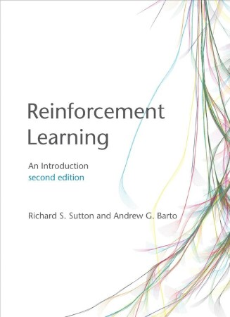

### Machine Learning and Data Science Blueprints for Finance: From Building Trading Strategies to Robo-advisors using Python

## Computer Vision
### Modern Computer Vision with PyTorch: Explore deep learning concepts and implement over 50 real-world image applications (English Edition)

### Computer Vision: Principles, Algorithms, Applications, Learning

### High Precision Camera Calibration
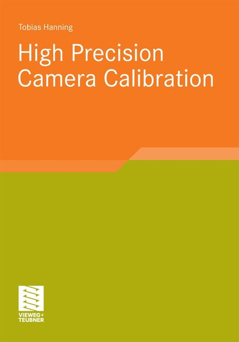

### Hands-On Computer Vision with TensorFlow 2: Leverage deep learning to create powerful image processing apps with TensorFlow 2.0 and Keras

### Programming Computer Vision with Python: Tools and algorithms for analyzing images

## Computer Science

### The algorithm design manual

### C++, UML und Design Patterns

### Patterns kompakt: Entwurfsmuster für effektive Software-Entwicklung (IT kompakt)

### Basiswissen für Softwarearchitekten: Aus- und Weiterbildung nach iSAQB-Standard zum Certified Professional for Software Architecture - Foundation Level

### Designing Software Architectures: A Practical Approach (SEI Series in Software Engineering)

### Clean Architecture: A Craftsman's Guide to Software Structure and Design: A Craftsman's Guide to Software Structure and Design (Robert C. Martin Series)

### Software-Engineering - kompakt
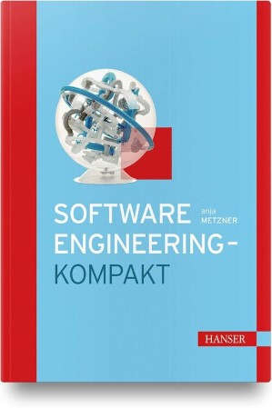

### UML 2.5: Das umfassende Handbuch
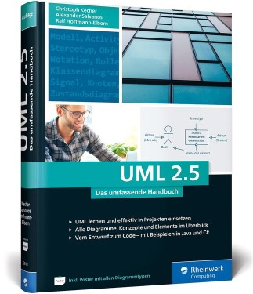

### Analyse und Design mit der UML 2.5: Objektorientierte Softwareentwicklung

### Grundkurs Software-Engineering mit UML: Der pragmatische Weg zu erfolgreichen Softwareprojekten

### Clean Code: A Handbook of Agile Software Craftsmanship (English Edition)
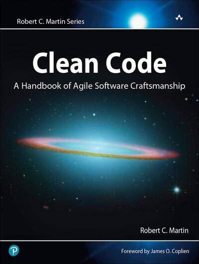

## C++ Programming Language

### Modern C++ Programming with Test-Driven Development: Code Better, Sleep Better

### Effective Modern C++: 42 Specific Ways to Improve Your Use of C++11 and C++14

### Effective C++: 55 Specific Ways to Improve Your Programs and Designs

### More Effective C++: 35 New Ways to Improve Your Programs and Designs

### Effective Stl: 50 Specific Ways to Improve Your Use of the Standard Template Library

### The C++ Standard Library: A Tutorial and Reference

### C++ Templates: The Complete Guide
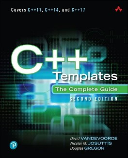

### Boost C++ Application Development Cookbook

### Real-Time C++: Efficient Object-Oriented and Template Microcontroller Programming
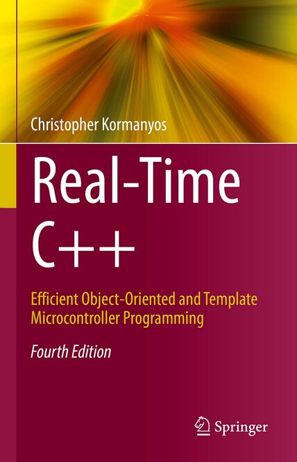

## Python Programming Language

### Effective Python: 59 Specific Ways to Write Better Python

### NumPy Programming, In 8 Hours, For Beginners, Learn Coding Fast

## C# Programming Language

### C# 6.0 – kurz & gut

### Exam Ref 70-483: Programming in C#

## Java Programming Language

### Java Programmieren: für Einsteiger

### JavaFX For Dummies
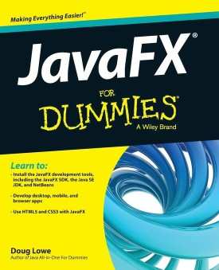

### Mastering Spring 5: An effective guide to build enterprise applications using Java Spring and Spring Boot framework
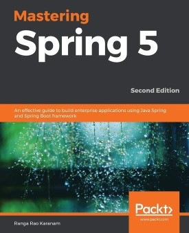

## Project Management

### Die Scrum-Revolution: Management mit der bahnbrechenden Methode der erfolgreichsten Unternehmen

### Professional Product Owner, The: Leveraging Scrum as a Competitive Advantage

### Agiles Projektmanagement mit Scrum für Einsteiger

### Basiswissen für Softwareprojektmanager im klassischen und agilen Umfeld

### Managing successful projects with PRINCE2
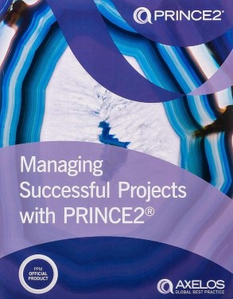

## Soft Skills

### Konflikte lösen - Verhandeln unter Stress: Tools für Führungskräfte und Teams

### RHETORIK | SMALLTALK | SCHLAGFERTIGKEIT | SELBSTBEWUSSTSEIN - Das Große 4 in 1 Buch!

### Die 4-Stunden-Woche: Mehr Zeit, mehr Geld, mehr Leben

## Economy and Finances

### Wie Wirtschaft funktioniert: Der anschauliche Navigator durch Wirtschaftstheorie, Wirtschaftspolitik und Wirtschaftspraxis

### Grundzüge der Spieltheorie: Ein Lehr- und Arbeitsbuch für das (Selbst-)Studium

### Trading für Dummies

### Technische Analyse der Finanzmärkte: Grundlagen, Strategien, Methoden, Anwendungen

### How to Day Trade for a Living: A Beginner's Guide to Trading Tools and Tactics, Money Management, Discipline and Trading Psychology

### How To Swing Trade: A Beginner’s Guide to Trading Tools, Money Management, Rules, Routines and Strategies of a Swing Trader

### Algorithmic Trading with Interactive Brokers
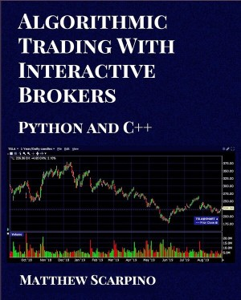

### Gaming the Market: Applying Game Theory to Create Winning Trading Strategies

