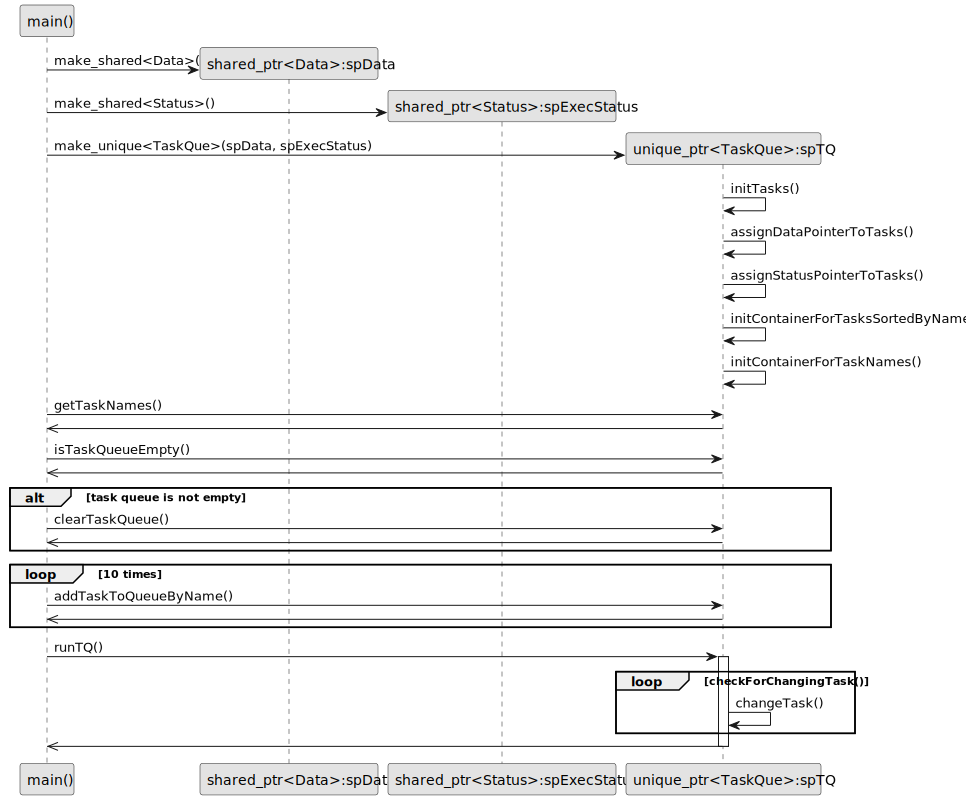

# Task queue design pattern in modern C++
[Code on Github](https://github.com/VPERepos/TaskQueueDesignPattern/tree/main)
## Motivation

Imagine, that you have some data that you would like to process, but the way to process it can be combined of a lot of simple steps, that, in general, can be mixed up with each other, giving different orders of computation. For example, you have many images and it is necessary to process them and get some information out of them. You have also a library that consists of different computer vision algorithms, but you still don't know which is the most optimal way to apply those algorithms. Developing the procedure is time consuming due to checking many combinations and tuning parameters of algorithms. It is also very helpfull to be able to control the results after each step. My solution would be to program a tool with user interface, that lists in one window all possible steps, which can be chosen and added to the next window describing the resulting procedure. This is exactly the case, where a task queue design pattern can be applied. The steps from the resulting procedure are put into a task queue and then processed one after another. The example in this project is much simpler and somehow abstract, because it is made just to represent the idea.

## Classes structure and functionality

UML-diagram above represents a design of the example program. There is a class called TaskQueue, which consists of shared pointers to the objects of classes Data, Status and Task1 to Task4. The shared pointers of types Status and Data are passed by reference to the parameters of the constructor of the TaskQueue class. The objects of Task1 to Task4 types are allocated on heap in this constructor. During initialization of tasks, they are given unique names, which are contained in a sorted order in a vector. There is also a map with names as keys and pointers as values. This is needed in order to be able to clear and fill out the main queue in the necessary way from outside in the consumer function. Objects of types Data, Status and TaskQueue are allocated on heap in the main function. Objects of types Task1 to Task4 have a function executeTask(). This function can be powered with any custom business logic that processes an object of the type Data. The loop in the function runTQ() takes the front element of the constructed queue and calls the function executeTask(). Afterwards the front element is deleted from the queue. This proceeds until the queue is empty. 

The principle program flow is described by the following sequence diagram
