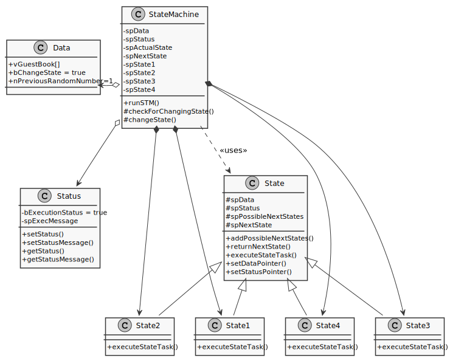
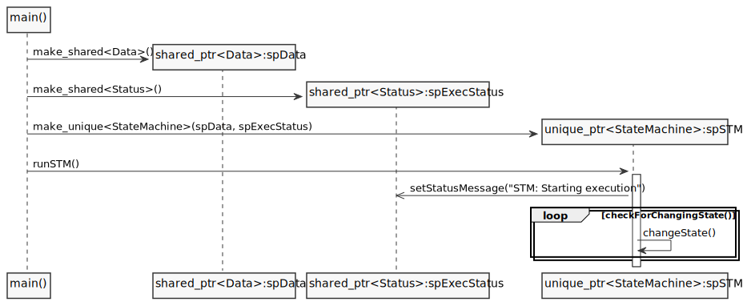
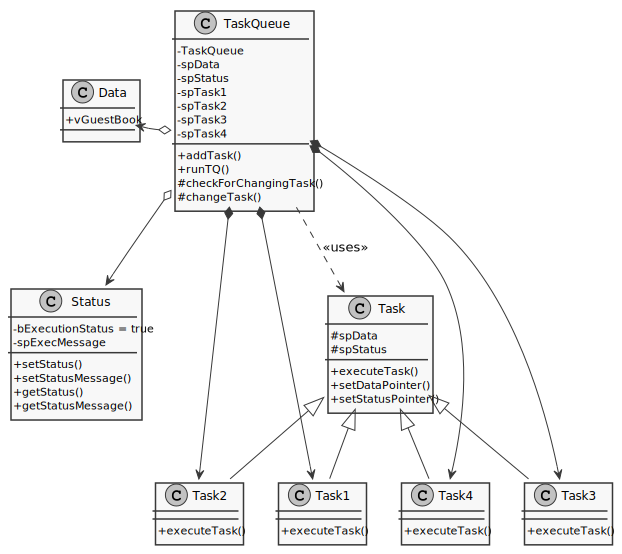
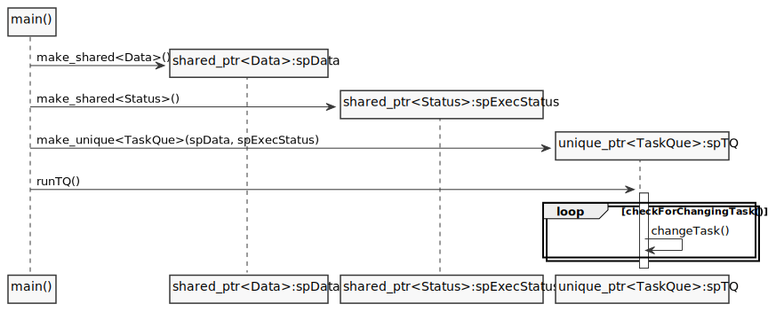
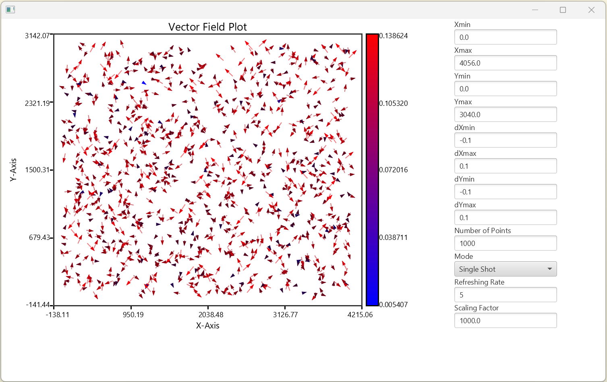

# Projects

## C++ Projects
### State machine design pattern in modern C++
[Code on Github](https://github.com/VPERepos/StateMachineDesignPattern/tree/master)
#### Motivation

Working several years as a firmware developer for FPGA-systems, where the whole business logic must be  implemented in the form of a state machine, I really got used to them and found it later on very practical also for C++ programming. A lot of algorithms, like for example text parsing, have this kind of non-linear flow with transitions and abortions, where the state machines are, may be, the best design choice. I adopted the idea of the class polymorphism (underlying in almost all design patterns, except for singleton as to my knowledge) to a state machine and implemented it in terms of the modern C++. This kind of software design was also applied for my real life programming problems, like non-XML text protocol parser.

#### Classes structure and functionality

UML-diagram above represents the design of the example program. There is a class called StateMachine, which consists of shared pointers to the objects of the classes Data, Status and State1 to State4. The shared pointers of types Status and Data are passed by parameters of the constructor of the StateMachine class. The objects of State1 to State4 types are allocated on heap in this constructor. Objects of types Data, Status and StateMachine are allocated on heap in the main function. Transitions of the state machine, made possible by derivation from the base class State, are implemented in the function runSTM(). They are dependent on the results of the business logic of each state, but there is only one main loop, which runs until exit is initiated. In common, the states can be filled with custom business logic, but in this example a random number is generated, which represents the next state and main loop executes the next state in the next iteration. The execution stops ordinary in the 4-th state and with an error during transition from the 3-rd to the 4-th state. It is implemented this way only in order to show the principle. Generally, as mentioned above, this design can be configured to work in any way, depending on needs.

The principal programe flow is described by the following sequence diagram.

### Task queue design pattern in modern C++
[Code on Github](https://github.com/VPERepos/TaskQueueDesignPattern/tree/main)
#### Motivation

Imagine, that you have some data that you would like to process, but the way to process it can be combined of a lot of simple steps, that, in general, can be mixed up with each other, giving different orders of computation. For example, you have many images and it is necessary to process them and get some information out of them. You have also a library that consists of different computer vision algorithms, but you still don't know which is the most optimal way to apply those algorithms. Developing the procedure is time consuming due to checking many combinations and tuning parameters of algorithms. It is also very helpfull to be able to control the results after each step. My solution would be to program a tool with user interface, that lists in one window all possible steps, which can be chosen and added to the next window describing the resulting procedure. This is exactly the case, where a task queue design pattern can be applied. The steps from the resulting procedure are put into a task queue and then processed one after another. The example in this project is much simpler and somehow abstract, because it is made just to represent the idea.

#### Classes structure and functionality

UML-diagram above represents the design of the example program. There is a class called TaskQueue, which consists of shared pointers to the objects of the classes Data, Status and Task1 to Task4. The shared pointers of types Status and Data are passed by parameters of the constructor of the TaskQueue class. The objects of Task1 to Task4 types are allocated on heap in this constructor. The member variable containerTaskQueue is also filled out with randomly generated tasks in the constructor, but it can be done generally somewhere else in the program by using function addTask(). Objects of types Data, Status and TaskQueue are allocated on heap in the main function. Objects of types Task1 to Task4 have a function executeTask(). This function can be powered with any custom business logic that processes an object of the type Data. The loop in the function runTQ() takes the front element of the member variable containerTaskQue and calls the function executeTask(). Afterwards the front element is deleted from the queue. This proceeds until the queue is empty. 

The principal programe flow is described by the following sequence diagram

## Java Projects

### Vector Field Widget
[Code on Github](https://github.com/VPERepos/VectorFieldWidget/tree/main/VectorFieldWidget)
#### Overview

## Python Projects