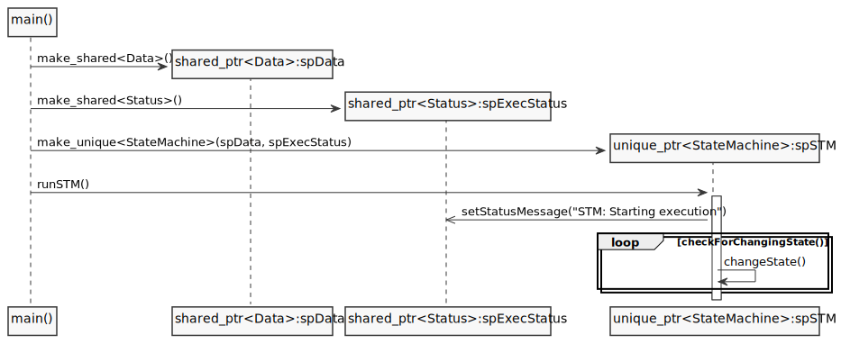

# C++ Projects
## State machine design pattern in modern C++
[Code on Github](https://github.com/VPERepos/StateMachineDesignPattern/tree/master)
### Motivation

Working several years as a firmware developer for FPGA-systems, where the whole business logic must be  implemented in the form of a state machine, I really got used to them and found it later on very practical also for C++ programming. A lot of algorithms, like for example text parsing, have this kind of non-linear flow with transitions and abortions, where the state machines are, may be, the best design choice. I adopted the idea of the class polymorphism (underlying in almost all design patterns, except for singleton as to my knowledge) to a state machine and implemented it in terms of the modern C++. This kind of software design was also applied for my real life programming problems, like non-XML text protocol parser.

### Classes structure and functionality

UML-diagram above represents the design of the example program. There is a class called StateMachine, which consists of shared pointers to the objects of the classes Data, Status and State1 to State4. The shared pointers of types Status and Data are passed by parameters of the constructor of the StateMachine class. The objects of State1 to State4 types are allocated on heap in this constructor. Objects of types Data, Status and StateMachine are allocated on heap in the main function. Transitions of the state machine, made possible by derivation from the base class State, are implemented in the function runSTM(). They are dependent on the results of the business logic of each state, but there is only one main loop, which runs until exit is initiated. In common, the states can be filled with custom business logic, but in this example a random number is generated, which represents the next state and main loop executes the next state in the next iteration. The execution stops ordinary in the 4-th state and with an error during transition from the 3-rd to the 4-th state. It is implemented this way only in order to show the principle. Generally, as mentioned above, this design can be configured to work in any way, depending on needs.

The principal programe flow is described by the following sequence diagram.

