# Readings

## Computer vision and machine learning
### Modern Computer Vision with PyTorch: Explore deep learning concepts and implement over 50 real-world image applications (English Edition)

### Computer Vision: Principles, Algorithms, Applications, Learning

### Hands-On Computer Vision with TensorFlow 2: Leverage deep learning to create powerful image processing apps with TensorFlow 2.0 and Keras

### Programming Computer Vision with Python: Tools and algorithms for analyzing images

### Hands-On Machine Learning With Scikit-Learn and Tensorflow: Concepts, Tools, and Techniques to Build Intelligent Systems

### Reinforcement Learning, second edition: An Introduction

## Computer science

### The algorithm design manual
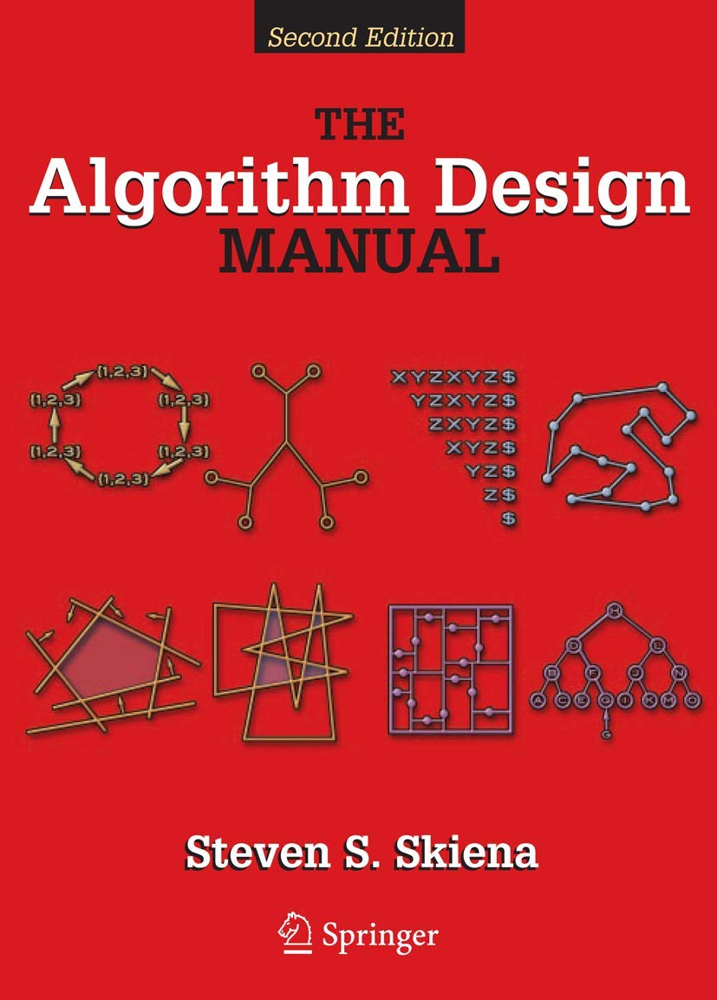

### C++, UML und Design Patterns
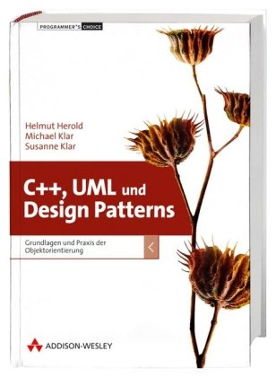

### Patterns kompakt: Entwurfsmuster für effektive Software-Entwicklung (IT kompakt)
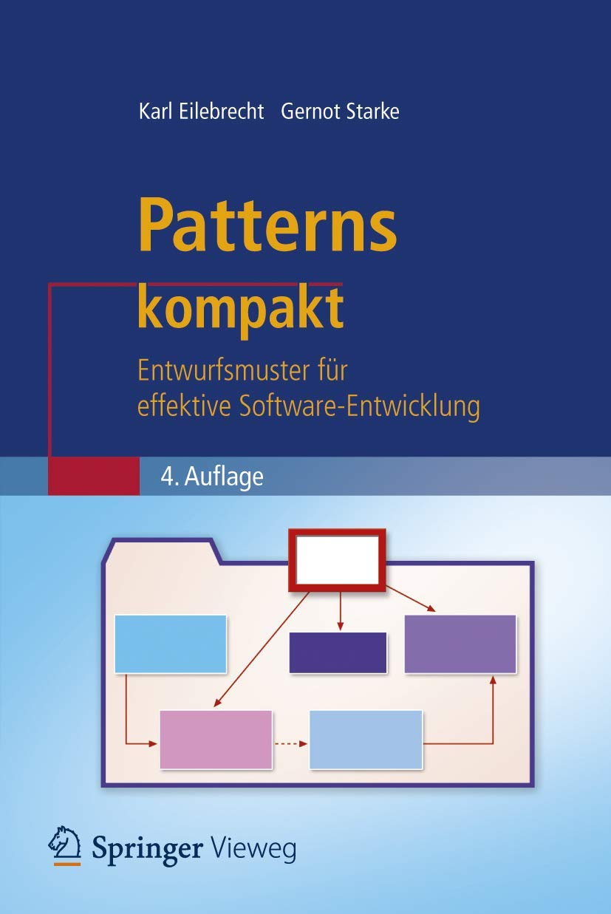

### Basiswissen für Softwarearchitekten: Aus- und Weiterbildung nach iSAQB-Standard zum Certified Professional for Software Architecture - Foundation Level
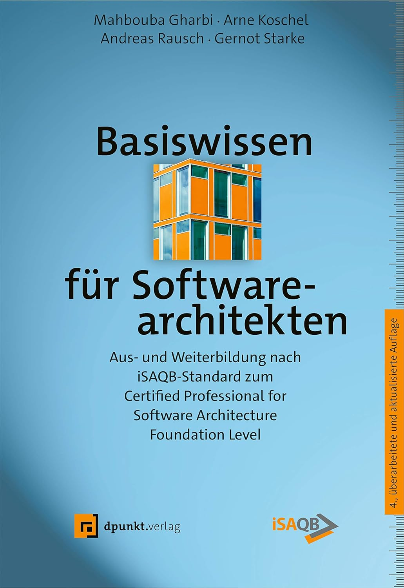

### Designing Software Architectures: A Practical Approach (SEI Series in Software Engineering)
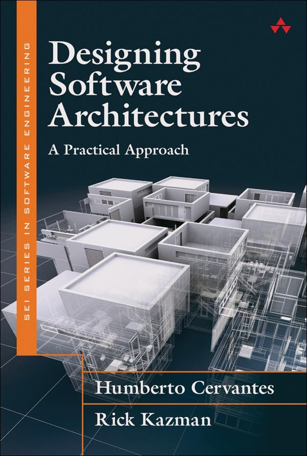

### Clean Architecture: A Craftsman's Guide to Software Structure and Design: A Craftsman's Guide to Software Structure and Design (Robert C. Martin Series)
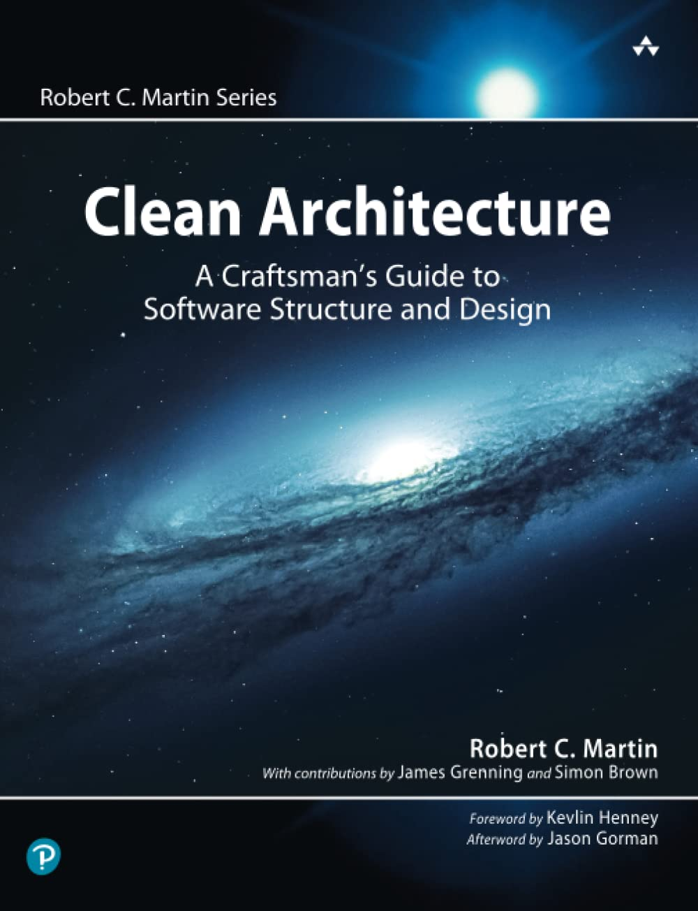

### Software-Engineering - kompakt
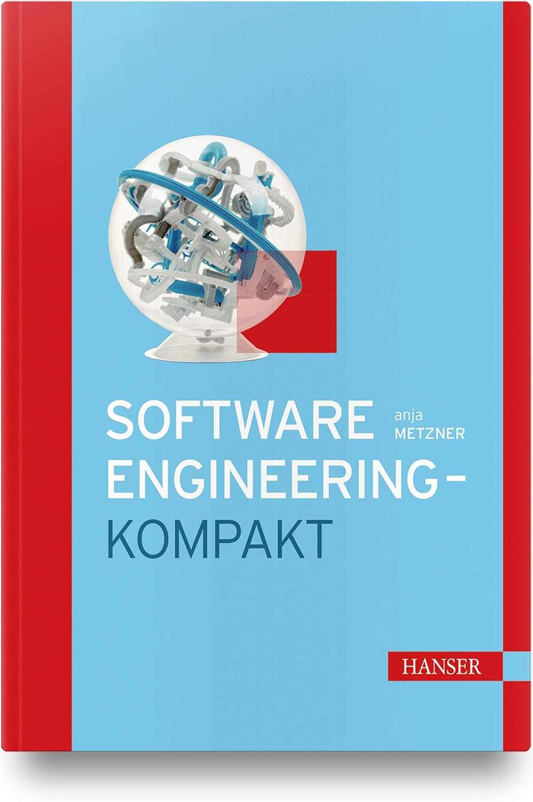

### UML 2.5: Das umfassende Handbuch
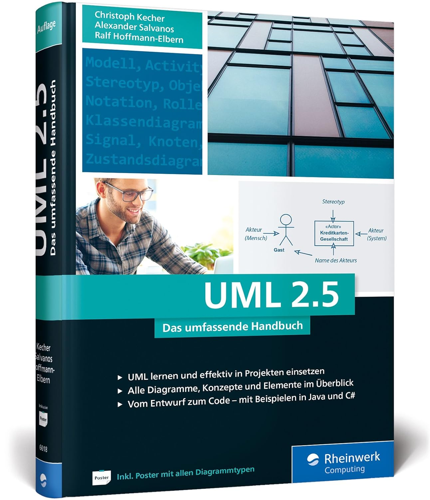

### Analyse und Design mit der UML 2.5: Objektorientierte Softwareentwicklung
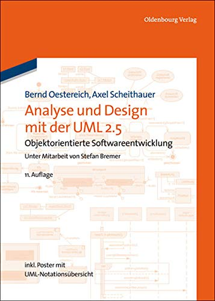

### Grundkurs Software-Engineering mit UML: Der pragmatische Weg zu erfolgreichen Softwareprojekten
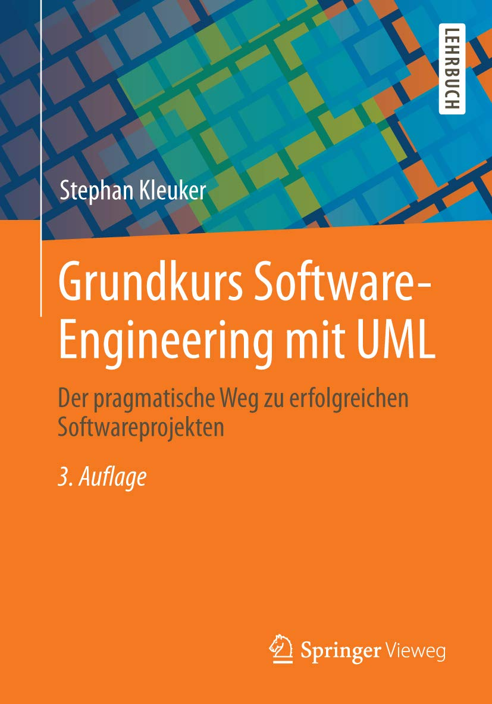

### Clean Code: A Handbook of Agile Software Craftsmanship (English Edition)
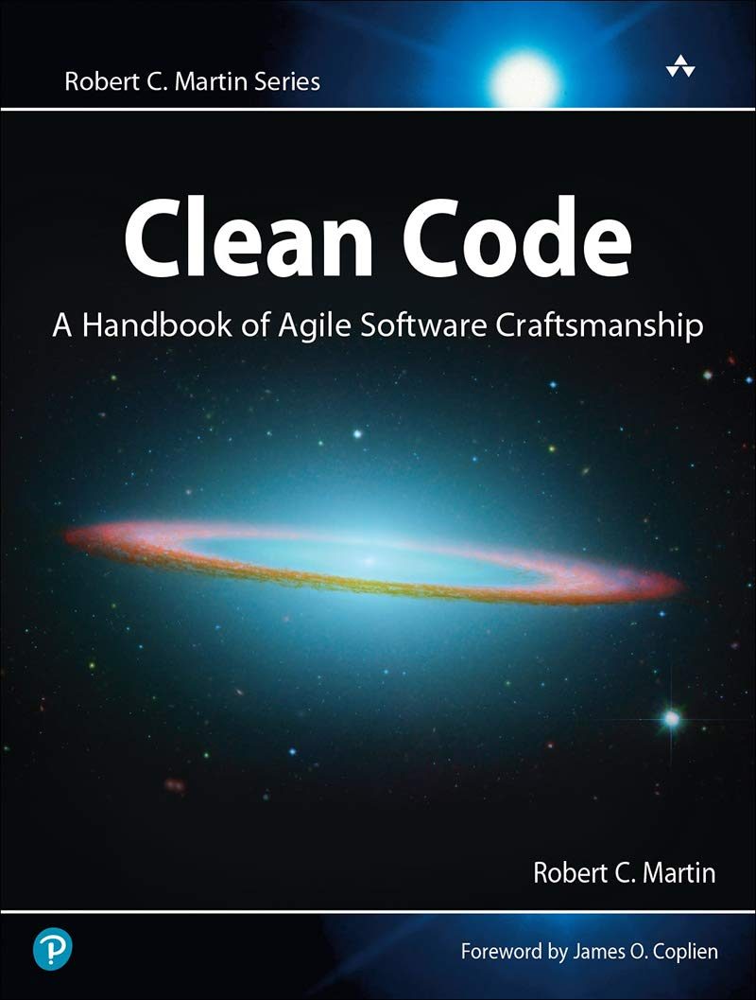