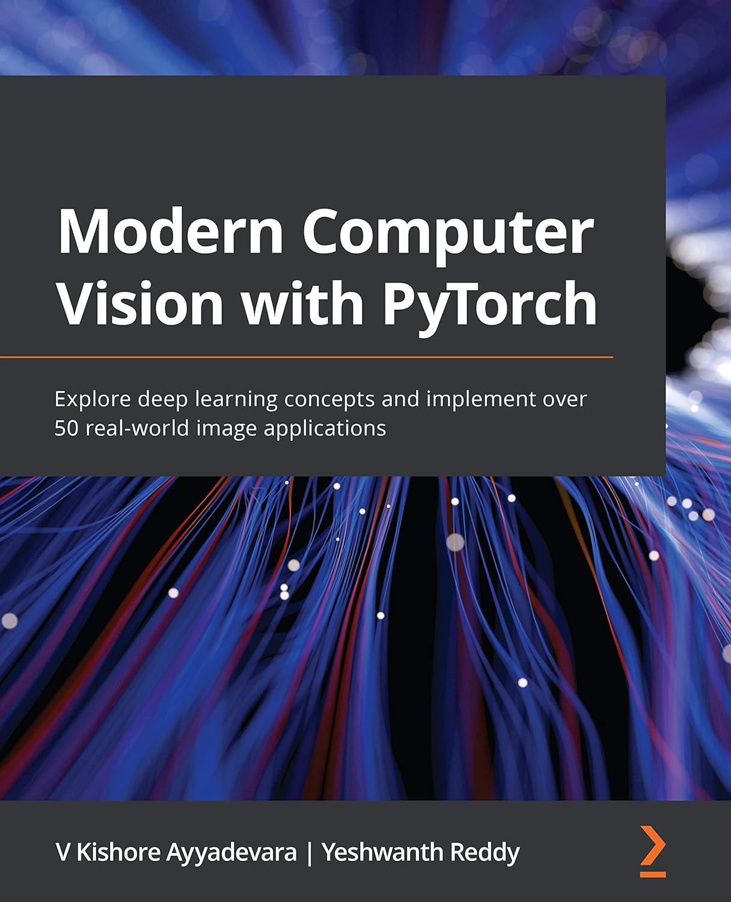
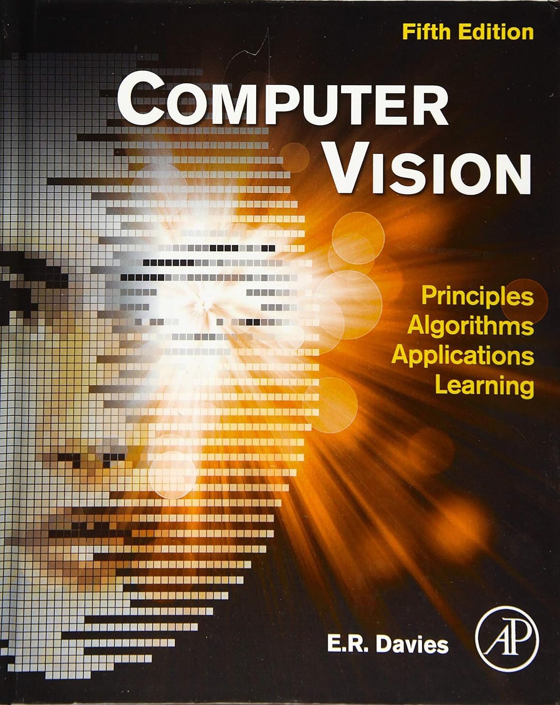
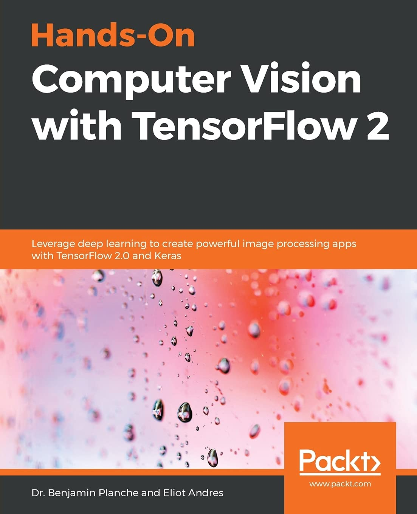
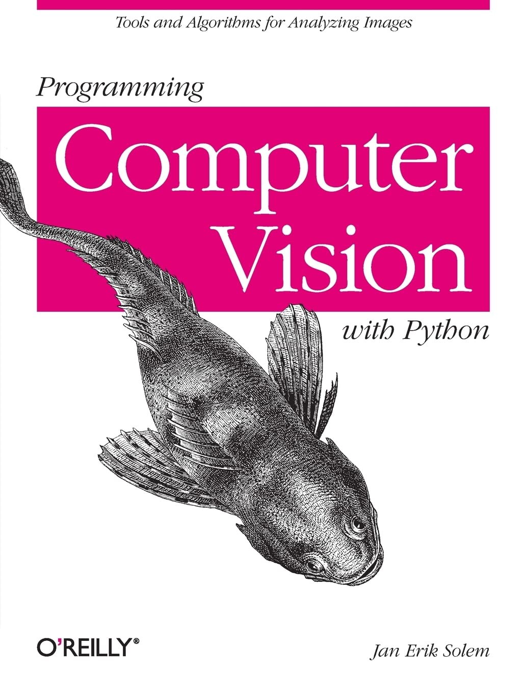
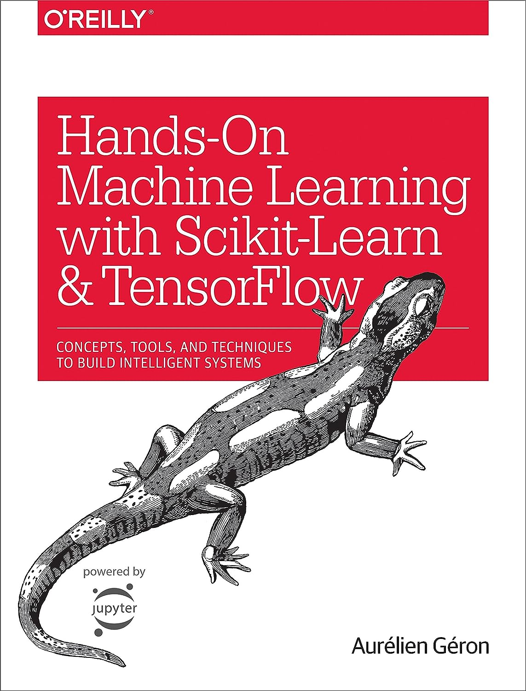
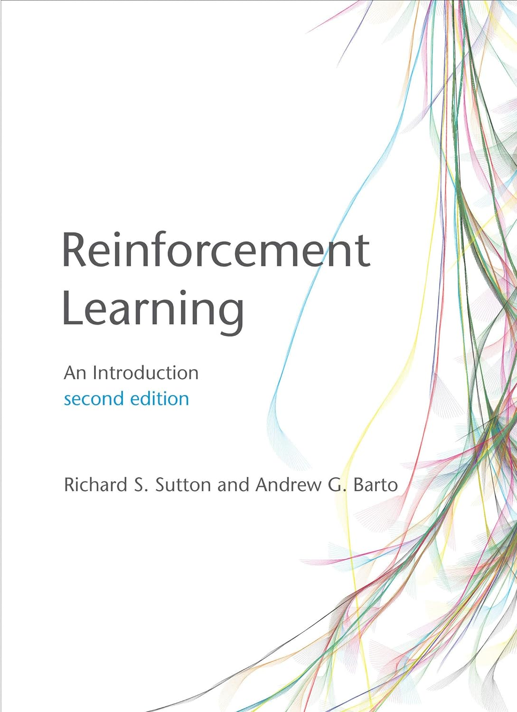

# Readings

## Computer vision and machine learning
### Modern Computer Vision with PyTorch: Explore deep learning concepts and implement over 50 real-world image applications (English Edition)

### Computer Vision: Principles, Algorithms, Applications, Learning

### Hands-On Computer Vision with TensorFlow 2: Leverage deep learning to create powerful image processing apps with TensorFlow 2.0 and Keras

### Programming Computer Vision with Python: Tools and algorithms for analyzing images

### Hands-On Machine Learning With Scikit-Learn and Tensorflow: Concepts, Tools, and Techniques to Build Intelligent Systems

### Reinforcement Learning, second edition: An Introduction

## Computer science