# Readings
In this section I present some selected books, that I read during the last years. These readings cover most of the topics related to my work. In some of the books I selected only some chapters, but the most of them were read completely. 
## Computer Vision and Machine Learning
### Modern Computer Vision with PyTorch: Explore deep learning concepts and implement over 50 real-world image applications (English Edition)

### Computer Vision: Principles, Algorithms, Applications, Learning

### High Precision Camera Calibration
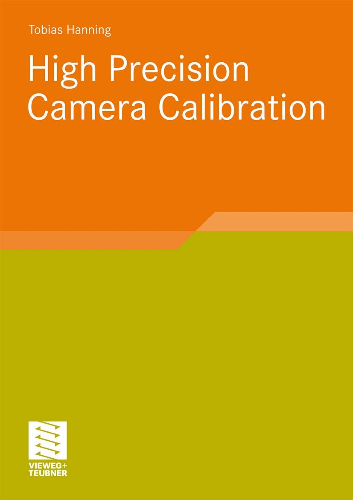

### Hands-On Computer Vision with TensorFlow 2: Leverage deep learning to create powerful image processing apps with TensorFlow 2.0 and Keras

### Programming Computer Vision with Python: Tools and algorithms for analyzing images

### Hands-On Machine Learning With Scikit-Learn and Tensorflow: Concepts, Tools, and Techniques to Build Intelligent Systems

### Reinforcement Learning, second edition: An Introduction

## Computer Science

### The algorithm design manual

### C++, UML und Design Patterns

### Patterns kompakt: Entwurfsmuster für effektive Software-Entwicklung (IT kompakt)

### Basiswissen für Softwarearchitekten: Aus- und Weiterbildung nach iSAQB-Standard zum Certified Professional for Software Architecture - Foundation Level

### Designing Software Architectures: A Practical Approach (SEI Series in Software Engineering)

### Clean Architecture: A Craftsman's Guide to Software Structure and Design: A Craftsman's Guide to Software Structure and Design (Robert C. Martin Series)

### Software-Engineering - kompakt

### UML 2.5: Das umfassende Handbuch

### Analyse und Design mit der UML 2.5: Objektorientierte Softwareentwicklung

### Grundkurs Software-Engineering mit UML: Der pragmatische Weg zu erfolgreichen Softwareprojekten

### Clean Code: A Handbook of Agile Software Craftsmanship (English Edition)

## C++ Programming Language

### Effective Modern C++: 42 Specific Ways to Improve Your Use of C++11 and C++14
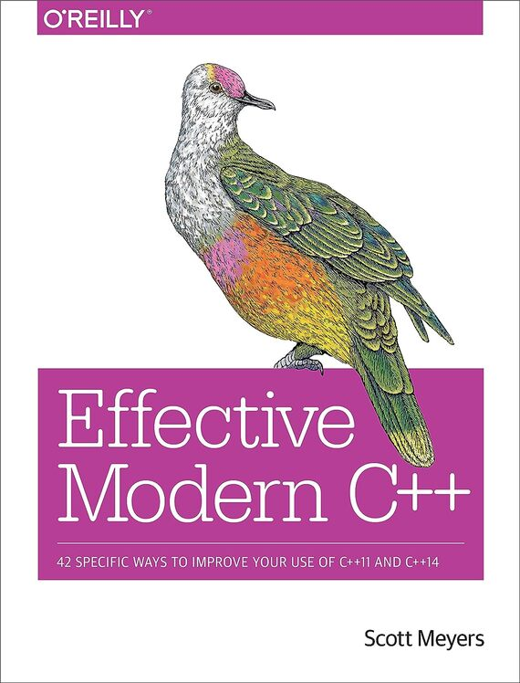

### Effective C++: 55 Specific Ways to Improve Your Programs and Designs
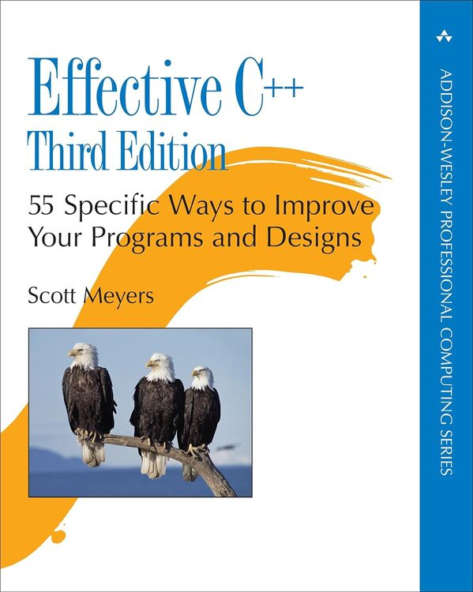

### More Effective C++: 35 New Ways to Improve Your Programs and Designs
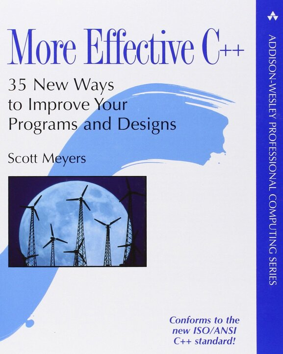

### Effective Stl: 50 Specific Ways to Improve Your Use of the Standard Template Library
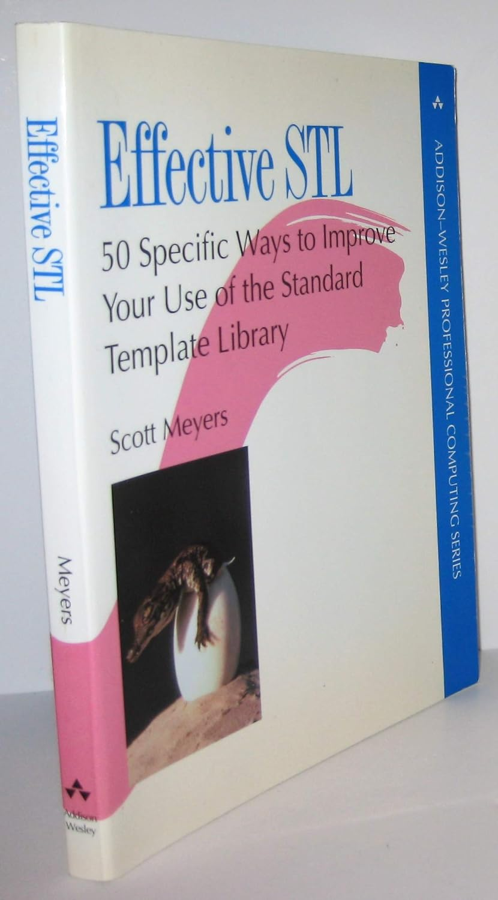

### The C++ Standard Library: A Tutorial and Reference
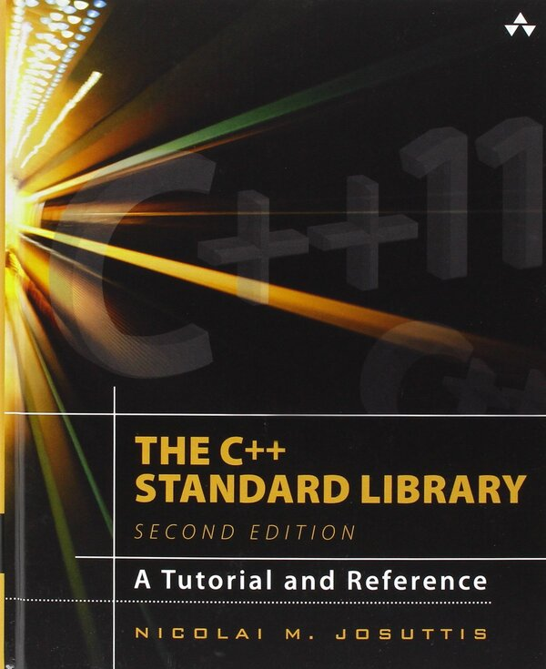

### C++ Templates: The Complete Guide
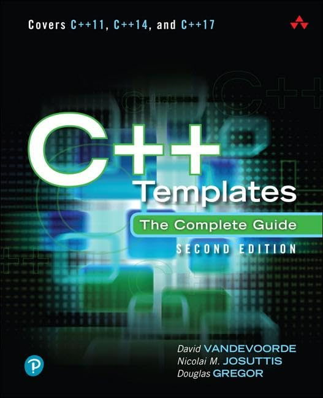

### Boost C++ Application Development Cookbook
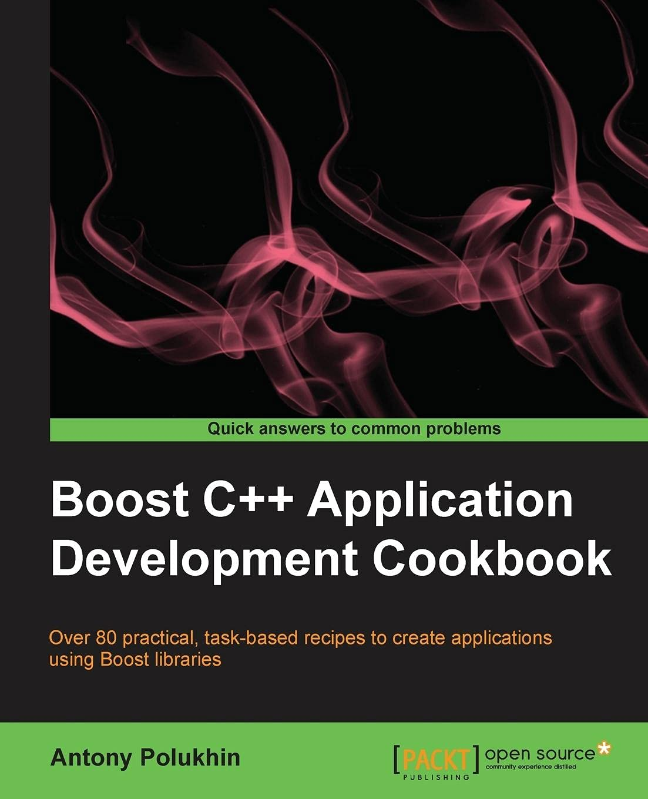

### Real-Time C++: Efficient Object-Oriented and Template Microcontroller Programming
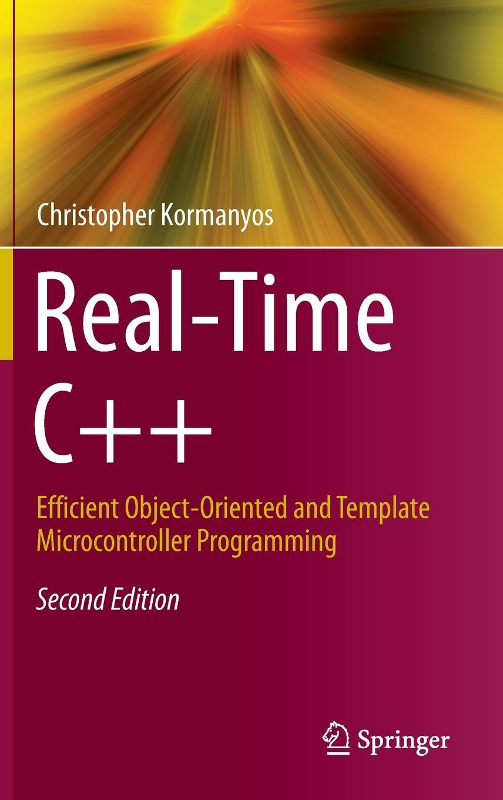

## Python Programming Language

### Effective Python: 59 Specific Ways to Write Better Python
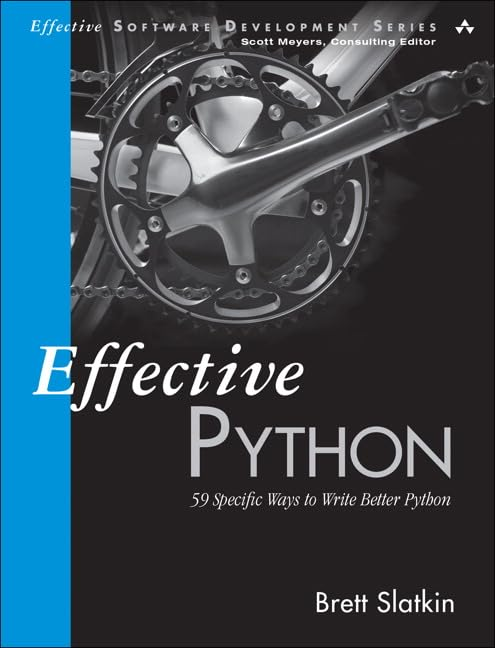

### NumPy Programming, In 8 Hours, For Beginners, Learn Coding Fast
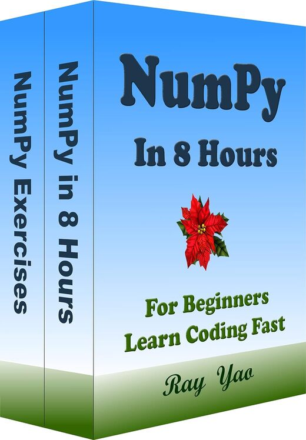

## JavaScript/TypeScript Programming Language

## C# Programming Language

### C# 6.0 – kurz & gut
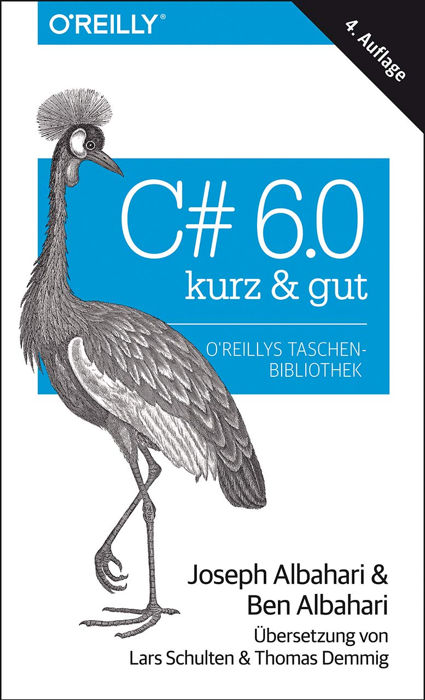

### Exam Ref 70-483: Programming in C#
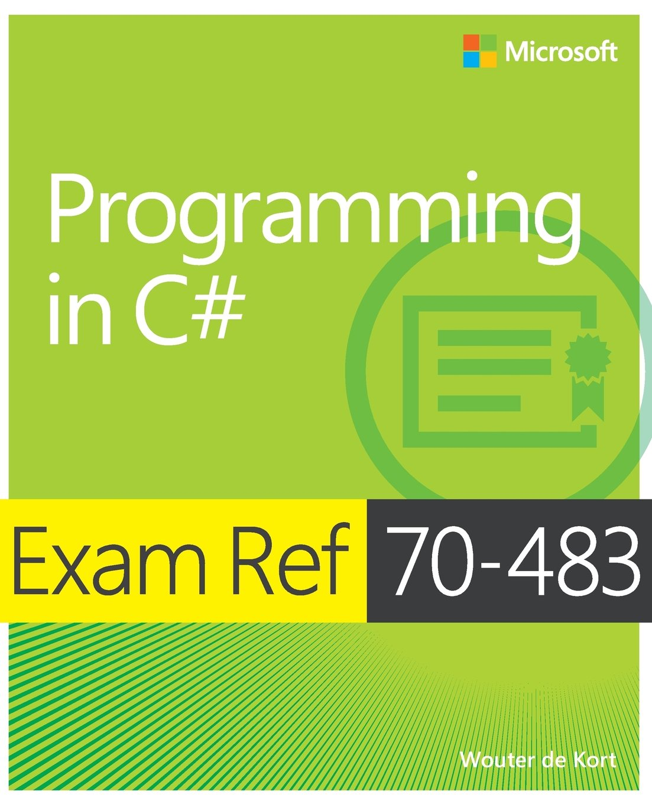

## Java Programming Language

### Java Programmieren: für Einsteiger
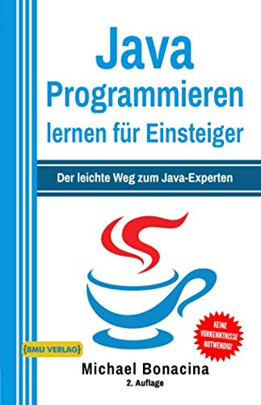

### JavaFX For Dummies
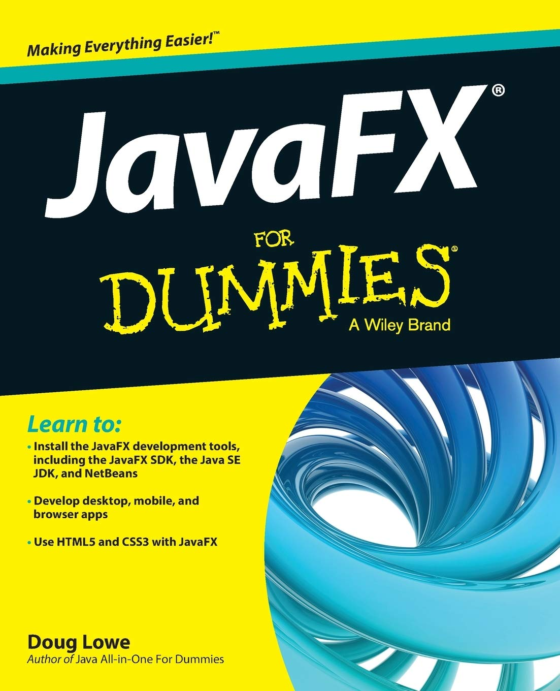

### Mastering Spring 5: An effective guide to build enterprise applications using Java Spring and Spring Boot framework
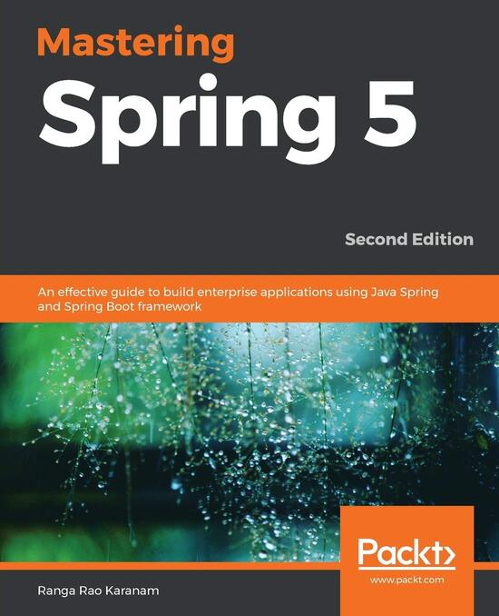

